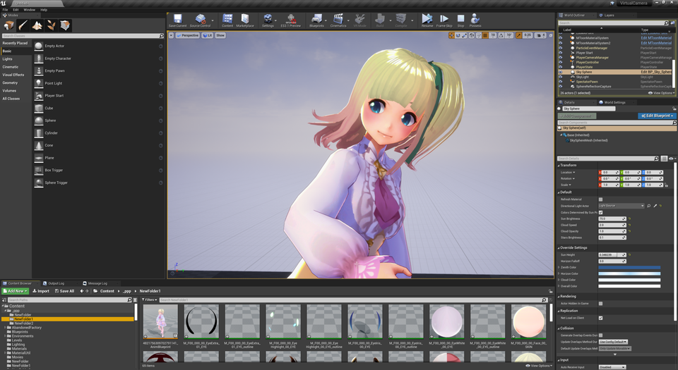
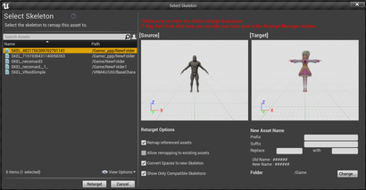
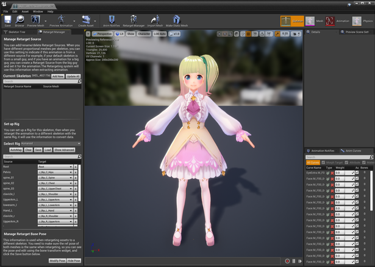
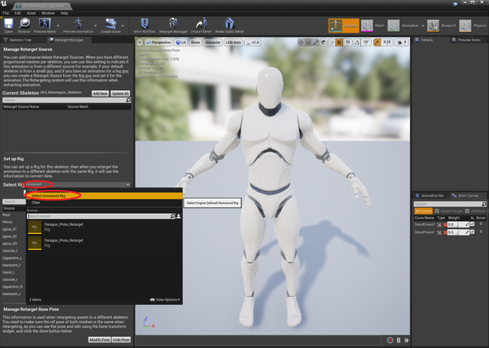
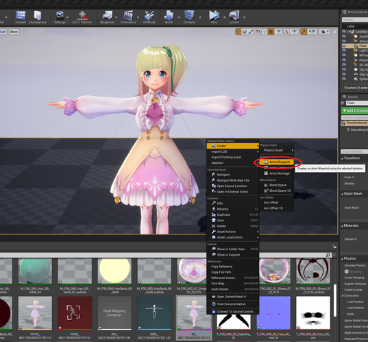
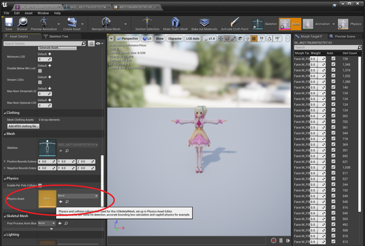
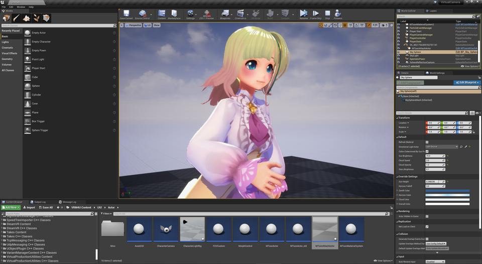

||
|-|
||
|モデル：[ヴィクトリア・ルービン](https://hub.vroid.com/characters/2792872861023597723/models/5013769147837660446)|

----
## アニメーションファイルを準備する

いくつかアニメーションアセットを持っている方は次の項目へどうぞ。

データが無い場合は[こちらのリンクページ](../10_link/)より、ネオンのアニメーションをダウンロードすることをオススメします。女性らしいアニメーションが入っています。

またプロジェクト作成時に「サードパーソンテンプレート」を選択すると、移動アニメーションが同梱されています。
他にマーケットプレイスにも無料のアニメーションアセットがあります。

慣れた方はミライ小町のアニメーションも利用してみましょう。ただしインポート時間が長いので注意ください。

## リターゲットする

UE4標準の方法で可能です。セットアップの大半は自動化されています。

[こちらの公式ドキュメントの後半](https://docs.unrealengine.com/ja/Engine/Animation/AnimHowTo/Retargeting/index.html)より、「Retarget Anim Assets -> Duplicate Anim Assets and Retarget」以降の項目を参照ください。

A-poseとT-poseの違いに注意ください。
具体的に以下のような場面は切り替えが必要です。

|正しい組み合わせ|間違った組み合わせ|
|-|-|
|||

VRM4Uアセットはポーズを切り替え可能です。
以下よりポーズを指定してください。

||
|-|
||

A-Tを切り替え可能です。

|A-pose|T-pose|
|-|-|
|||

補足です。標準のTPSテンプレートのグレイマンはリターゲット設定がありません。これを利用する場合は下図のように`Humanoid`を選択してください。（前述の公式ドキュメント前半と同じ手順です）

||
|-|
||

----

## 揺れ骨をVRMSpringBoneで再現する

**初期状態では揺れ骨が再現できていません。**
{: .notice--info}

`PhysicsAsset`で揺らしていますが不完全です。

まず`SkeletalMesh`より、`AnimBlueprint`を作成します。

||
|-|
||

任意のアニメーションノードを作成し、最後に`VRMSprintBone`ノードを追加します。`VRMMetaObject`に対象キャラクタのメタデータをセットします。このメタデータはVRMインポート時に作成されています。

||
|-|
||

`PhysicsAsset`による揺れ骨を無効化します。SkeletalMeshより`PhysicsAsset`の欄で `clear` を選択し空欄にします。

||
|-|
||

VRMの設定値で揺れました。

||
|-|
||

揺れが大きい場合は `VRMSprintBone` のパラメータで調節可能です。

UE4でアクションさせる場合は `StiffnessScale` を2～3あたりに設定すると安定しやすいです。

多くのVRMファイルは、アバターとしてモーションキャプチャを適用した時に適切に揺れるよう調整されています。アクションゲームのアニメーションを適用すると、揺れ方がオーバーに見えることがあります。

||
|-|
||

