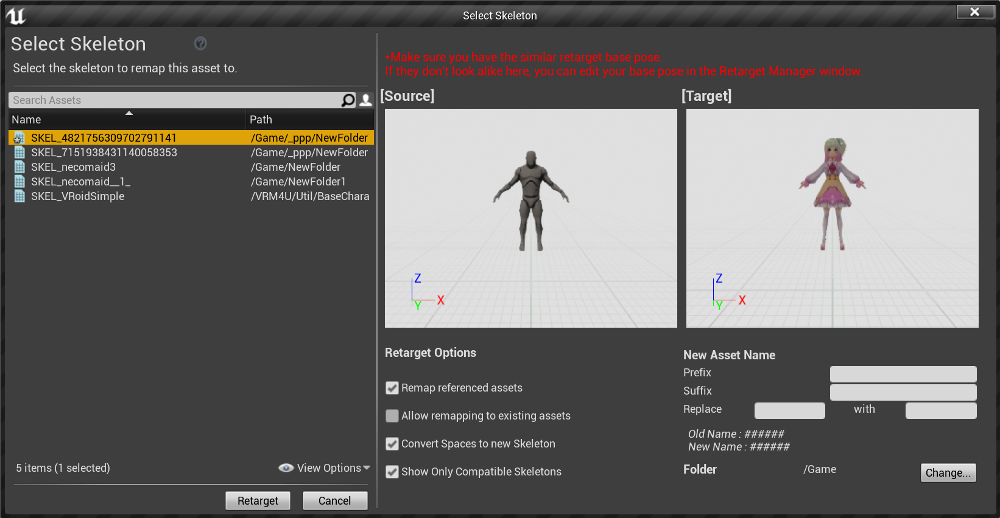

----
## リターゲットする
UE4標準の方法で可能です。

A-poseとT-poseの違いに注意ください。
具体的に以下のような場面は切り替えが必要です。

|正しい組み合わせ|間違った組み合わせ|
|-|-|
|||

VRM4Uアセットはポーズを切り替え可能です。
以下よりポーズを指定してください。

||
|-|
||

A-Tを切り替え可能です。

|A-pose|T-pose|
|-|-|
|||

補足です。標準のTPSテンプレートののグレイマンはリターゲット設定がありません。これを利用する場合は下図のように`Humanoid`を選択してください。

||
|-|
||

----

## 揺れ骨を再現する

**初期状態では揺れ骨が再現できていません。**
PhysicsAssetである程度再現していますが不完全です。

ここではVRMSwingBoneを再現します。AnimBlueprintにノードを追加します。

