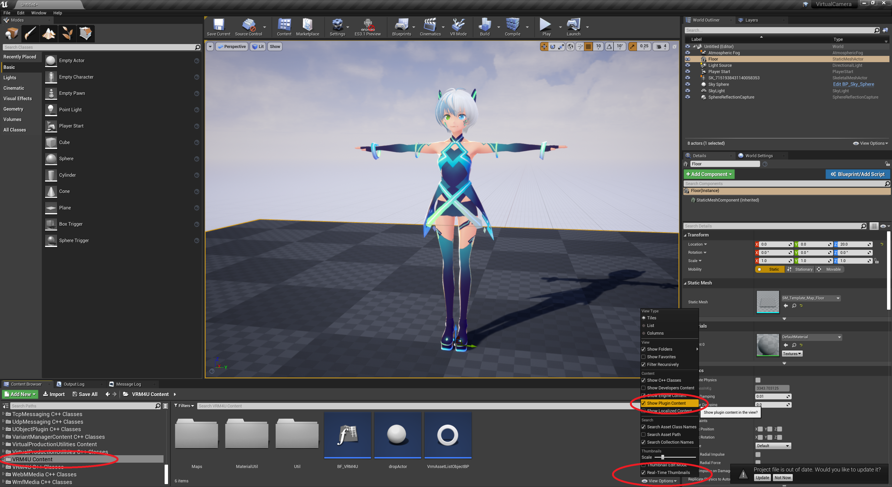
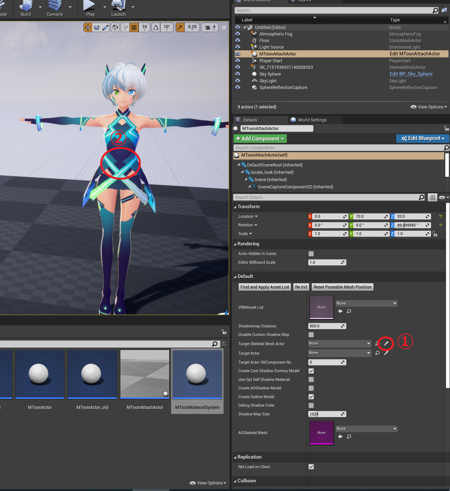
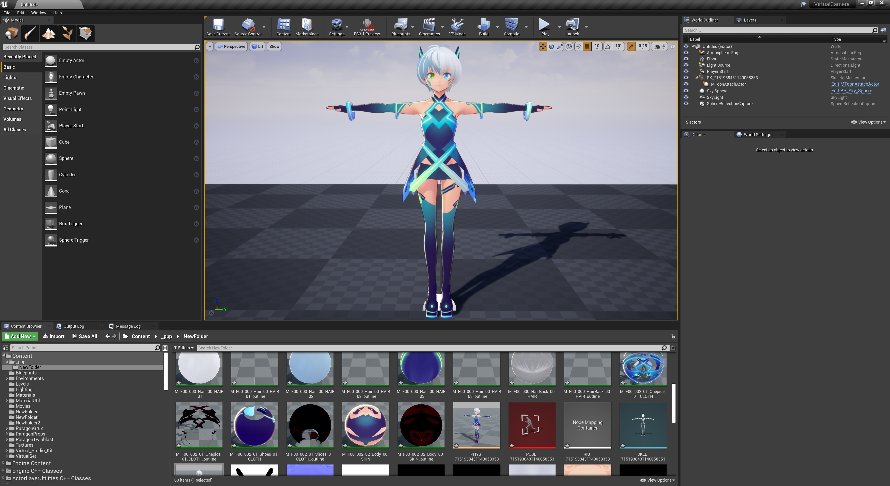
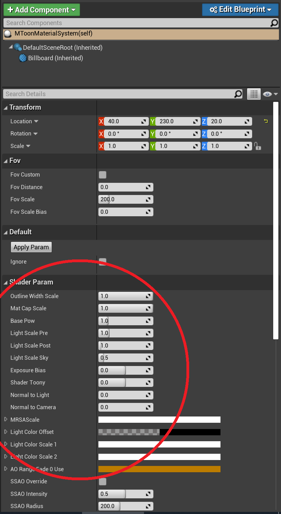
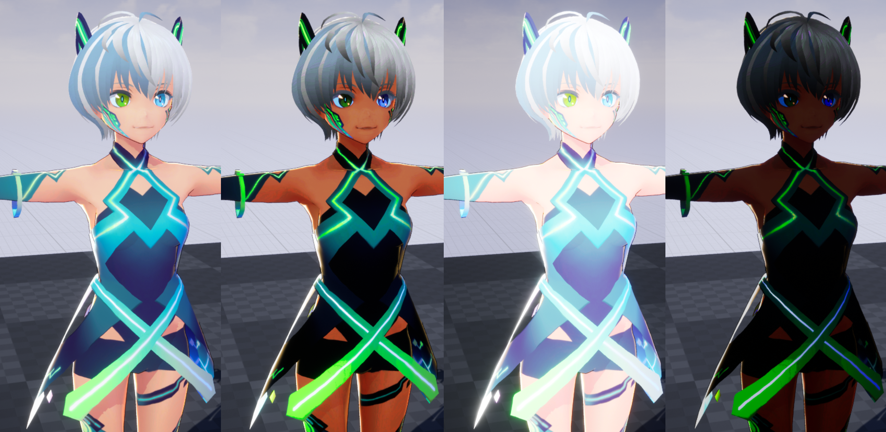
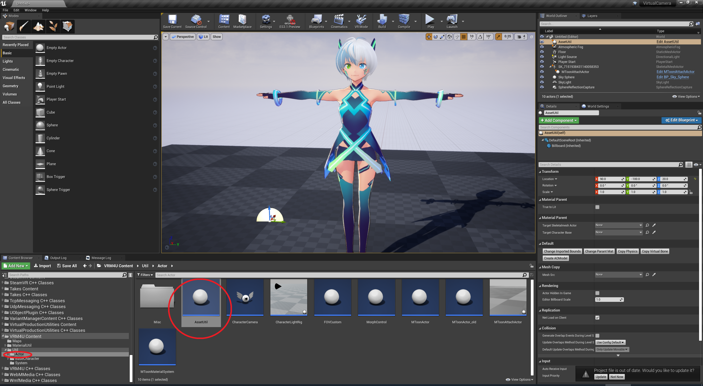
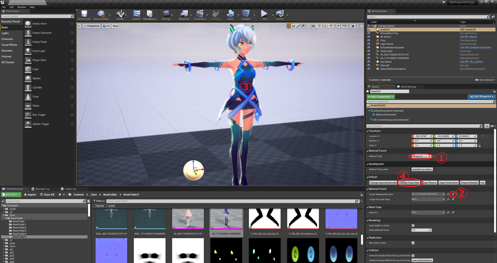

----
## 輪郭線とシャドウを有効化する

以下のメニューのチェックボックスをONにして、VRM4Uフォルダを表示します。

<figure>
  
</figure>

`VRM4U Content/Util/Actor` から、`MToonAttachActor` を配置します。ドラッグ＆ドロップです。

下図の番号順にクリックしてください。
スポイトアイコンをクリックし、その後キャラクタをクリックします。

輪郭線とセルフシャドウが有効化されました。

----## 色味を調整する

`VRM4U Content/Util/Actor` から、`MToonMaterialSystem` を配置します。

`details` よりパラメータを適当に変更してみましょう。
特殊描画（輪郭線の太さ、MatCap強度、色のガンマ補正）から、ライト（オフセット、Exposure基準）を変更できます。

一部のパラメータは、Litモード（後述します）のみ反応します。

ここでは大まかにキャラクタ全体の見た目を調整することができます。
同じ調整はマテリアル個別でも可能です。応用編で解説します。

----
## ライティングする

`AssetUtil`を配置します。

下図の順にクリックします。LitチェックボックスをONにします。

ライトが反映されるようになります。

上記手順は、インポート時にも設定可能です。Litマテリアルでインポートしてください。

----
## 見た目の調整 その先へ

上手くライティングすると素敵な見た目になります。
詳しくは応用編へどうぞ。

