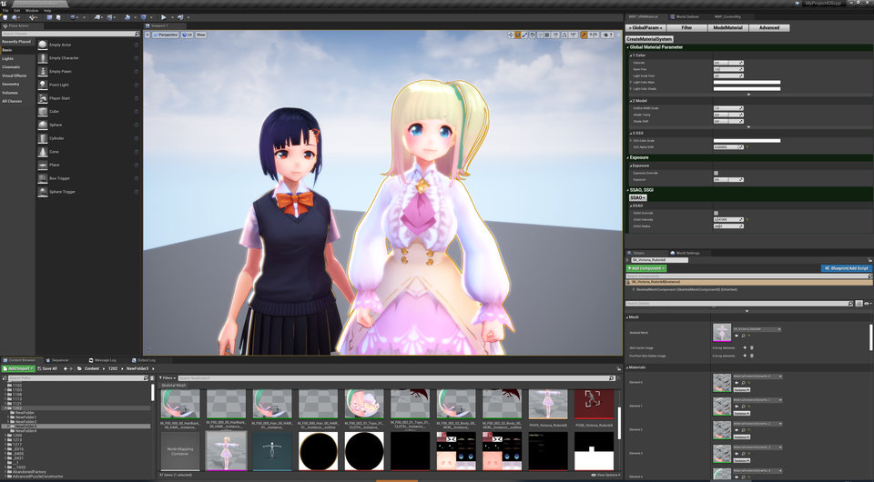

||
|-|
||
|モデル：[ヴィクトリア・ルービン](https://hub.vroid.com/characters/2792872861023597723/models/5013769147837660446)、[千駄ヶ谷 渋](https://hub.vroid.com/characters/675572020956181239/models/4479743608263344465)|

----

## マテリアル調整ウインドウ

VRM4Uの主要な調整機能ついて、手軽にパラメータを操作できるウインドウです。

|マテリアル調整ウインドウの外観|
|-|
||

この機能はUE4.26以降でのみ利用可能です。
{: .notice--info}

----

## マテリアル調整ウインドウを起動する

`VRM4U/Util/Actor/latest/WBP_VRMMaterial` を右クリックし、メニューから `RunEditorUtilityWidget`を選択すると起動します。

出てきたウインドウより、`CreateMaterialSystem`ボタン を押すと動作開始です。

|マテリアル調整ウインドウ 起動|
|-|
||

調整ウインドウはドッキングしておくと便利です。
なおレイアウトを元にもどしたい場合は、`DefaultEditorLayout` を選択ください。

|ウィンドウのドッキング、解除|
|-|
||

----

## 各ウインドウの解説

実際に操作した方が理解が早いです。まずは適当に操作してみることをオススメします。
{: .notice--info}

ボタンにより、4つのサブウインドウが切り替わります。

|種別|特徴|
|-|-|
|GlobalParam|シーン全体の描画設定です|
|Filter|VRMモデルと相性の良いポストフィルタを設定します。 お好みでご利用ください|
|ModelMaterial|モデルのマテリアル設定です|
|Advanced|特殊な設定です。後述|

----

### GlobalParam ウインドウ

|GlobalParam|
|-|
||

基本的な描画パラメータです。VRM4Uのマテリアル調整はこの画面でほぼ完結します。

----

### Filter ウインドウ

|Filter（未設定時）|設定後|
|-|-|
|||

ポストフィルタです。トゥーン/アニメ調のモデルと相性の良いフィルタを追加します。

EnableのチェックをONにすると有効化されます。対応するActorがレベルに配置されます。

----

### ModelMaterial ウインドウ

|ModelMaterial（未設定時）|設定後|
|-|-|
|||

モデルのベースマテリアルを変更することができます。インポート時の設定と同じ効果です。
`TargetActor` をレベル上のActorから選択すると操作開始です。

以下に特徴をまとめています。手軽に変更できるので 実際に試して確認ください。

||**MToonUnlit**|**MToonLit**|**SubsurfaceScattering**|
|-|:-:|:-:|:-:|
|見た目|||
|ライト効果|**なし**|あり（弱め）|あり|
|UE4背景との相性|悪い|普通|良い|
|調整の難易度|**簡単**|普通|**やや難しい**|

マテリアルを自作する場合は、他のタイプに設定ください。シンプルな構成に置き換わります。

----

### Advanced ウインドウ

|Advanced|
|-|
||

VRM4Uのマイナーな機能のうち、手軽に扱えるものをまとめています。

思わぬ発見があるかもしれません。気が向いたらONにして効果を確認ください。 
（やや特殊な動作です。常時ONにする場合は 他シーンに影響ないか十分確認ください）

 - 画角固定
   - キャラクタの描画画角を固定します。 
     ライティングや座標の整合性が合わなくなります
 - Tonemap切り替え
   - レガシートーンマッパーに切り替えます。 
     ライティングされたシーンと相性が悪いです。Unlitでの利用を想定しています

----

## 調整ウインドウの詳しい話、内部動作の仕組み

調整用のActorを生成し、それらをUMGで操作できるようにしています。

他ページでは、調整用Actorを利用して解説しています。が、このウインドウで同等の操作が可能です。適宜読み替えてご利用ください。
