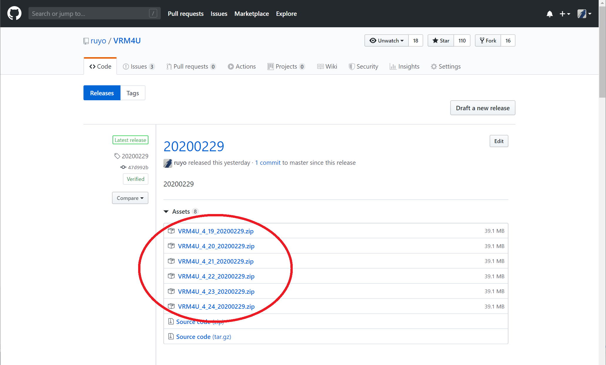
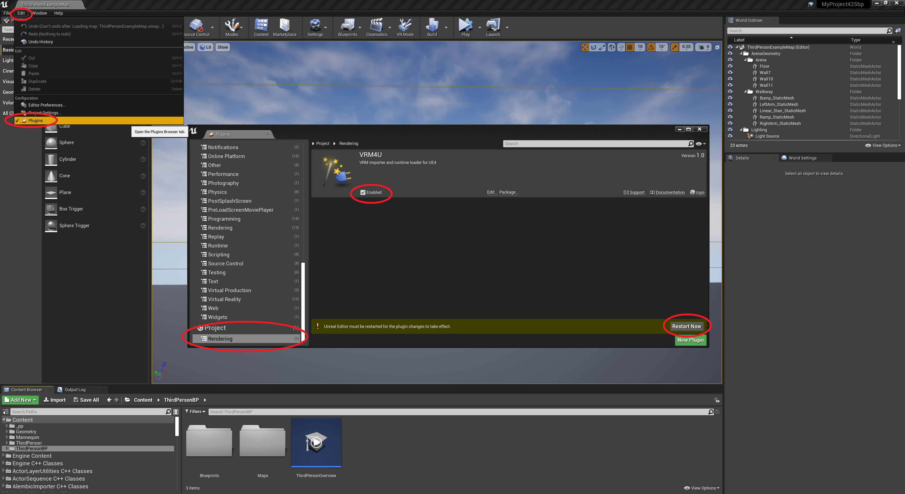

## 正しくVRMを動作させるための手順

3段階の手順があります。

- プラグインの導入＆モデルインポート
- 輪郭線、セルフシャドウの適用
  - MToonAttachActorを利用します
- 揺れ骨の適用
  - VRMSpringBoneを利用します。**初期状態では粗く再現されています**

正しくセットアップして、UE4でかわいく動作させましょう。

----
## プラグインセットアップ
こちらのリンクより、

[https://github.com/ruyo/VRM4U](https://github.com/ruyo/VRM4U)

||
|-|
|[](../assets/images/010_top.png)|


最新版から自分の利用するUE4バージョンに合ったものをダウンロードし、

||
|-|
|[](../assets/images/010_release.png)|

Pluginsに配置します。
例えばUE4のプロジェクト名が「MyGame」である場合は、
以下のようにファイルを配置してください。


```
-MyGame
  -MyGame.uproject
  -Config
  -Content
  -Plugins
    -VRM4U
      -VRM4U.uplugin
      - :
```

プラグインウィンドウにVRM4Uが表示されたら完了です。

||
|-|
|[](../assets/images/010_plugin.png)|

----
## VRMモデルをインポートする

拡張子「.vrm」のファイルを、コンテンツブラウザにDrag&Dropしてください。

オプションウインドウが出ます。そのままimportをクリックしてください。

||
|-|
|[](../assets/images/010_import.png)|

インポート完了です。

**まだ完全な見た目にはなりません。 次の章を参照ください。**
{: .notice--info}

||
|-|
|[](../assets/images/010_result.png)|

