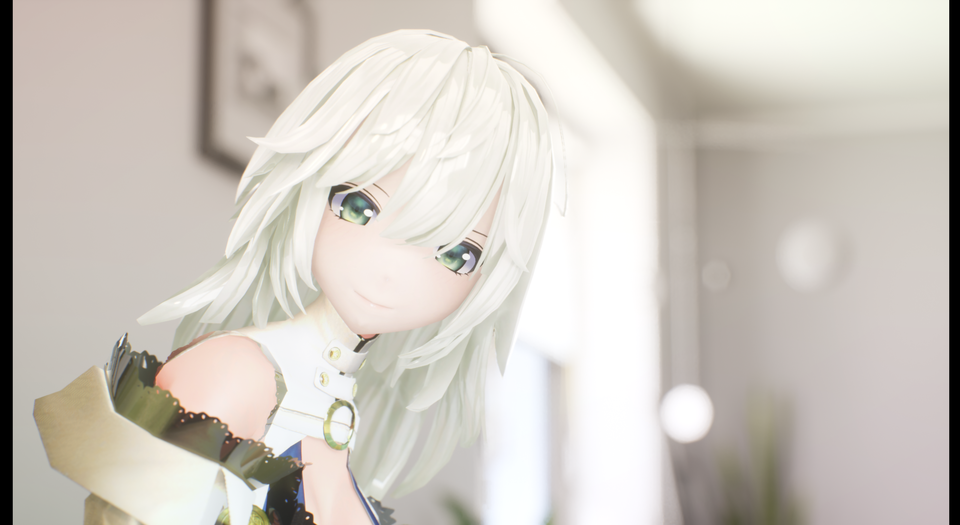
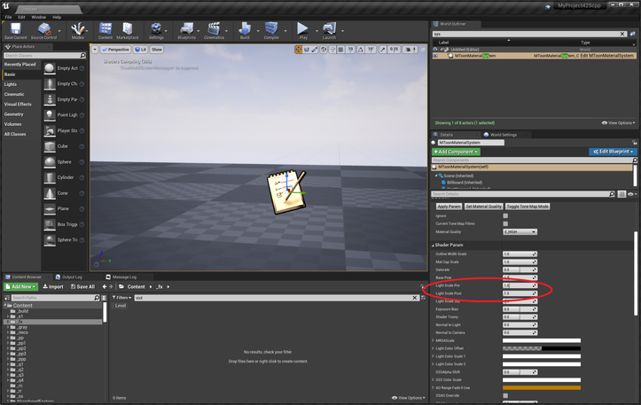
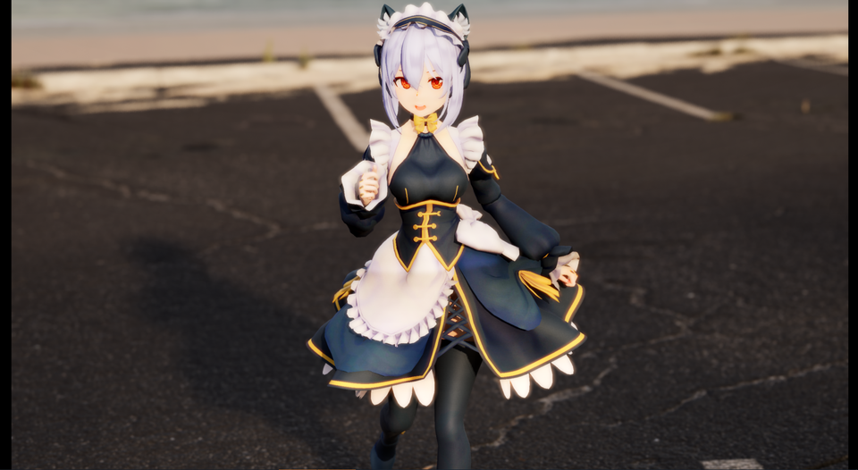

||
|-|
||
|モデル：[FORTUNA](https://booth.pm/ja/items/1590375) MToonLitモード|
|背景：ArchVizInterior (照明1000lux)|

----
## 概要

UEのライト環境は多種多様であり、キャラクタが極端に「明るく/暗く」「薄く/濃く」描画されることがあります。それらの補正方法を紹介します。

----
## 先に要点

MaterialSystemより、`PreLightScale` と `PostLightScale` を組合せて補正します。

||
|-|
||

- Litマテリアルの補正
  - VRM4UのLitマテリアルは、主光源が3.14 luxの時に原色に近い色が出ます。
  この明るさから離れるほど色の再現度が低くなります。
- SSSマテリアルの補正
  - ほぼ不要です。ただToon素材の色合いによっては違和感が残ります。好みに応じて微調整ください。

## 補正の目安
補正はマテリアル側で行います。ライト側は変更しません。
以下のように補正します。

|主光源の明るさ|補正方法|典型的なシーン||
|:-|:-|:-|-|
|1～3.14 lux|Preを上げてPostを下げる|新規作成TimeOfDayテンプレート|
|3.14 lux|補正必要なし|新規作成Defaultテンプレート|
|3.14～10,000 lux 以上|Preを下げてPostを上げる|現実のライトや太陽光を再現した環境|

||
|-|
||
|モデル：[NecoMaid PREMIUM](https://booth.pm/ja/items/2147201) SSSモード|
|背景：Automotive Beach Scene (照明11lux)|

----
## 補正の詳しい話

### Litマテリアルの補正
VRM4UではFilmicTonemapperを逆変換しています。逆変換処理には、ライト強度とExposureを利用します。PreとPostが、それぞれの補正に対応しています。

### SSSマテリアルの補正
ライトに対する補正は不要ですが、モデルの材質・見た目に合わせる調整は必要です。

私の経験則としては、鮮やかなToon素材にSSSを適用すると彩度が下がりやすいです。
対応としてMaterialSystemには彩度やテクスチャガンマ補正機能がありますので、合わせて利用ください。

`PostLightScale`に初期値として0.5を利用しています。これは原色テクスチャをAlbedoとして違和感なく利用するための補正値です。大抵うまく動きますが、適宜調整して構いません。

