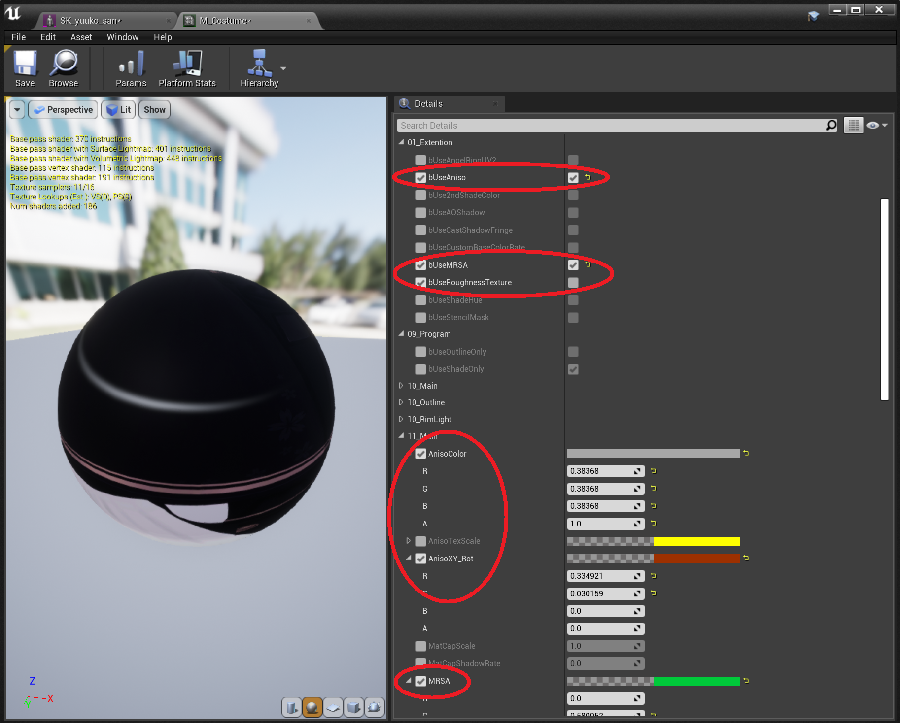
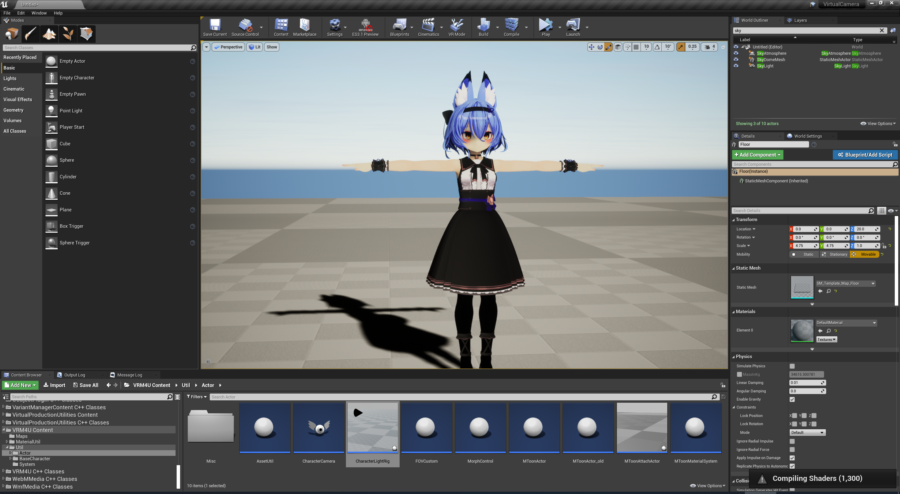
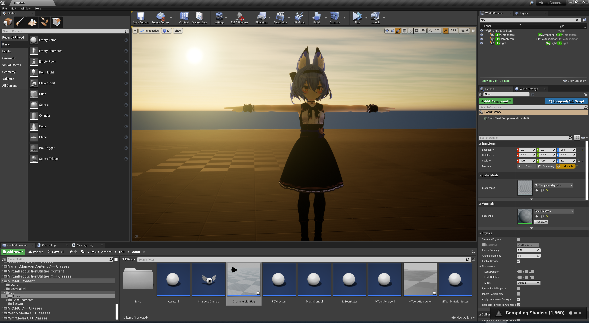
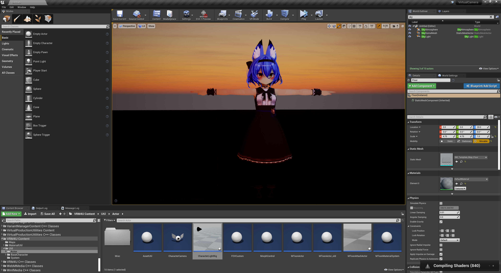

||
|-|
||
|モデル：[幽狐族のお姉様](https://booth.pm/ja/items/1484117) （fbx -> VRM変換）|
|アニメーション：[ミライ小町](https://www.bandainamcostudios.com/works/miraikomachi/dlcguideline.html)（fbx -> humanoidリターゲット）|

----
## 概要

UE4の大きな特徴の一つであるPBR（物理ベースレンダリング/PhysicallyBasedRendering）によるリアリスティックな背景に、Toonのキャラクタを配置する方法を探ります。

ライトが影響する効果（ハイライトやリムライト、AOやSSS）を追加すると良く馴染む傾向があるようです。

シーンによって調整方法が大きく異なります。

----
## 有用なパラメータ

PBR用のパラメータを有効化できます。Toon本来の雰囲気が損なわれない範囲で適用されます。

手動の調整が必要です。厳密にはUE4のPBRに則っていないためです。

|異方性反射、ラフネス（衣服）|サブサーフェス（髪、肌）|
|-|-|
|||

----
## ライティング

主光源に追従します。最低限1つのDirectionalLightが必要です。
SkyLightにも追従します。

ライト環境によって色味が大きく変わります。イメージとずれてしまう場合は`MToonMaterialSystem`で補正できます。
DirectionalLight/SkyLightの影響度合いや、テクスチャのガンマ補正が可能です。

下図はライト環境のみを変更したものです。モデルの描画パラメータは同一ですが、大きく見え方が変わっています。

|順光|逆光|暗め（ほぼSkyLight影響のみ）|
|-|-|-|
||||

----
## ポストプロセス

`ColorGrading`を調整しましょう。`WhiteBalance`だけでも大きな効果があります。

雰囲気に合わせてLens効果を加えたら完成です。キャラクタカメラで撮影しましょう。

|標準|色調整、レンス効果追加|
|-|-|
|||

----
## PBRとToon/セルシェーディング

ここまでToonのデータに情報付加し、PBRに馴染ませる手法を紹介しました。

パラメータを変更することで、様々な可能性が見えてくると思います。
ぜひ素敵な解決方法を探してみてください！

VRMが本来表現できる見た目とは大きくかけ離れています。
当然ながら、一番良いアプローチは「表現したい内容に応じて専用データを用意する」ことでしょう。
{: .notice--info}
