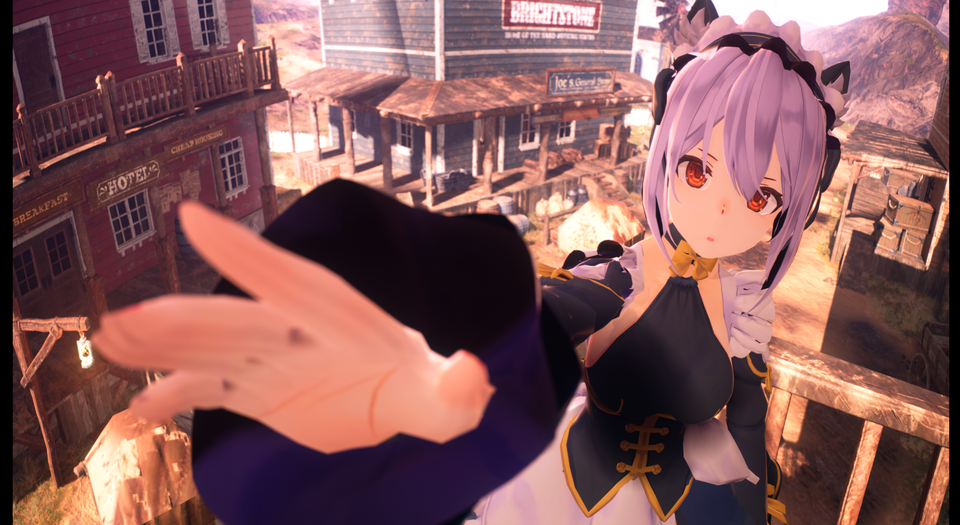
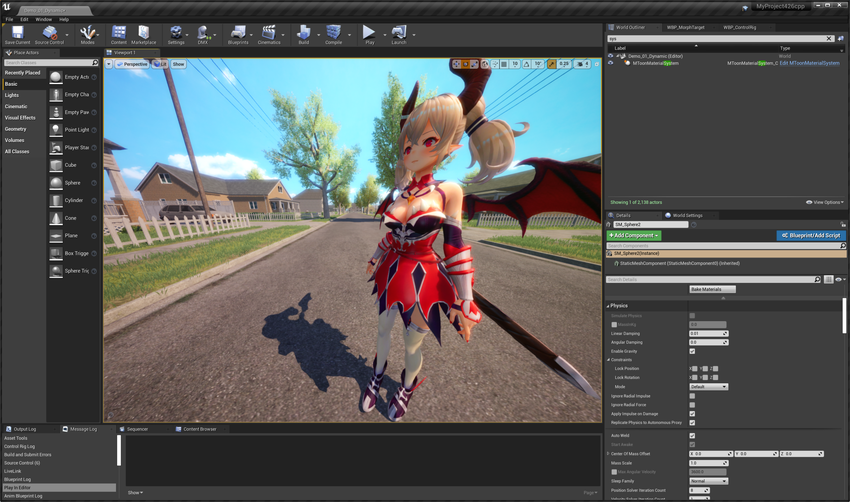
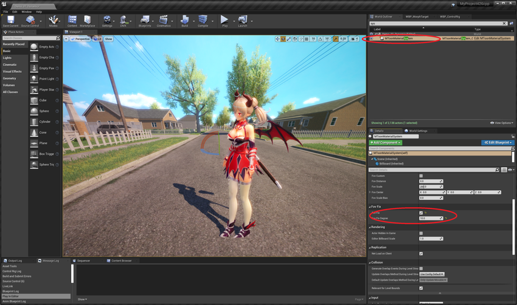
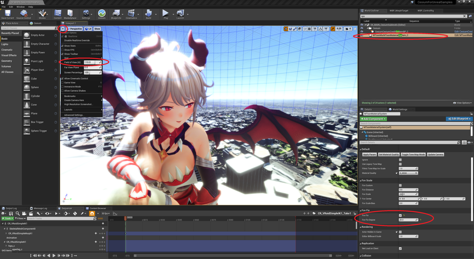
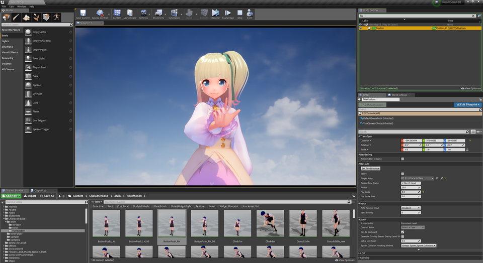
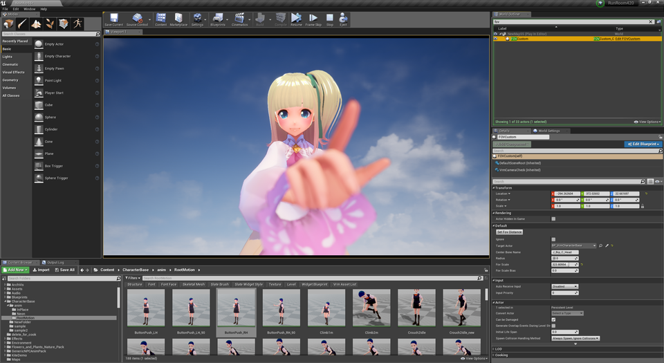
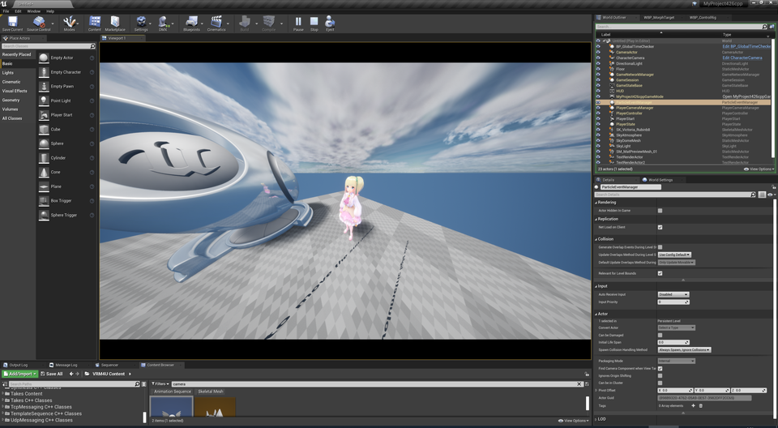
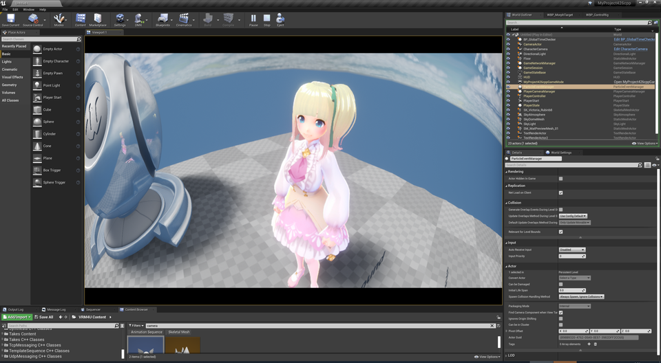
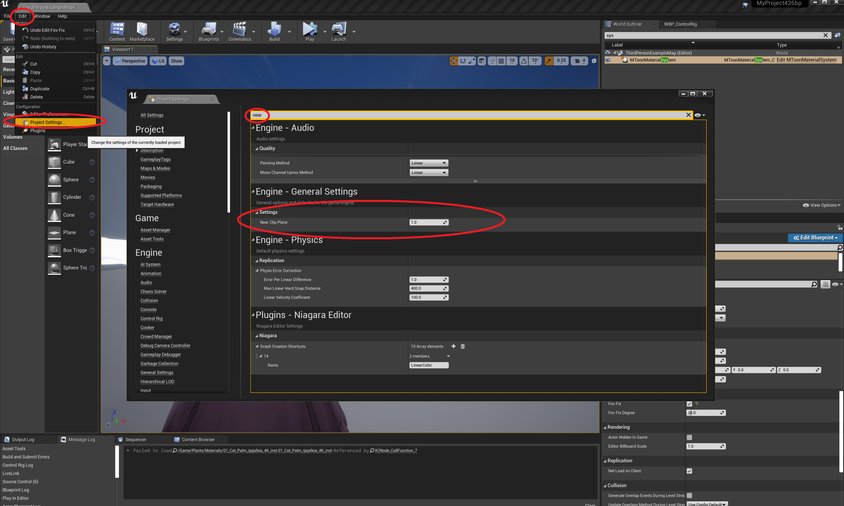

||
|-|
||
|モデル：[NecoMaid PREMIUM](https://sonovr.booth.pm/items/2147201)|

----
## 迫力ある絵を撮りたい

少々扱いにくい機能です。工夫してお使いください。
{: .notice--info}

3つの機能があります。

|効果|解説|使いやすさ|
|-|-|-|
|キャラパース固定|キャラ描画のパースを固定します 広角でもキャラが歪まず、背景を広く映せます|○|
|嘘パース|キャラ描画のパースを、カメラ距離に応じて変更します 近いものがより大きく見え、迫力ある絵になります|△|
|魚眼レンズ|中央を拡大し、樽型に歪ませます 魚眼レンズを利用したような大きく歪んだ絵になります|○|

----

## キャラパース固定

サンプルマップ `VRM4U_FOVFIX.umap` を参照ください。

`MToonMaterialSystem`を配置して、`FovFix` をONにすれば完了です。
キャラクタは常に`FovFixDegree`の画角で描画されます。

|標準|パース固定ON|
|-|-|
|||

画角の変更には、「エディタ上の画角変更」または「CharacterCameraでのUniversalZoom」を利用すると便利です。

PlayIn中にカメラ操作したい場合は[VRM4Uのカメラをご利用ください](../02_shortcut2/)

|エディタプレビューでの画角変更|
|-|
|||
|モデル：[【オリジナル3Dモデル】ドラゴニュート・シェンナ](https://booth.pm/ja/items/2661189)|

キャラクタの足先を背景位置と合わせています。キャラクタがアニメーション等で移動する場合、位置がずれることがあります。またライトの向きも変化します
{: .notice--info}

----

## 嘘パース

サンプルマップ `VRM4U_FOV.umap` を参照ください。

`FOVCustom`を配置して`TargetActor`に対象のモデルをセットします。

`FOVCustom` を中心にして、ある距離より離れた箇所がスケールされます。`DistanceFromCamera`で距離を、`FovScale` でスケール値を制御できます。

オプションとして、`CenterBoneName` でアタッチする骨の名前を指定できます。無視しても問題ありません。

|標準|パース補正ON|
|-|-|
|||

----

## 魚眼レンズ
CharacterCameraを配置し`UniversalZoom`をONにして画角制限を解除します。
PlayIn後、`Z/Cキー`で画角を調整し、`T/Yキー`で魚眼処理(Paniniプロジェクション)を調整します。

[操作は前述のカメラ説明を参照ください](../02_shortcut2/)

|標準|魚眼効果ON(Paniniプロジェクション)|
|-|-|
|||

描画負荷が上がるのでご注意ください。魚眼効果中は描画解像度がx2されます。

詳しい動作は こちらの公式ドキュメントを参照ください。
https://docs.unrealengine.com/ja/RenderingAndGraphics/PostProcessEffects/PaniniProjection/index.html

VRデバイスが接続されていると、魚眼効果が無効化されることがあります。その場合はデバイスを切断 or VRプラグインを無効化してご利用ください。
{: .notice--info}

----

## 補足：モデルが欠ける対処（Nearクリップの変更）

キャラに接近しすぎると、モデルが欠けることがあります。その場合は Nearクリップを`1`に変更することをオススメします。

UE4の初期Nearクリップは`10`で、この設定ではキャラに10cm未満に近づくと 描画が欠けます。
問題ある場合は とりあえず`1`にすればOKと思います。構図に応じて変更ください。

|Nearクリップの変更。要エディタ再起動|
|-|
|||

パース補正を利用すると、キャラクタの見た目と実際の距離に大きな差異が出ます。十分に設定を確認しましょう。
{: .notice--info}
