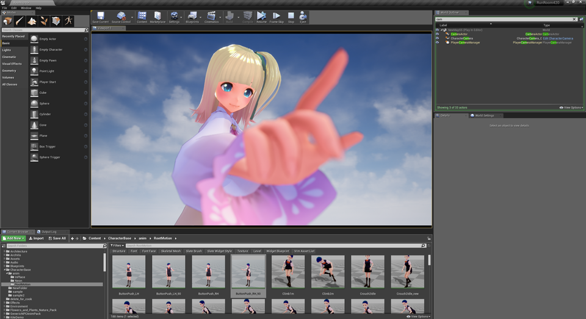

||
|-|
||
|モデル：[ヴィクトリア・ルービン](https://hub.vroid.com/characters/2792872861023597723/models/5013769147837660446)|

----
## 迫力ある絵を撮りたい

扱いにくいです。実験的な実装です。
{: .notice--info}

近いものがより大きく見えるよう変形します。画角が変わったように見えます。

## 嘘パースの使い方

`FOVCustom`を配置して`TargetActor`に対象のモデルをセットします。

`CenterBoneName`に頭骨の名前、`Radius`に頭の大きさを入れます。この範囲より手間側が変形します。

`FovScale`で変形します。変形に緩急付けたい場合は`FovScaleBias`を指定します。

|標準|パース補正ON|
|-|-|
|||

----
