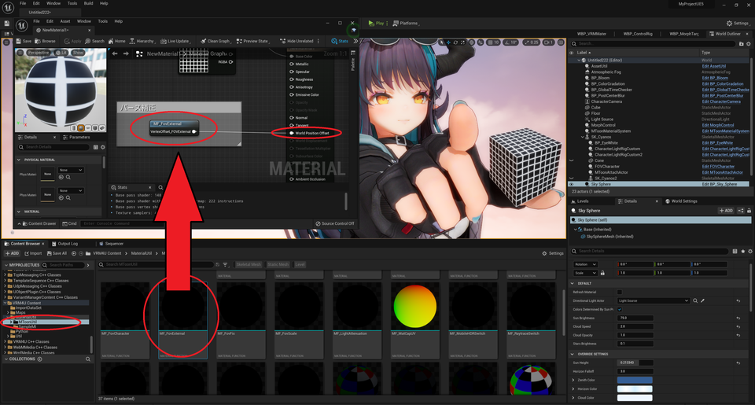

||
|-|
||
|モデル：[NecoMaid PREMIUM](https://sonovr.booth.pm/items/2147201)|

----
## 迫力ある絵を撮りたい

少々扱いにくい機能です。ご利用の際は工夫してお使いください。
{: .notice--info}

4つの機能があります。

|効果|解説|使いやすさ|
|-|-|:-:|
|キャラパース固定|キャラ描画のパースを固定します 広角でもキャラが歪まず、背景を広く映せます|○|
|嘘パース 新板|キャラ描画のパースを、カメラ距離に応じて変更します 近いものがより大きく見え、迫力ある絵になります|○|
|嘘パース 旧版|機能は同上ですが、パラメータがわかりにくいです。|△|
|魚眼レンズ|中央を拡大し、樽型に歪ませます 魚眼レンズを利用したような大きく歪んだ絵になります|◎|

----

## キャラパース固定

### 利用方法 基本編

サンプルマップ `VRM4U_FOVFIX.umap` を参照ください。

`MToonMaterialSystem`を配置して、`FovFix` をONにすれば完了です。
キャラクタは常に`FovFixDegree`の画角で描画されます。

|標準|パース固定ON(キャラ10度、背景130度)|
|-|-|
|||

画角の変更には、「エディタ上の画角変更」または「CharacterCameraでのUniversalZoom」を利用すると便利です。

PlayIn中にカメラ操作したい場合は[VRM4Uのカメラをご利用ください](../02_shortcut2/)

|エディタプレビューでの画角変更|
|-|
|||
|モデル：[【オリジナル3Dモデル】ドラゴニュート・シェンナ](https://booth.pm/ja/items/2661189)|

キャラクタの足先を背景位置と合わせています。キャラクタがアニメーション等で移動する場合、位置がずれることがあります。またライトの向きも変化します
{: .notice--info}

### 利用方法 応用編

シーケンサーと併用する場合は、以下の順に操作してください。

1. パース固定を`マテリアル調整ウインドウ`から設定します。
シーンに`BP_GlobalTimeChecker`というActorが生成されます。

2. アウトライナからActorを選択し、編集画面より`Compile`を押します。

完了です。以降、シーケンサー編集モードやPlayIn中も、パース固定機能が動作します。

|調整ウインドウで設定|TimeCheckerを再コンパイル|
|-|-|
|||

----

## 嘘パース

サンプルマップ `VRM4U_FOVCharacter.umap` を参照ください。
（UE4でも動作します。解説はUE5を利用しています）

|標準|パース補正ON|
|-|-|
|||
|モデル：[【オリジナル3Dモデル】　ドラゴニュート・シアノス](https://booth.pm/ja/items/3224415)||

主要なパラメータは3つで、変形開始位置・終了位置と、変形スケールです。

Debug表示設定により、パース変更範囲が表示されます。カメラからの距離に応じて、パースが変化します。

||
|-|
||

### 利用方法

1. 撮影対象を`FarPlaneByActor`で指定し、`PlaneOffset` で変形開始位置を指定する

2. パースを変形したい中心(モデルの先端)に、FOVCharacter を移動させる。もしくは モデルの骨にアタッチする。ここが変形終了位置となる。

3. `Pow`, `Scale` でスケールを調整する。

### 詳細

|項目|機能解説|デバッグ表示|
|-|-|-|
|FarPlaneByActor &  PlaneOffset|パースが変わる範囲を指定します。|座標はキューブ表示、範囲は紫の面で表示|
|UseActorLocationForscale|パース変化の中心を指定します。OFFだと画面中心です。 直線を曲げたくない場合はOFFで利用ください。|紫の球で表示|
|Pow & Scale Param|Scaleぶんモデルが大きくなります。Powで距離による変化量がかわります|-|
|UseScaleLimit|パース変形量の上限を Scale指定値までに制限します|-|
|UseCameraDirectionScaleLimit|カメラ位置に応じて、Scaleを制限します。 モデルが破綻しませんが、パース変化範囲が狭くなります。|-|

### 利用方法 応用編

VRM4U以外のマテリアルを併用する際は、以下のノードを利用ください。

|標準|パース補正ON。キューブはそのまま|キューブに変形ノード適用|
|-|-|-|
||||

|MF_FovExternal を WorldPositionOffset に繋ぐ ドラッグ&ドロップで配置ください|
|-|
||

## 嘘パース（旧バージョン）

`FOVCharacter` の利用をオススメします。こちらは制御しにくいです。
{: .notice--info}

サンプルマップ `VRM4U_FOV.umap` を参照ください。

`FOVCustom`を配置して`TargetActor`に対象のモデルをセットします。

`FOVCustom` を中心にして、ある距離より離れた箇所がスケールされます。`DistanceFromCamera`で距離を、`FovScale` でスケール値を制御できます。

オプションとして、`CenterBoneName` でアタッチする骨の名前を指定できます。無視しても問題ありません。

|標準|パース補正ON|
|-|-|
|||

----

## 魚眼レンズ
CharacterCameraを配置し`UniversalZoom`をONにして画角制限を解除します。
PlayIn後、`Z/Cキー`で画角を調整し、`T/Yキー`で魚眼処理(Paniniプロジェクション)を調整します。

[操作は前述のカメラ説明を参照ください](../02_shortcut2/)

|標準|魚眼効果ON(Paniniプロジェクション)|
|-|-|
|||

描画負荷が上がるのでご注意ください。魚眼効果中は描画解像度がx2されます。

詳しい動作は [こちらの公式ドキュメント](https://docs.unrealengine.com/ja/RenderingAndGraphics/PostProcessEffects/PaniniProjection/index.html)を参照ください。

VRデバイスが接続されていると、魚眼効果が無効化されることがあります。その場合はデバイスを切断 or VRプラグインを無効化してご利用ください。
{: .notice--info}

----

## 補足：モデルが欠ける対処（Nearクリップの変更）

キャラクタに接近しすぎると、モデルが欠けることがあります。その場合は Nearクリップを`1`に変更することをオススメします。

UE4の初期Nearクリップは`10`で、この設定ではキャラクタに10cm未満に近づくと 描画が欠けます。
構図に応じて変更ください。とりあえず`1`にすれば大抵は問題ありません。

パース補正を利用すると、キャラクタの見た目と実際の距離に大きな差異が出ます。十分に設定を確認ください。
{: .notice--info}

|Nearクリップの変更。要エディタ再起動|
|-|
|||

