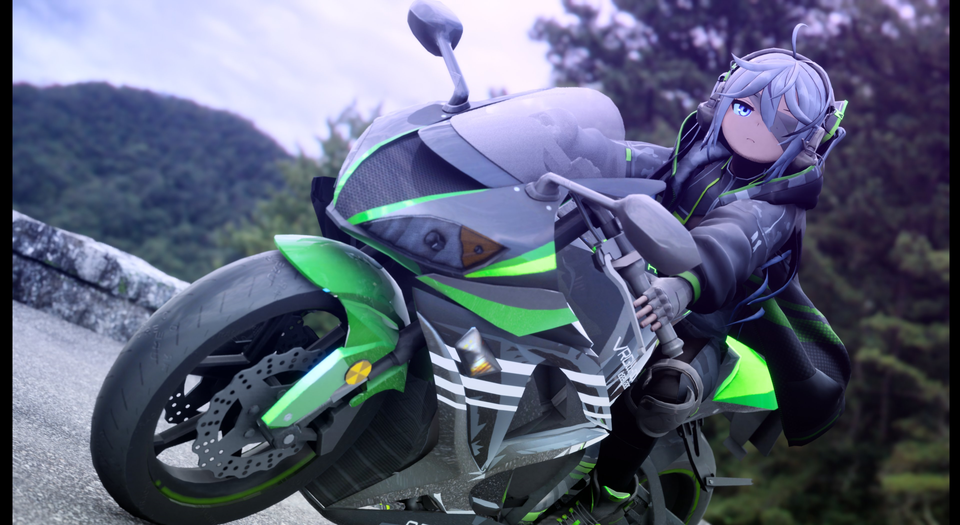
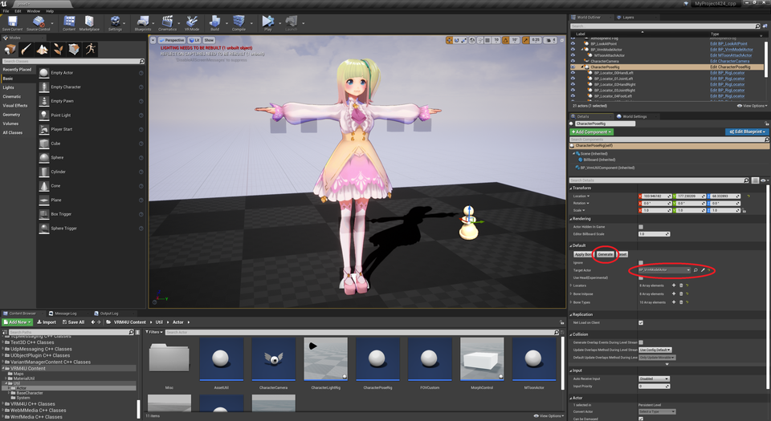
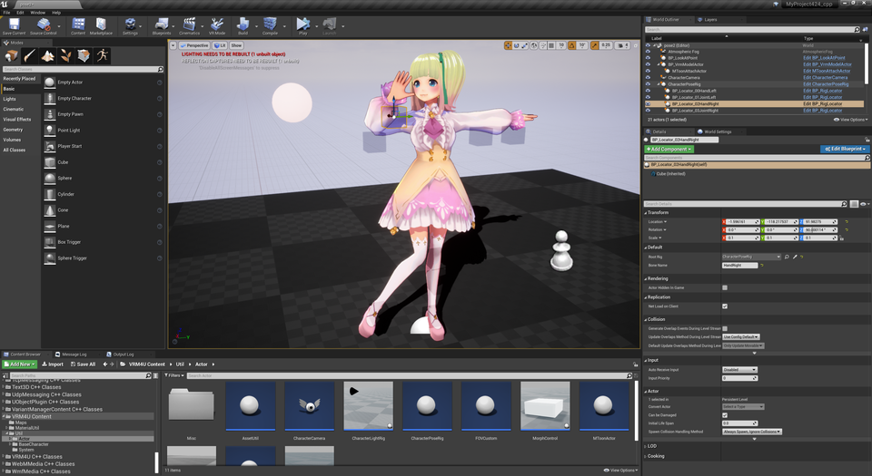
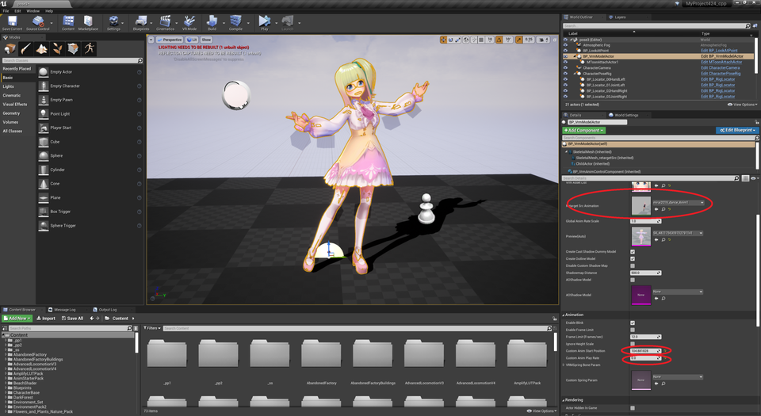
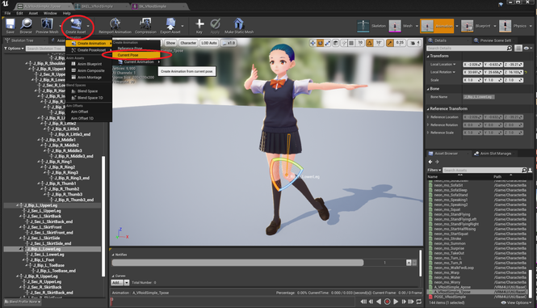

||
|-|
||
|モデル：[アルグレイ](https://booth.pm/ja/items/1935911)（fbx -> VRM変換）|
|アニメーション：T-poseからアセット生成+rig調整|
----
## 概要

VRM4Uが提供するのは微調整のツールです。複雑な制御は難しいです。
座標がずれる不具合があります。（上体の補正、アタッチなど）
{: .notice--info}

基準ポーズを元に、ツールで微調整する機能です。

基準ポーズが無い場合は、エディタ上で作成したり、既存アニメーションの特定フレームを切り出すことができます。

----
## ポーズを調整する

`CharacterPoseRig`を配置して、`TargetActor`に対象のモデルをセットします。

`Generate`を押すと手足にロケータが生成されます。マウスで選択し、移動・回転するとモデルが追従します。

モデルやポーズを入れ替えると一時的にRigが無効になります。`ApplyBone`を押すと再度適用されます。

|||
|-|-|
|||

エディタ詳しい方向け：Generateボタンを押下するとAllowTranslucentSelectionが有効化されます。ロケータを選択可能にするためです。無効化にはSettingsアイコンから設定するか、ショートカットキー「T」でトグルしてください。
{: .notice--info}

### 上体、顔向きの調整

上体の調整自体は可能ですが、解決困難な不具合が残っています。
初期姿勢がずれたり、rigの生成位置がオフセットされることがあります。
{: .notice--info}

従来機能である`LookAt`と同時利用したり、`CharacterPoseRig`のEnableHeadをONにして強制的に動かすことができます。

----
## 基準ポーズを作成する

2通りの作り方があります。簡易な順に紹介します。

### 既存アニメーションから切り出す(簡易版)

`VRMCharacterModel`にアニメーションをセットし、CustomAnimStartPositionに切り出したい秒数、CustomAnimPlayRateを0にセット。

||
|-|
||

T-poseから直接rigで調整することも可能です。が、あまり自由度はありません。思うように操作できない場合は、下記手順のようにAnimSequenceを作成ください。

### 既存アニメーションから調整する(アセット版)

任意のアニメーションアセットのプレビュー画面より、任意のフレームで骨を調整する。
AnimSequenceとして切り出し、`VRMCharacterModel`にセット。

||
|-|
||

T-poseやA-poseからアセット作成し、調整することもできます。
