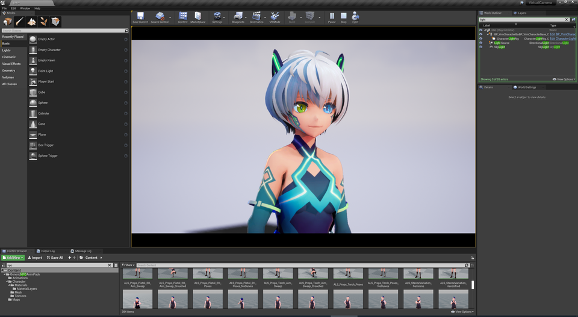
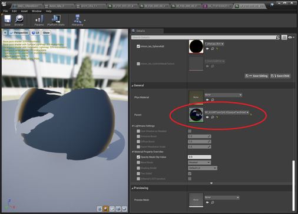
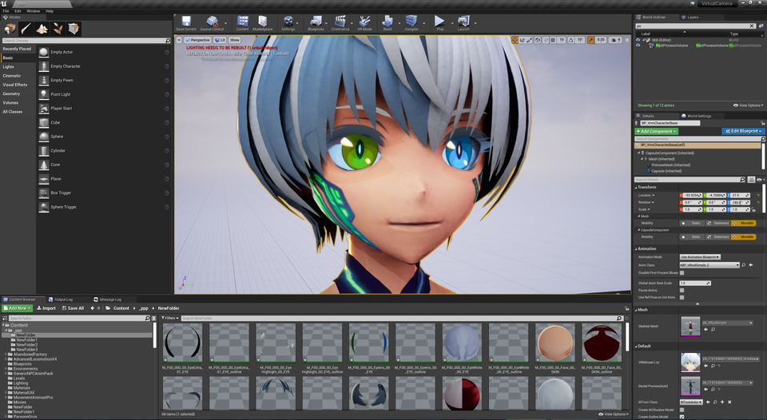
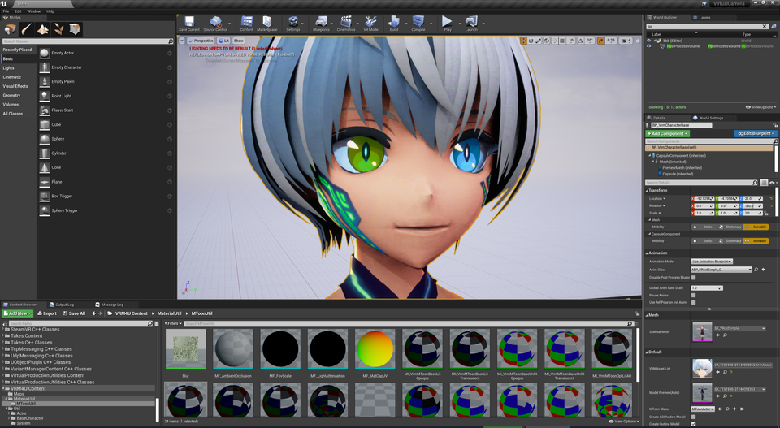
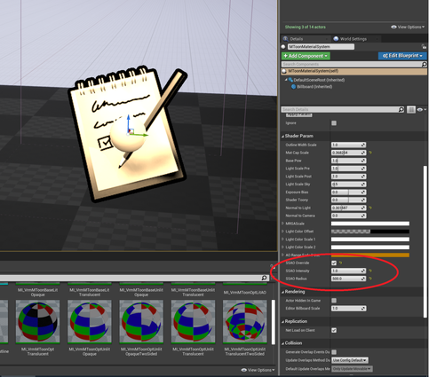
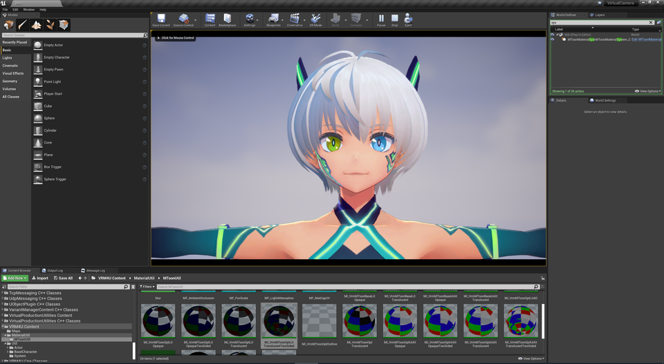
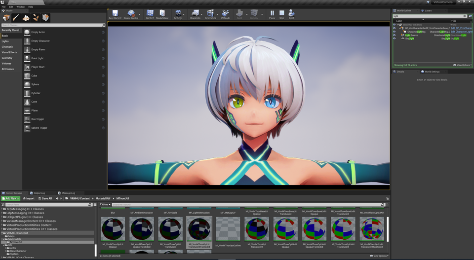
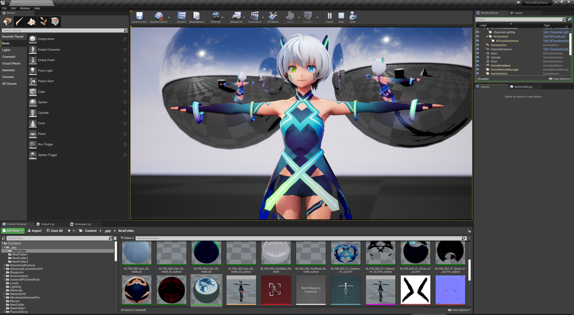

||
|-|
||
|モデル：[ヴィータ](https://hub.vroid.com/characters/6193066630030526355/models/3525604181073039892)|

----
## 特徴

VRM4Uにおいてレイトレースの効果的が一番わかりやすい箇所は、AmbientOcclusionです。その解説をします。

開発者の私自身も手探りでテストしています。他に効果的な使い方があるかもしれません。是非この機能を実験してみてください。

----
## UEのレイトレースを有効にする

[公式ドキュメント](https://docs.unrealengine.com/ja/Engine/Rendering/RayTracing/index.html)を参照してレイトレースを有効してください。

----
## 相性悪いマテリアルを置き換える

マテリアルの半透明/不透明の境界が見えてしまうため、不透明に置き換えます。

Parentの`MI_VrmMToonOptLitTranslucentTwoSided`を、`MI_VrmMToonOptLitOpaque`に変更します。

||
|-|
||

置き換えると以下のような見た目になります。目の周辺や瞼にある、明るさが不連続なエリアが改善されています。

|初期状態|眉毛やアイラインを不透明にする|
|-|-|
|||

----
## AmbientOcclusionを調整可能にする

`MToonMaterialSystem`によりAOパラメータを調整可能です。

||
|-|
||

AOと同時に、Normalなどを調整します。キャラライトも適用しましょう。

|AO OFF|AO ON|
|-|-|
|||

----
## リフレクションさせる

レイトレースの醍醐味の一つ、正確なリフレクションを見てみましょう。
モデルの近くに全反射のオブジェクトを配置します。

||
|-|
||

効果としては十分でしょう。厳密には写り込んだ側に輪郭線が無かったり、色味が少し異なります。

