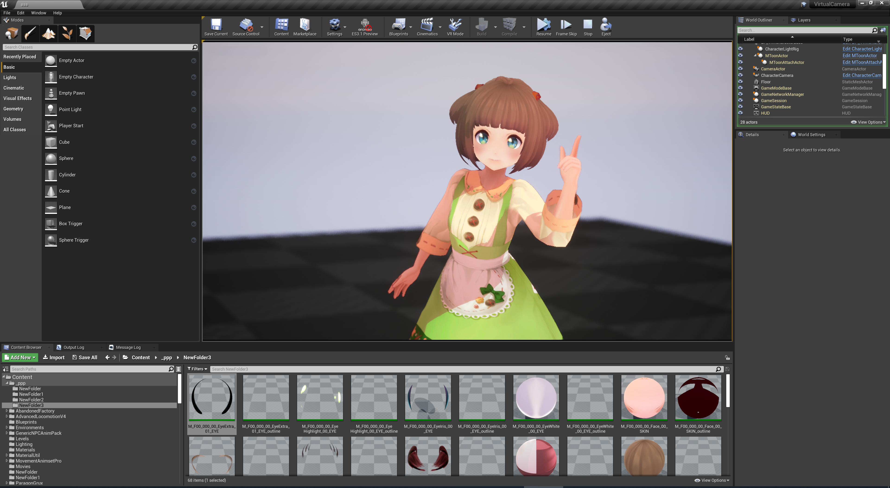
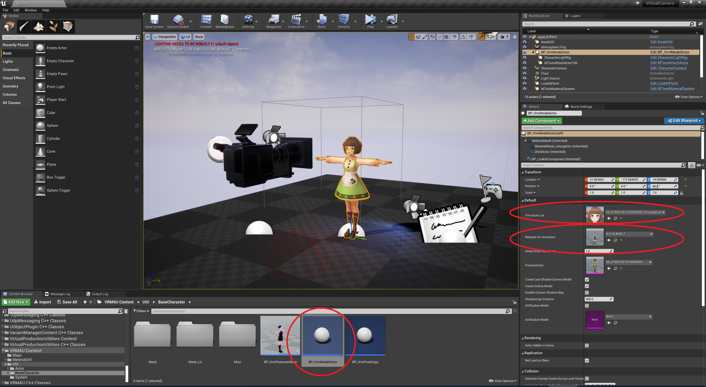
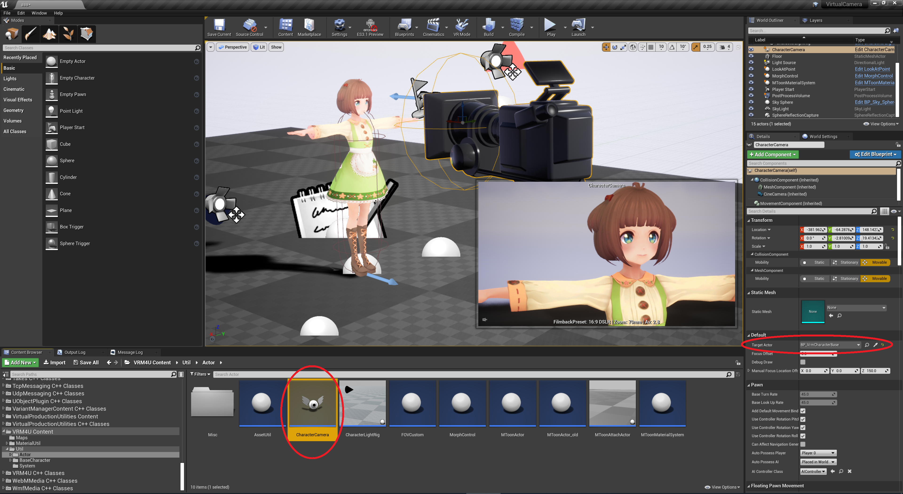
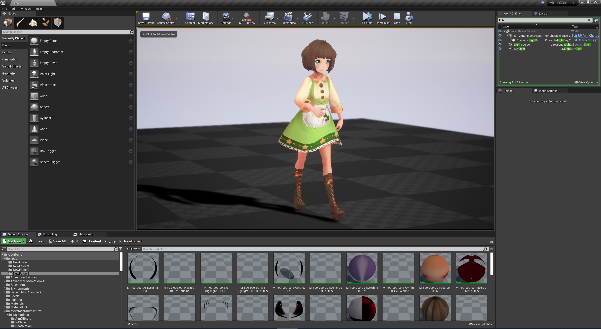
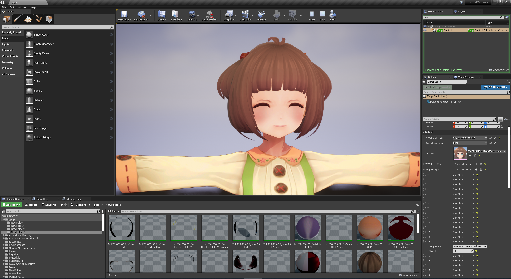

||
|-|
||
|モデル：[ビビ](https://hub.vroid.com/characters/945152946522067123/models/1622417912888236740)|

----

## 簡易キャラクタセットアップ

`BP_VrmCharacterBase`を配置します。
下図のように、`VrmAssetList`と`CustomAnimSequence`をセットします。

**ここで注意！ `CustomAnimSequence`にはVRoidSimpleモデルにリターゲットしたアニメーションをセットします！ このモデルはプラグインに同梱されています**

これでキャラクタセットアップは完了です。
基礎編で解説した輪郭線やシャドウ、揺れ骨が動作します。

キャラクタを変更したい場合は `VrmAssetList` を差し替えれば完了です。

||
|-|
||

----

## キャラクタ用カメラ

`CharacterCamera` を配置し `TargetActor` に対象のモデルをセットします。

Playすると、被写界深度が浅く 画角が狭いカメラがセットされます。
オートフォーカスでキャラ顔に焦点が合います。

極端な調整にしています。シーンに応じて適宜変更してください。

||
|-|
||

----
## キャラクタ用ライト

`CharacterLightRig` を配置し `TargetActor` に対象のモデルをセットします。

スポットライトが2つ設置されます。それぞれ正面の補助ライト、背面のバックライト になります。
バックライトはカメラに追従し、常にキャラクタの背面に回ります。

ライトはキャラにのみ影響します。LightChannelは2番を利用しています。

||
|-|
||

|キャラライトON|キャラライトOFF|
|-|-|
|||

----
## シェーディング調整

`MToonMaterialSystem` を利用することで、ライトや影色が馴染むよう調整できます。
基礎編で解説した通り、全体の明るさや色味も変更できます。

|項目|解説|
|-|-|
|`Shader Toony`|主/陰色のフェード域を変更します。MToonの機能です。|
|`Normal to Light`|モデル法線を主光源向きに曲げます。VRM4U拡張機能です。|
|`Normal to Camera`|モデル法線をカメラ向きに曲げます。VRM4U拡張機能です。|

下図に例を示します。

左は初期状態。

中央は`ShaderToony`で主/陰色の境界をハッキリさせました。

右は`NormalToLight`で陰が減っています。左袖の陰が狭くなっています。

スカートや右肩の影はセルフシャドウで、どのパターンでも残っています。

|左：標準、中央：ShaderToony=0.5、右：NormalToLight=0.2|
|-|
||

----
## 表情変更
`MorphControl` を配置し `TargetActor` に対象のモデルをセットします。

モーフ制御は2つ方法があります。

|方法|用途|
|-|-|
|VRMのMorphGroup制御|標準的な表情向け。|
|個別のMorphTarget制御|VRM定義外の特殊な表情むけ。「＞＜」(目が✕になるもの)や「照れ」など|

**Play中のみ反映されます！ エディタ作業中は動作しません**

||
|-|
||

