||
|-|
|[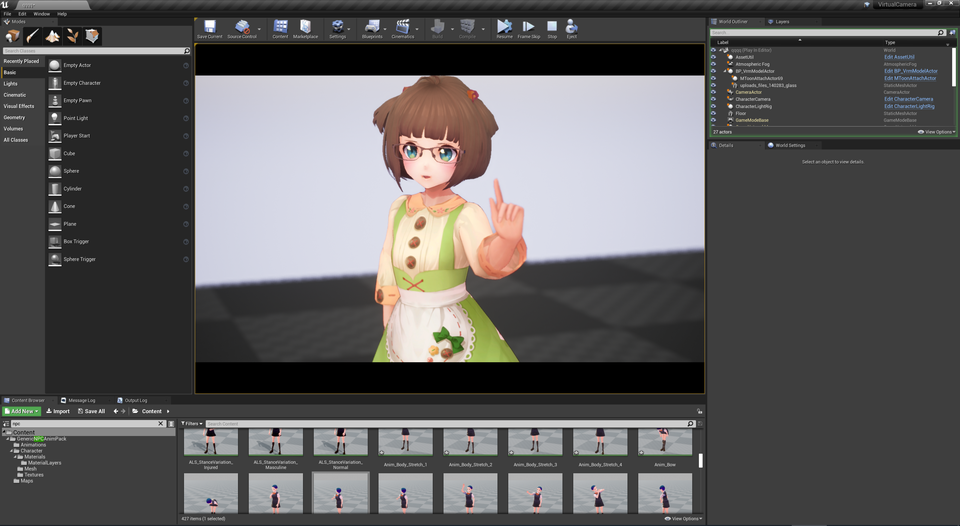](../assets/images/02a_top2.png)|
|モデル：[ビビ](https://hub.vroid.com/characters/945152946522067123/models/1622417912888236740)|

----

## とにかく可愛く撮影したい

撮影に特化した機能が多数あります。扱えるものは、顔・ボディアニメーション、カメラ、ライティング、視線追従 です。

この解説ではアニメーションについて、VRM4Uの`ランタイムリターゲット`機能を利用します。とりあえずVRM4Uを使ってみたい方は、この方法をオススメします。見た目や揺れ骨が自動適用されます。

UE4の標準的なセットアップを行う場合は、[前章のアニメーション](../01_animation/)や、[後述のControlRig](../06_controlrig/)を参照し、手動で設定ください。

----

## ランタイムリターゲット向け アニメーションの準備

利用したいアニメーションを `SKEL_VRoidSimple` にリターゲットします。
モデルが見つからない場合は表示オプションを確認ください。以下のようにセットします。

||
|-|
|[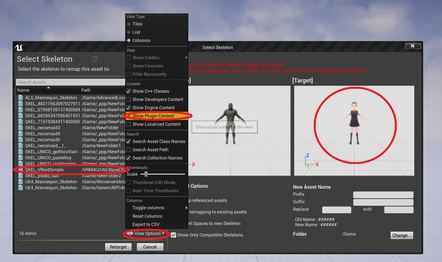](../assets/images/02a_retarget.png)|

**`SKEL_VRoidSimple` です！ 撮影対象のモデルではありません！ ランタイムリターゲットのための設定です。このアニメーションはすぐ次の解説で使います**
{: .notice--info}

このモデルにアニメーションが適用されていればOKです。

||
|-|
|[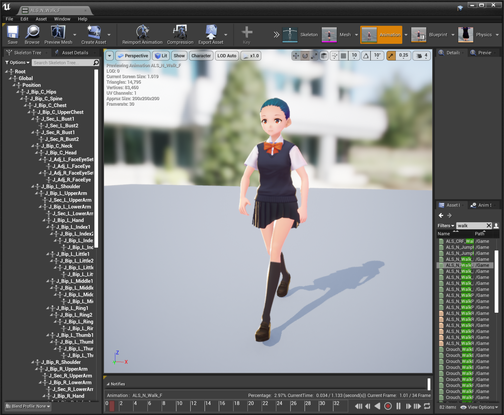](../assets/images/02a_retarget2.png)|

## ランタイムリターゲット向け 簡易キャラクタセットアップ

`BP_VrmModelActor`を配置します。
使いたいモデルを `VrmAssetList` に、使いたいアニメーション（さきほどリターゲットしたもの）を `RetargetSrcAnimation` にセットします。下図の赤丸の部分です。

||
|-|
||

これでキャラクタセットアップは完了です。
基礎編で解説した輪郭線やシャドウ、揺れ骨が動作します。
キャラクタを変更したい場合は `VrmAssetList` を差し替えれば完了です。

Playするとアニメーションが適用されます。

|Play中|
|-|
|[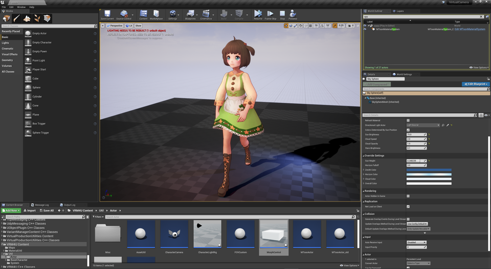](../assets/images/02a_play.png)|

----

## キャラクタ用カメラ

`CharacterCamera` を配置し `TargetActor` に対象のモデルをセットします。

Playすると、被写界深度が浅く 画角が狭いカメラがセットされます。
オートフォーカスでキャラ顔に焦点が合います。

キャラを手軽に可愛く撮影できるよう、初期値は超望遠に設定しています。シチュエーションに応じて`CineCameraActor`を設定してください。

||
|-|
||

----
## キャラクタ用ライト

`CharacterLightRig` を配置し `TargetActor` に対象のモデルをセットします。

スポットライトが2つ設置されます。それぞれ正面の補助ライト、背面のバックライト になります。
バックライトはカメラに追従し、常にキャラクタの背面に回ります。

ライトはキャラにのみ影響します。LightChannelは2番を利用しています。

||
|-|
|[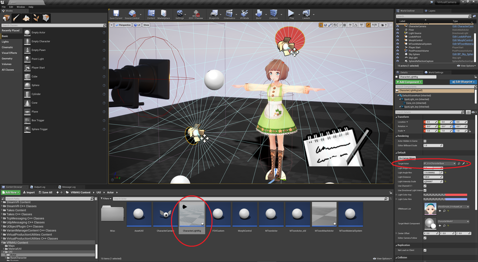](../assets/images/02a_s2.png)|

|キャラライトON|キャラライトOFF|
|-|-|
|[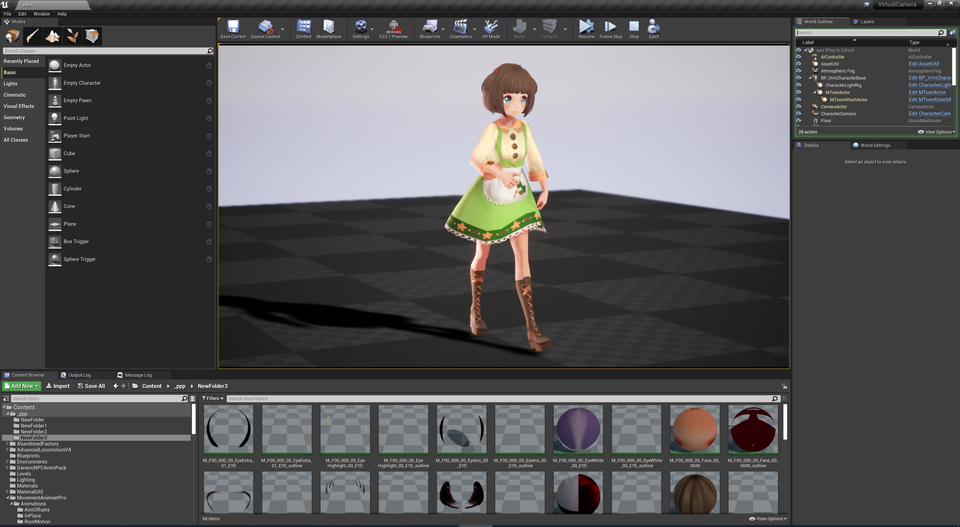](../assets/images/02a_s5.png)||

----
## シェーディング調整

`MToonMaterialSystem` を利用することで、ライトや影色が馴染むよう調整できます。
基礎編で解説した通り、全体の明るさや色味も変更できます。

|項目|解説|
|-|-|
|`Shader Toony`|主/陰色のフェード域を変更します。MToonの機能です。|
|`Normal to Light`|モデル法線を主光源向きに曲げます。VRM4U拡張機能です。|
|`Normal to Camera`|モデル法線をカメラ向きに曲げます。VRM4U拡張機能です。|

下図に例を示します。

左は初期状態。

中央は`ShaderToony`で主/陰色の境界をハッキリさせました。

右は`NormalToLight`で陰が減っています。左袖の陰が狭くなっています。

スカートや右肩の影はセルフシャドウで、どのパターンでも残っています。

|左：標準、中央：ShaderToony=0.5、右：NormalToLight=0.2|
|-|
|[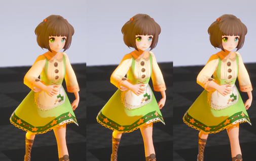](../assets/images/02a_s7.png)|

----
## 視線追従
`/VRM4U/Util/Actor/Misc/LookAtPoint` を配置し`TargetActor` に対象のモデルをセットします。

キャラクタが`LookAtPoint`を追うよう動きます。

|||
|-|-|
|[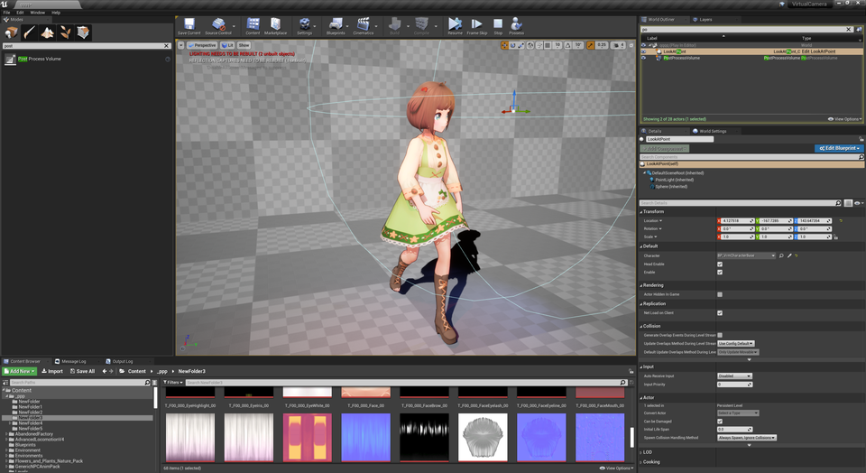](../assets/images/02a_look1.png)||

視線のみ動かすことも可能です。オプションを参照ください。

||
|-|
|[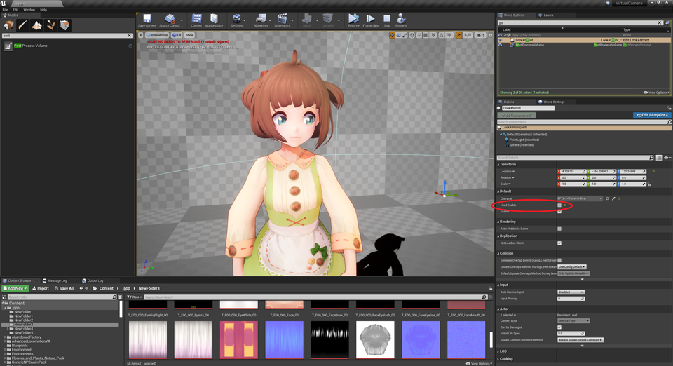](../assets/images/02a_look3.png)|

----
## 表情変更
`MorphControl` を配置し `TargetActor` に対象のモデルをセットします。
「台座+キャラクタモデル」のActorが作られます。これで表情を制御します。

|配置した状態。台座のみ|対象のモデルをスポイトで選択。台座+モデル|
|-|-|
|[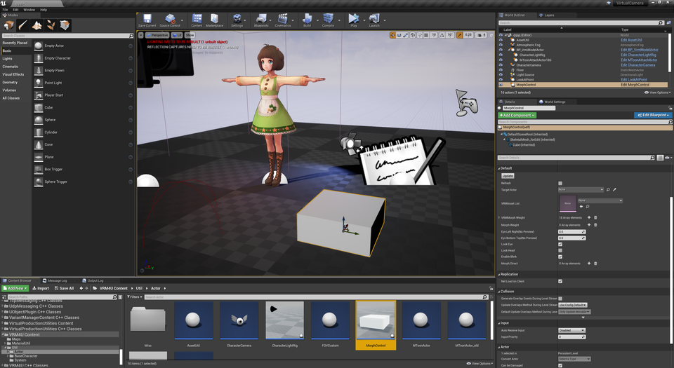](../assets/images/02a_morph1.png)|[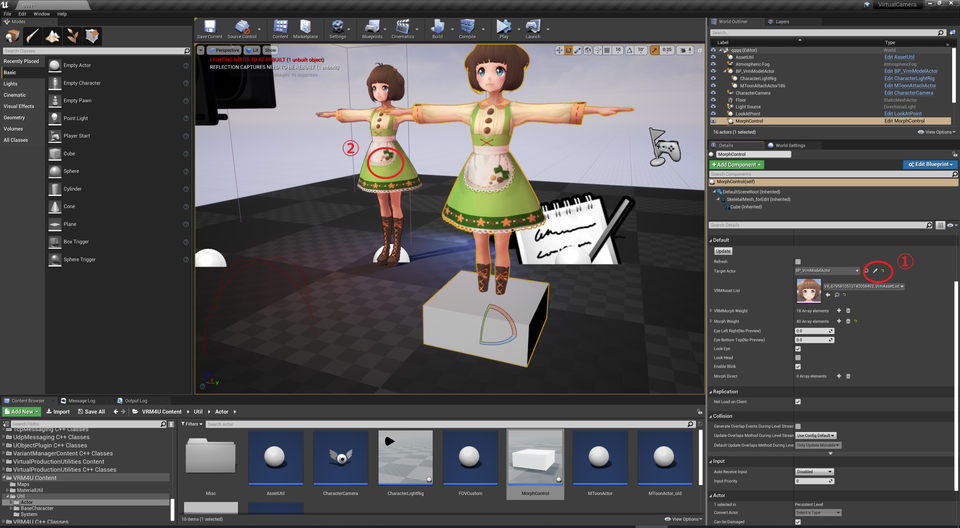](../assets/images/02a_morph2.png)|

`MorphControl`にMorphが一覧表示されます。適当にウェイトを変更してみましょう。コントローラの表情が変わります。

Playすると`TargetActor`に適用されます。コントローラは非表示になります。

|エディタでウェイト調整|Play中。コントローラは消える|
|-|-|
|[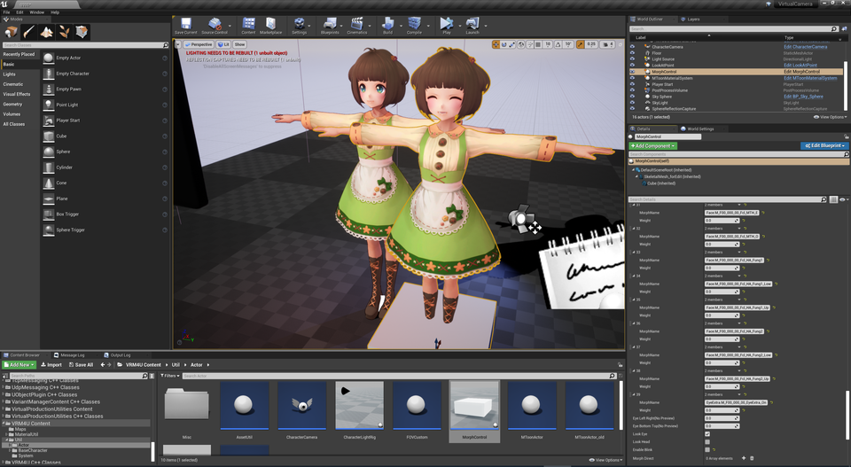](../assets/images/02a_morph3.png)|[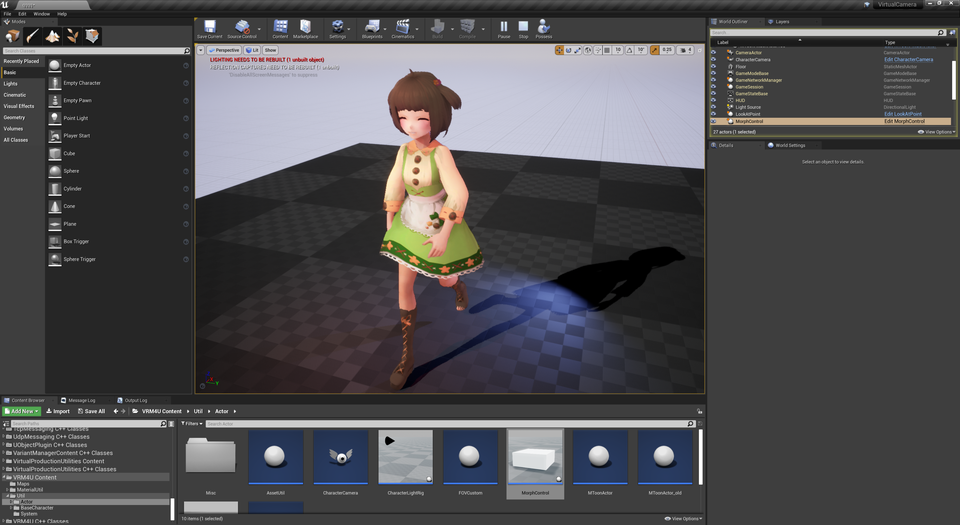](../assets/images/02a_morph4.png)|

リストは2つあり、制御方法が異なります。

|リスト項目|制御できる表情パターン|
|-|-|
|VRMMorphWeight|VRMに登録した表情|
|MorphWeight|全てのMorphパターン。「＞＜」(目が✕になるもの)や「照れ」など|

**まばたき中に不具合が出る場合は`EnableBlink`をOFFにしてください**
{: .notice--info}

||
|-|
|[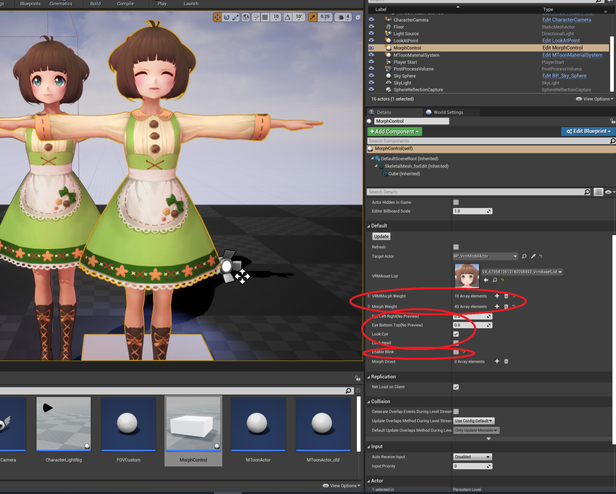](../assets/images/02a_moset.png)|

色々組み合わせて見ましょう。

||
|-|
|[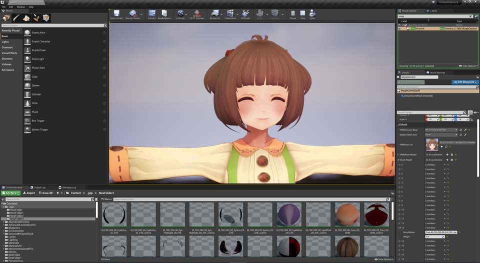](../assets/images/02a_s4.png)|

----
## 小物を追加する

2通りあります。

|||
|-|-|
|通常モード|特別な操作は不要。一時的なものでレベルロード時に座標がズレる|
|Attachモード|操作手順が増える。正しくアタッチできる|

### 通常版：小物を追加する

レベルに配置したモデルをキャラクタにアタッチします。
`BP_VrmModelActor` を利用していれば、アタッチ時に追従する骨を選択できます。

下図で取り付けたメガネは`J_Bip_C_Head`にアタッチしています。
モデルの設定は「Movable」「コリジョンなし」です。

||
|-|
|[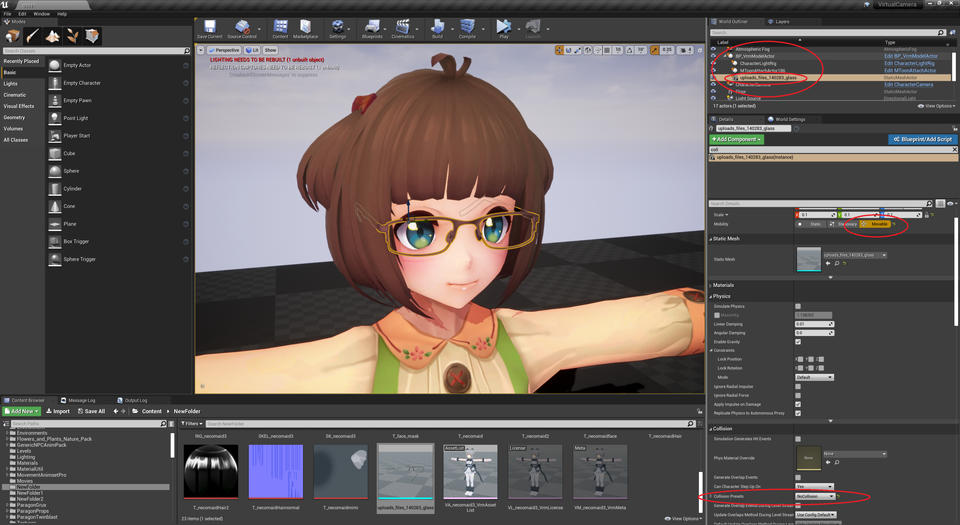](../assets/images/02a_prop.png)|

モデルによって骨や設定を変更してください。

### Attachモード：モードを切り替えて小物を追加する

キャラクタの表示モードを切り替えます。
`BP_VrmModelActor`より `To Attach Mode`をクリックします。
一時的にモデル表示が崩れますが、続いて`RefreshDummy`をクリックして更新します。（チェックボックスは自動でOFFになります）

切り替え後は画面右上のアウトライナ上にアクタが追加されます。
このアクタにモデルをアタッチしてください。

||
|-|
|[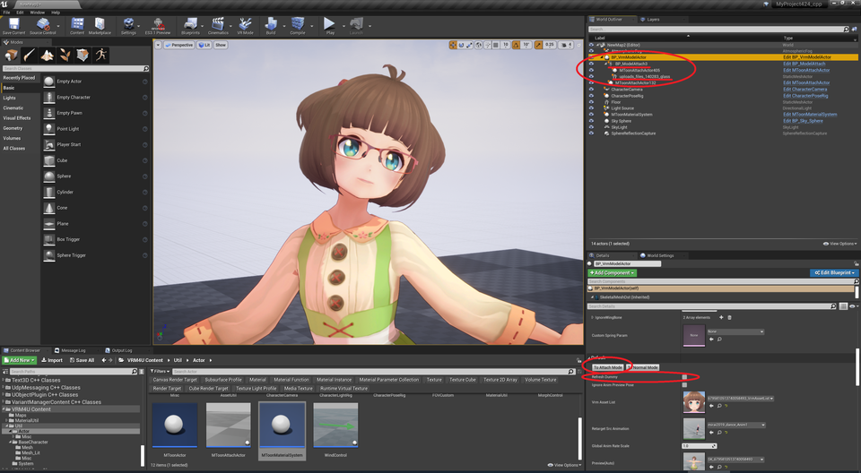](../assets/images/02a_attach.png)|

切り替え後は各種ターゲット設定（カメラ注視点やキャラライト中心点など）を再設定する必要があります。