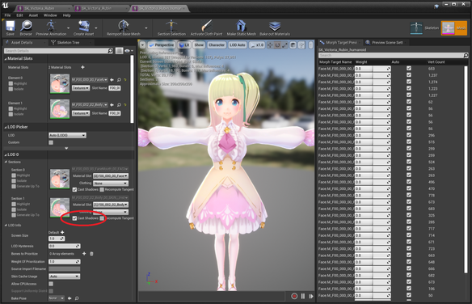
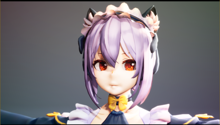
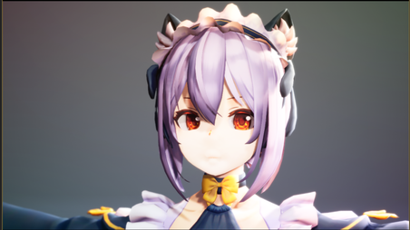
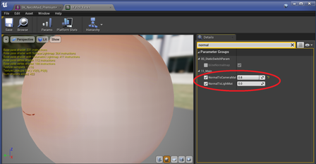
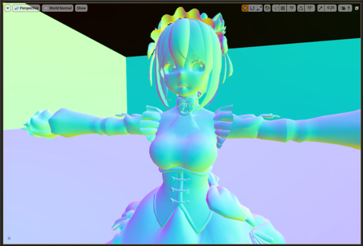
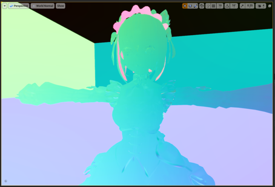
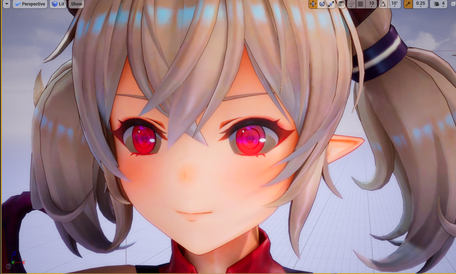
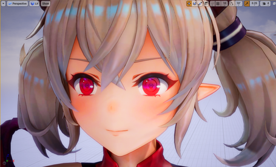
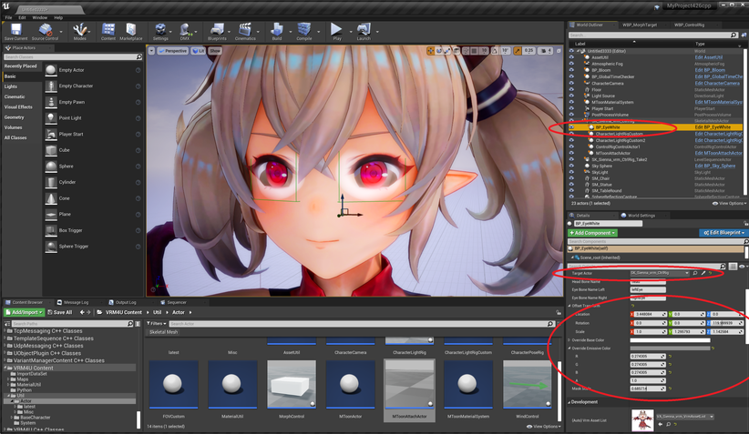

----
## カメラ操作

CharacterCameraアクターの操作方法

`※レンジ制限解除可能`の記述がある箇所は、`UniversalZoom`をONでレンジが広がる。

|効果|入力方法|補足|
|-|-|-|
|移動：前後左右|w a s d||
|移動：上下|q e||
|ズーム変更|z c,v （xで初期値）|※レンジ制限解除可能|
|ピント調整|shift+z shift+c,v （shift+xで初期値）|※レンジ制限解除可能|
|ロール回転|1 3 （2で初期値）||
|フォーカス距離変更|f h （gで初期値）||
|ピッチ、ヨー回転|マウス前後左右||
|魚眼処理|t y|レンジ制限を解除し、広角時に利用する|

エディタ上で直接CineCameraを回転して調整することも可能です。

|ロール回転|縦|
|-|-|
|||
|モデル：[NecoMaid](https://booth.pm/ja/items/1843586) （fbx -> VRM変換）||

BreathingをONにすることで、ピント調整時の画角ずれやズーム時のピントずれ を再現します。

3rd CameraをONにすることで、VRPreview時に観客視点として利用できます。

----
## 顔に落ちる影を消したい

|初期状態|対応後（影対応あり）|
|-|-|
|||
|モデル：[ヴィクトリア・ルービン](https://hub.vroid.com/characters/2792872861023597723/models/5013769147837660446)||

複数の対処方法があります。

### その１ マテリアルパラメータで制御
`mtoon_ReceiveShadowRate`を0にしてください。
これはMToonの機能です。

||
|-|
||

### その２ 対象パーツのシャドウを無効化する

描画プリミティブ毎にON/OFFします。モデル構成によっては上手く機能しません。
これはUE4の機能です。

またインポート時にPrimitiveOptimizeが有効化されている場合はプリミティブがマージされてしまい、細かな制御ができないことがあります。

||
|-|
||

----
## 顔色が悪い/暗いのを修正したい

|初期状態。SSAO 強め|対応後（SSAO なし）|
|-|-|
|||
|モデル：[千駄ヶ谷 篠](https://hub.vroid.com/characters/5860098757548846785/models/648876553405728395)||

大抵はSSAOの影響です。対応方法をオススメ順に紹介します。

|対応方法|補足|
|-|-|
|レイトレースAOを利用する|見栄えは良い。ただし描画負荷は高い|
|SSAOを弱める/無効化する|絵が寂しい|
|ライトを明るくする|解決できるか状況による|

`MToonMaterialSystem`よりSSAOを弱めてください。全体の明るさも調整可能です。

解決が難しい場合は、個別にUnlitマテリアルを利用したり、CastShadowをOFFする方法も有効です。
SkeletalMeshの編集画面より、パーツ毎のCastShadowを制御できます。
特に白目/黒目や首で調整が必要なことがあります。

----
## 顔の陰影を消したい

|SSSマテリアル初期状態|対応後|
|-|-|
|||
|モデル：[NecoMaid PREMIUM](https://booth.pm/ja/items/2147201)||

ライトによる陰影の影響です。LitやSSSモードでよく見かけます。Toonでは境界がクッキリしており問題が起きにくいです。

正攻法は補助ライトを当てて陰影を消すことです。まずはライトで補正しましょう。
対応が難しい場合は法線補正を利用します。

顔のマテリアルより`NormalToCameraMat`か`NormalToLightMat`を変更します。

||
|-|
||

`MToonMaterialSystem`にも同じ項目があり、こちらはキャラクタ全体に適用されます。

|初期状態の法線|全体を法線補正したもの|
|-|-|
|||

法線向きを変える都合上、MatCapやリムライトの入り方が変わってしまいます。十分確認しましょう。

----
## 白目が暗いのを修正したい

|SSSマテリアル初期状態|対応後|
|-|-|
|||
|モデル：[【オリジナル3Dモデル】ドラゴニュート・シェンナ](https://booth.pm/ja/items/2661189)|

要因は以下のようなものがあります。SSSマテリアルで起きやすいです。

 - SSAO/SSGIの影響
 - 虹彩のキャストシャドウが落ちている
 - SSSカラーが反映されている

アプローチは2つあります

 - マテリアルが別れている場合
   - 白目のSSSカラーを白に設定したり、マテリアル自体をUnlitなどに置き換える
   - 虹彩のプリミティブのシャドウをOFFにする。SSAOを弱める
 - マテリアルが他と共通の場合
   - `BP_EyeWhite`を配置する

BP_EyeWhiteよりTargetActorを設定ください。OffsetTransform、MaskScaleを調整し、白目に合わせます。形状によって上手く合わないことがあります。

||
|-|
||

----
## 背景色を指定したい

ステンシルバッファを利用します。エディタ設定より有効化し、キャラクタモデルに任意のステンシル値(ひとまず１）を指定してください。
`WindowTransparent`を配置し、実行中にキーボード「T」を押下すれば、Actorで指定した背景色で抜けます。

UE4.22でWindowモードの場合は、Windowが透過モードになります。ただし透過を一度有効化すると実行中のCPU負荷が上がります。中断すると戻ります。
{: .notice--info}

||
|-|
||

----
## マッハバンドを消したい＆色が濃いのを修正したい（上級者向け）

|初期状態|対応後（色再現モードON）|
|-|-|
|||
|モデル：[ノワ](https://booth.pm/ja/items/1859878)||

色再現モードを利用することで、なだらかなグラデーションや淡い色の再現が可能です。
`MToonMaterialSystem`のToggleTonemapModeより切り替えます。
画面全体の色合いが大きく変わるため、背景と合わせて確認ください。

||
|-|
||

### 色再現モードの細かい話
VRM4Uのデフォルトマテリアルはマッハバンド（不連続なグラデーション）や色ズレが出やすいです。これはUE4標準の **FilmicTonemapperを逆変換** してテクスチャ原色を出しているためです。

それぞれのモードの違いをまとめます。

|モード|VRM4Uへの影響|UE4への影響|
|-|-|-|
|標準|マッハバンド出やすい。色濃い。FilmicTonemapperを逆変換|問題なし。UE4標準|
|色再現モード|マッハバンドは減る。色やや薄め|古いTonemapを利用。コントラストやや低め|
|Tonamep無効|ほぼオリジナル色|Tonamep無し。ポストフィルタが効かない。背景は合わない|

各モードは一長一短あります。切り替える場合は十分ご確認ください。標準ままであればトラブルは起きません。
