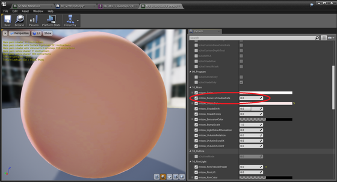

----
## カメラ操作

|効果|入力方法|
|-|-|
|移動：前後左右|w a s d|
|移動：上下|q e|
|ズーム変更|z c （xで初期値）|
|ピント調整|shift+z shift+c （shift+xで初期値）|
|ロール回転|1 3 （2で初期値）|
|ピッチ、ヨー回転|マウス前後左右|

エディタ上で直接CineCameraを回転して調整することも可能です。

|ロール回転|縦|
|-|-|
|||
|モデル：[NecoMaid](https://booth.pm/ja/items/1843586) （fbx -> VRM変換）||

----
## 顔に落ちる影を消したい

|初期状態|対応後（影対応あり）|
|-|-|
|||
|モデル：[ヴィクトリア・ルービン](https://hub.vroid.com/characters/2792872861023597723/models/5013769147837660446)||

マテリアルパラメータで制御可能です。`mtoon_ReceiveShadowRate`を0にしてください。
これはMToonの機能です。

||
|-|
||

またセルフシャドウ自体を無効化して対応することも可能です。

----
## 顔色が悪い/暗いのを修正したい

|初期状態。SSAO 強め|対応後（SSAO なし）|
|-|-|
|||
|モデル：[千駄ヶ谷 篠](https://hub.vroid.com/characters/5860098757548846785/models/648876553405728395)||

大抵はSSAOの影響です。対応方法をオススメ順に紹介します。

|対応方法|補足|
|-|-|
|レイトレースAOを利用する|見栄えは良い。ただし描画負荷は高い|
|SSAOを弱める/無効化する|絵が寂しい|
|ライトを明るくする|解決できるか状況による|

レベル上にPostProcessVolumeが配置されていることを確認してから、
`MToonMaterialSystem`よりSSAOを弱めてください。全体の明るさも調整可能です。

----
## 背景色を指定したい

ステンシルバッファを利用します。エディタ設定より有効化し、キャラクタモデルに任意のステンシル値(ひとまず１）を指定してください。
`WindowTransparent`を配置し、実行中にキーボード「T」を押下すれば、Actorで指定した背景色で抜けます。

UE4.22でWindowモードの場合は、Windowが透過モードになります。ただし透過を一度有効化すると実行中のCPU負荷が上がります。中断すると戻ります。
{: .notice--info}

||
|-|
||

----
## マッハバンドを消したい＆色が濃いのを修正したい（上級者向け）

|初期状態|対応後（色再現モードON）|
|-|-|
|||
|モデル：[ノワ](https://booth.pm/ja/items/1859878)||

色再現モードを利用することで、なだらかなグラデーションや淡い色の再現が可能です。
`MToonMaterialSystem`のToggleTonemapModeより切り替えます。
画面全体の色合いが大きく変わるため、背景と合わせて確認ください。

||
|-|
||

### 色再現モードの細かい話
VRM4Uのデフォルトマテリアルはマッハバンド（不連続なグラデーション）や色ズレが出やすいです。これはUE4標準の **FilmicTonemapperを逆変換** してテクスチャ原色を出しているためです。

それぞれのモードの違いをまとめます。

|モード|VRM4Uへの影響|UE4への影響|
|-|-|-|
|標準|マッハバンド出やすい。色濃い。FilmicTonemapperを逆変換|問題なし。UE4標準|
|色再現モード|マッハバンドは減る。色やや薄め|古いTonemapを利用。コントラストやや低め|
|Tonamep無効|ほぼオリジナル色|Tonamep無し。ポストフィルタが効かない。背景は合わない|

各モードは一長一短あります。切り替える場合は十分ご確認ください。標準ままであればトラブルは起きません。
