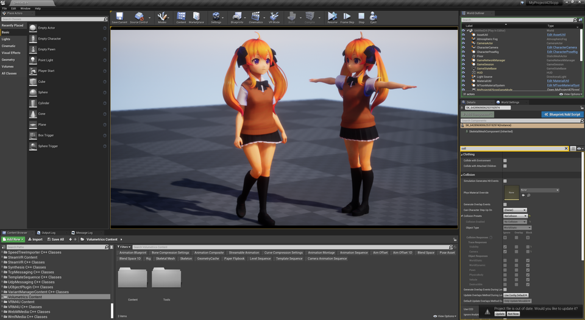

||
|-|
||

----
## モデル製作者への配慮を忘れずに楽しみましょう！

これはモデル製作者が意図していない使い方です。
{: .notice--info}

Toon向けのデータを無理やりPBRに利用します。

モデルは法線やテクスチャをToon向けに加工していたり、アウトラインありきでデザインされている場合があります。
PBRでの利用はモデル製作者の本意と異なる場合がありますので、ご配慮頂いた上でご利用ください。

## 概要

このドキュメントは作成途中です。。

UE4の描画に寄せたマテリアルで、リアリスティックな表現ができます。
順を追って調整すればToonとは異なった絵が出せます。

関連するパラメータが多く調整が難しいです。事前に`MToon Lit`での調整を体験してから試すことをオススメします。

やっていることは「全てのマテリアルをSubsurfaceで作成して補助ライトを当てる」です。

----
## 下準備をする

新規レベルにて、標準背景を選択します。

ライトやポストプロセスボリュームの些細な違いで調整幅が大きく変わります。
まずは標準背景で特性を掴むことをオススメします。
{: .notice--info}

以下を配置します。

|||
|-|-|
|BP_VrmModelActor|調整対象のキャラクタ|
|CharacterLightRig|キャラライト|
|MaterialUtil|マテリアル調整のメインパネル|
|MToonMaterialSystem|調整補助|

----
## SSSモードに切り替える

### ライト設定
CharacterLightRigより、Key、Rimを無効化、AmbientBackを有効化するようチェックボックスを操作します。

ボタン`ApplyRayTraceCastShadow`を押して影の設定を変更します。レイトレース用の設定ですが、とりあえず押せばOKです。

レベルに最初から配置されているライト（DirectionalLight、SkyLight）をMovableにします。
DirectionalLightのDynamicShadowDistanceMovableLightを3000に設定します。（近距離の影の精度が上がります。お好みで変更ください）

### マテリアル、影設定の切り替え
対象のSkeletalMeshをレベルに配置します。
MaterialUtilより、TargetSkeletalMeshActorに前述のSkeletalMeshをセットします。
ボタン `2 PBR SSSMode` をクリックするとマテリアルが切り替わり、シェーダ生成が始まります。完了まで待ちます。（SkeletalMeshを配置しますが、見た目はBP_VrmModelActorで確認ください）

BP_VrmModelActorより、DisableCustomShadowmapをONにします。
最後に`RefreshDummy`をONにします。ここまでの設定がキャラクタに正しく反映されます。チェックボックスは自動でOFFになります。

||
|-|
||

----

## 調整する 基本編

### 露出の固定
MaterialSystemより`OverrideExposure`をONにします。調整時に画面全体の明るさが変わってしまうのを抑えます。まずはONで、調整後に好みによってOFFにしましょう。

### 色味
MaterialUtilより、TexturePowとTextureSaturateで変更できます。SubsurfaceColorで全体の色味も変わります。が、これらのパラメータのみで意図した色味にすることは難しいです。ここではやや薄めに調整し、キャラライトやポストプロセスで補正するのが良いでしょう。

### ライト
CharacterLightRigより、AmbientBackLightScaleを変更します。陰側をライトで照らすことができます。ある程度明るさのバランスが取れたらrimを有効化し、輪郭を強調しましょう。

----
## 調整する 応用編

### 色味 個別調整
マテリアルごとにTexturePow, TextureSaturate, SubsurfaceColorを変更できます。
特にSubsurfaceColorの初期値は肌用に調整してあります。厳密には各部位で調整するのが望ましいでしょう。手間次第です。

### 色味 強制補正
どうしても色を合わせたい場合のみ。MaterialUtilより、BaseColorRateを0に近づけると元のToonの色味に近づきます。0にするとライトの影響力がなくなり、見た目は`MToon UnLit`になります。ライトが素直に反応しなくなるため、全体の調整がややこしいです。

### ライト配置
SSSの特性上、やや逆光だと雰囲気が出やすいです。メインのDirectionalLightをあわせて配置します。場面によってはkeyを有効化して向きを調整し、バックライトとして利用すると効果的でしょう。

