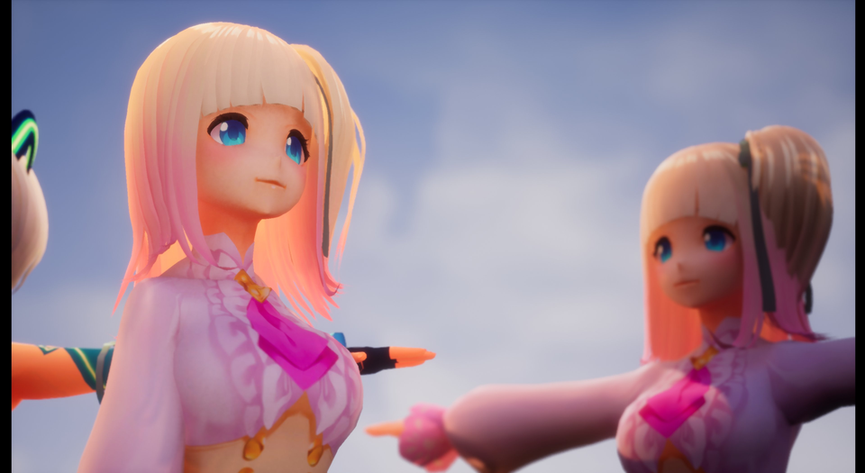
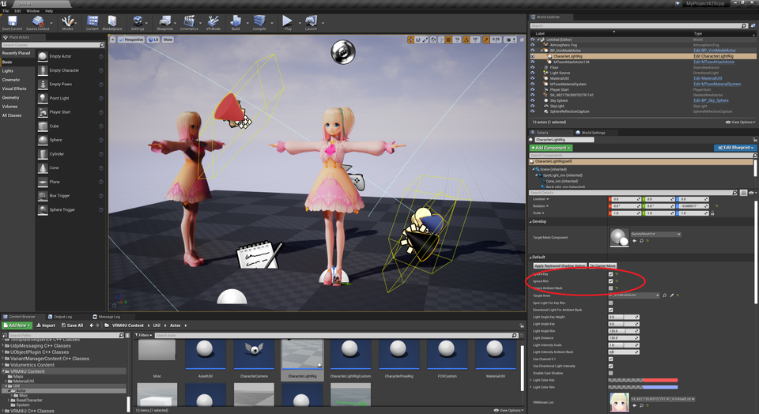
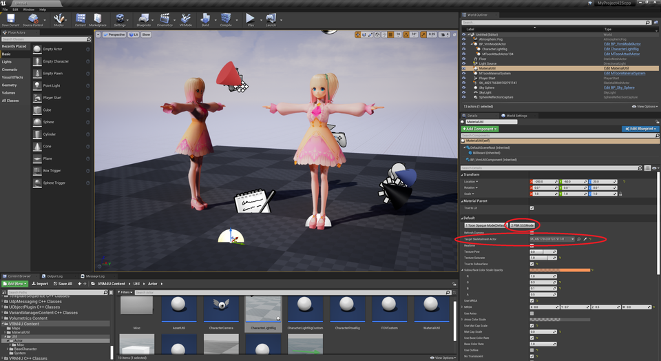
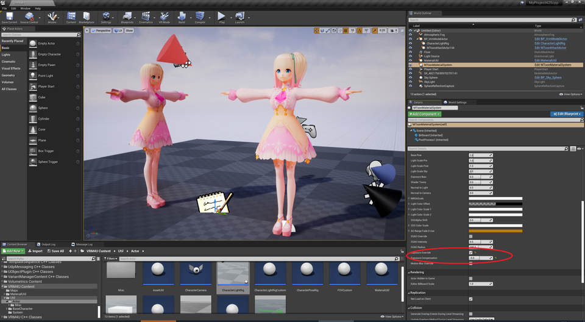
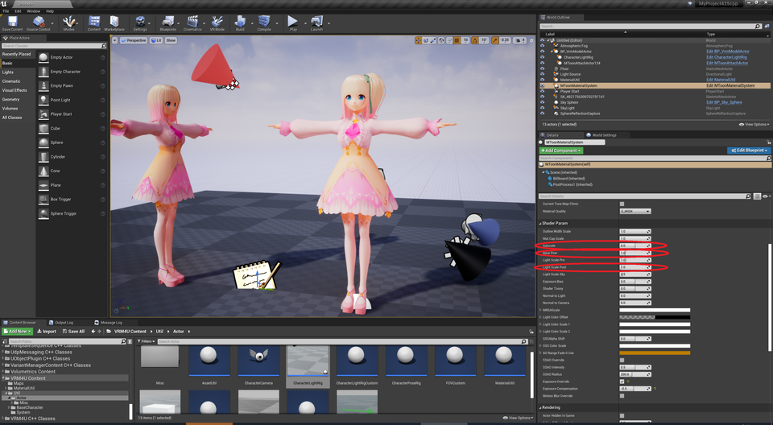
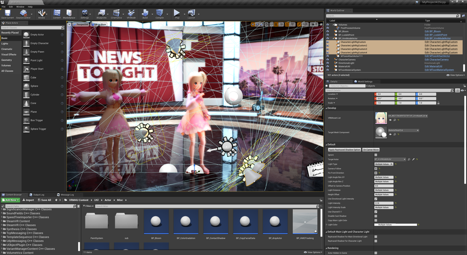
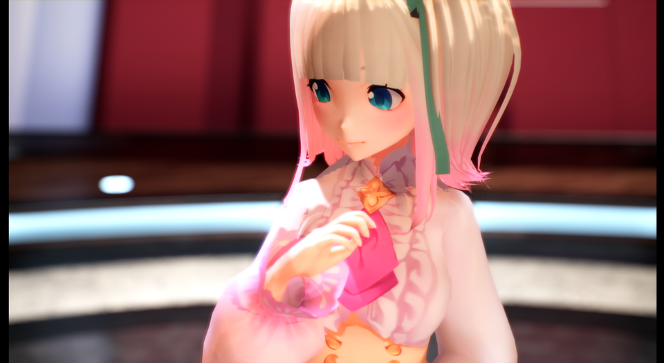
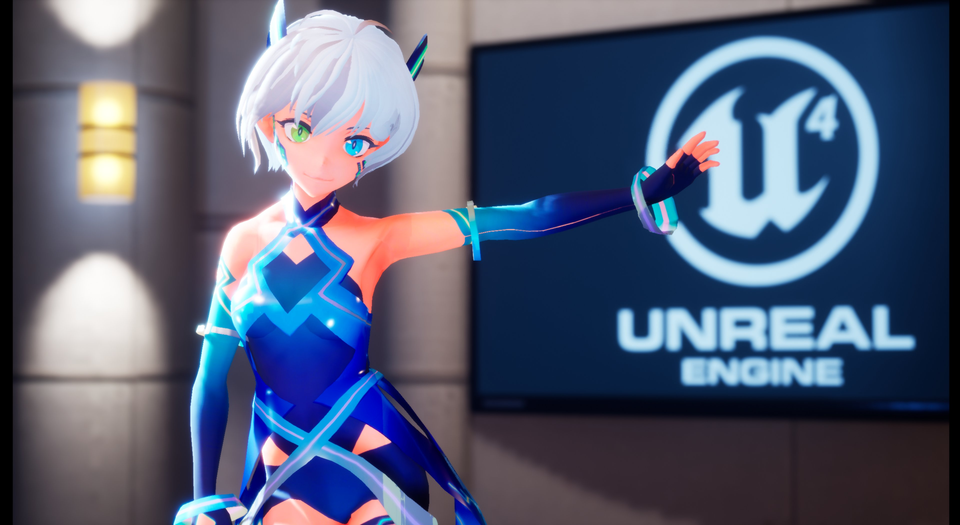

||
|-|
||

----
## モデル製作者への配慮を忘れずに楽しみましょう！

これはモデル製作者が意図していない使い方です。
{: .notice--info}

Toon向けのデータを無理やりPBRに利用します。

モデルは法線やテクスチャをToon向けに加工していたり、アウトラインと合わせてデザインされています。
PBRでの利用はモデル製作者の本意でないことがありますので、ご配慮の上でご利用ください。

## 概要

UE4の描画に寄せたマテリアルで、より素直にライト効果を受けます。（専門的に言うとemissiveを利用しません）

関連するパラメータが多く調整が難しいです。事前に`MToon Lit`での調整を体験してから試すことをオススメします。

やっていることは以下の3つです。
 - 全てのマテリアルをSubsurfaceで作成して色味をあわせる
 - 補助ライトを当てる
 - カラーグレーディングで整える

----
## 下準備をする

新規レベルにて、標準背景を選択します。

ライトやポストプロセスボリュームの些細な違いで調整幅が大きく変わります。
まずは標準背景で特性を掴むことをオススメします。
{: .notice--info}

以下を配置します。

|||
|-|-|
|BP_VrmModelActor|調整対象のキャラクタ|
|CharacterLightRig|キャラライト|
|MaterialUtil|マテリアル調整のメインパネル|
|MToonMaterialSystem|調整補助|
|BP_Bloom|特殊なBloom。お好みで|

----
## SSSモードに切り替える

### ライトを設定する
CharacterLightRigより、Key、Rimを無効化、AmbientBackを有効化するようチェックボックスを操作します。

||
|-|
||

レベルに最初から配置されているライト（DirectionalLight、SkyLight）をMovableにします。
DirectionalLightのDynamicShadowDistanceMovableLightを3000に設定します。（近距離の影の精度が上がります。お好みで変更ください）

### マテリアルの切り替え
対象のSkeletalMeshをレベルに配置します。
MaterialUtilより、TargetSkeletalMeshActorに前述のSkeletalMeshをセットします。
ボタン `2 PBR SSSMode` をクリックするとマテリアルが切り替わり、シェーダ生成が始まります。完了まで待ちます。（SkeletalMeshを配置しますが、見た目はBP_VrmModelActorで確認ください）

||
|-|
||

BP_VrmModelActorより、DisableCustomShadowmapをONにします。
最後に`RefreshDummy`をONにします。ここまでの設定がキャラクタに正しく反映されます。チェックボックスは自動でOFFになります。

----
## 調整する 基本編

### 露出の固定
MaterialSystemより`OverrideExposure`をONにします。調整時に画面全体の明るさが変わってしまうのを抑えます。まずはONで、調整後に好みによってOFFにしましょう。
値は背景の明るさに応じて任意に設定ください。ここでは-0.5としています。

||
|-|
||

### 色味
MaterialSystemより以下の項目を変更して色味を調整します。
また肌の色味が合わない場合は、MaterialUtilより、SubsurfaceColorで操作します。
が、これらのパラメータのみで意図した色味にすることは難しいです。ここではやや薄め/暗めに調整し、キャラライトやポストプロセスで補正するのが良いでしょう。

||
|-|
||

### ライト
CharacterLightRigより、AmbientBackLightScaleを変更します。陰側をライトで照らすことができます。ある程度明るさのバランスが取れたらrimを有効化し、輪郭を強調しましょう。

### カラーグレーディング

必要です！ 軽く調整するだけで大きく効果が出ます。のでパラメータを触ってみましょう。

[こちらのオンラインラーニングコース](https://www.unrealengine.com/ja/onlinelearning-courses/creating-photoreal-cinematics-with-quixel)が参考になります。
ライト調整のみで絵を作るのは難しいです。

----
## 調整する 応用編

### 色味・ラフネス個別調整
前述の色味パラメータは、マテリアル毎に変更できます。
特にSubsurfaceColorの初期値は肌用に調整してあります。手間でなければ個別に調整するのが良いでしょう。
同時にラフネスを調整してスペキュラを出すこともできます。

### ライト配置
SSSの特性上、やや逆光だと雰囲気が出やすいです。合わせてkeyを有効化して顔を照らします。

またCharacterLightRigCustomを利用すると、キャラクタ用ライトを自由に追加可能です。慣れたら全てCustom版で構成した方が都合良いでしょう。

BP_Bloomを利用すると、ハイライト部分に色味を残したBloomがかかります。お好みでご利用ください。

|全てCustomで調整した様子。ライト4灯||
|-|-|
|||

----
## どうしても思ったような絵にならないんだけど？

この調整は難しいです。元素材がToon向けであり、周囲のライティングや元素材の造形・テクスチャによる変化幅が大きいためです。（全てがPBR素材であれば、このような問題は起きにくいです）

私個人の経験的には「顔を補助ライトで照らして中間的な明るさにまとめ、最後にカラーグレーディングで締める」と上手くまとまるようです。

||
|-|
||

