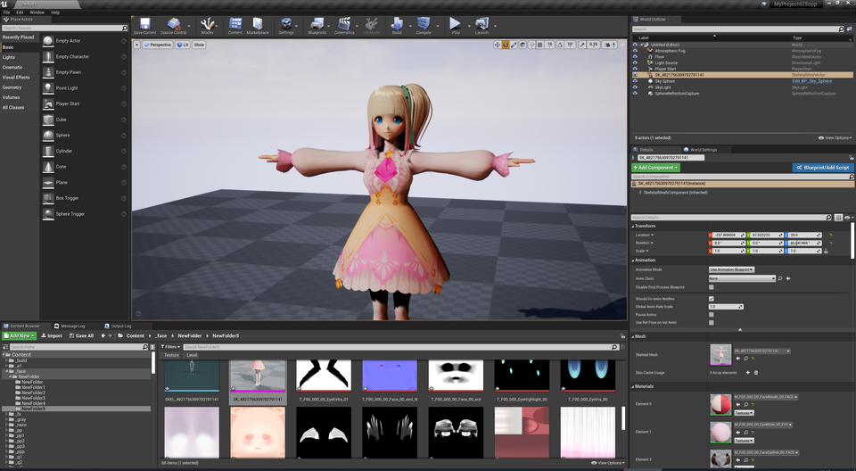

||
|-|
||

----
## モデル製作者への配慮を忘れずに楽しみましょう！

これはモデル製作者が意図していない使い方です。
{: .notice--info}

Toon向けのデータを無理やりPBRに利用します。

モデルは法線やテクスチャをToon向けに加工していたり、アウトラインと合わせてデザインされています。
PBRでの利用はモデル製作者の本意でないことがありますので、ご配慮の上でご利用ください。

----
## 概要

UE4のサブサーフェスを利用したマテリアルです。素直にライト効果を受けます。

関連するパラメータが多く調整が難しいです。事前に`MToon Lit`での調整を体験してから試すことをオススメします。

やっていることは以下の3つです。
 - 全てのマテリアルをSubsurfaceで作成して色味をあわせる
 - 補助ライトを当てる
 - カラーグレーディングで整える

----
## SSSマテリアルでインポートする

インポート時のオプションで選択可能です。後からAssetUtilで切り替えることもできます。

|||
|-|-|
|||

モデルのプレビューを開くとキレイに描画されているはずです。しかしレベルに配置すると意図どおりの見た目にならないでしょう。

SSSマテリアルをレベル上でキレイに描画するためには、いくつか設定が必要です。

|新規作成の初期マップに配置したもの|←のマップを調整したもの|
|-|-|
|||

----
## 準備するもの

新規にレベルを作成し、標準背景(default)を選択します。

ライトやポストプロセスボリュームの些細な違いで調整幅が大きく変わります。
まずは標準背景で特性を掴むことをオススメします。
{: .notice--info}

以下を配置します。

|||
|-|-|
|BP_VrmModelActor|調整対象のキャラクタ|
|CharacterLightRigCustom|キャラライト|
|MToonMaterialSystem|調整補助|
|BP_Bloom|色味が強い特殊なBloom。お好みで|
|MaterialUtil|マテリアル一括調整パネル。お好みで|

----
## 背景ライトを整える

ライト設定は重要です！ SSSマテリアルを利用する場合は、必ず以下の項目を確認しましょう。
{: .notice--info}

手順1.
初期配置されているDirectionalLight、SkyLightをMovableにする。

手順2.
各ライトを以下にセットアップする。

DirectionalLight
- CastRaytracingShadows を OFF
  - 陰影を和らげます。レイトレース時のみ影響します。
- DynamicShadowDistanceMovableLight を 3000に設定
  - 近距離の影の精度が上がります。

SkyLight
- LowerHemisphereIsSolidColor を OFF
  - 下方が環境光で照らされます。

設定したらライトをベイクしましょう。エディタ上部のアイコン「Build」の▼をクリックして、「BuildLightingOnly」で完了です。
ベイクしないと、PlayIn中のみ古いライトが参照されます。

----
## 大まかに色味を整える

### 露出の固定
MaterialSystemより`OverrideExposure`をONにします。調整後に好みによってOFFにしましょう。

調整中に画面全体の明るさが変わってしまうのを抑えます。

||
|-|
||

### 色味
MaterialSystemより以下の項目を変更して色味を調整します。
また肌以外のマテリアルのSubsurfaceColorを調整します。
MaterialUtilにより一括変更も可能です。

後でキャラライトやポストプロセスでの補正もあるので程々で次に進みましょう。

||
|-|
||

### ライト
CharacterLightRigCustomを配置、ターゲット指定してパラメータを変更してみましょう。

### カラーグレーディング

軽く調整するだけで大きく効果が出ます。のでパラメータを触ってみましょう。

[こちらのオンラインラーニングコース](https://www.unrealengine.com/ja/onlinelearning-courses/creating-photoreal-cinematics-with-quixel)が参考になります。

----
## 細かく個別に整える

### 色味・ラフネス個別調整
色味パラメータは、マテリアル毎に変更できます。
同時にラフネスを調整してスペキュラを出すこともできます。

### ライト配置
CharacterLightRigCustomを複数利用して、キーライトやバックライトとして配置しましょう。
バックライトはRectLight設定に切り替えるのをオススメします。

|調整した様子。ライト4灯||
|-|-|
|||

BP_Bloomを利用すると、ハイライト部分に色味を残したBloomがかかり鮮やかになります。お好みでご利用ください。

BP_ColorGradationを利用すると、画面全体にカラーフィルタをかけることができます。上部2隅に色を薄く乗せると雰囲気が出ます。

これらに加えてUE4の機能をフル活用しましょう！

----
## どうしても絵がまとまらないんだけど？

この調整は難しいです。元素材がToon向けであるため、周囲のライティングや元素材の造形・テクスチャによる変化幅が不規則です。

それに加えて、PBRでのライティングやカラーグレーディングのスキルも必要です。

私自身も手探りで調整しています。経験則ですが「顔を補助ライトで照らして中間的な明るさにまとめ、最後にカラーグレーディングで締める」と上手くまとまるようです。

||
|-|
||

