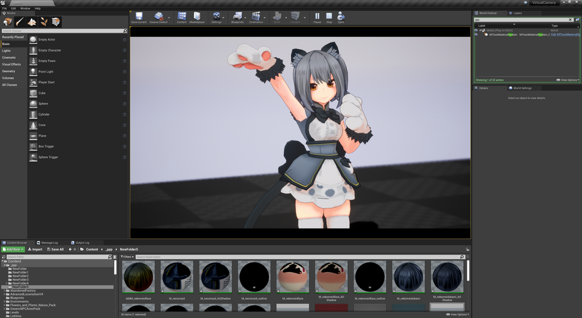
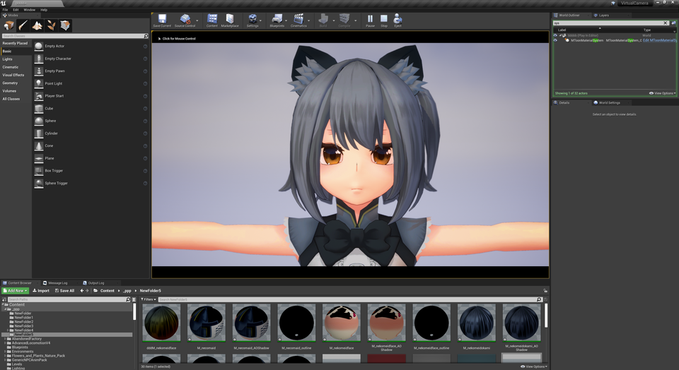
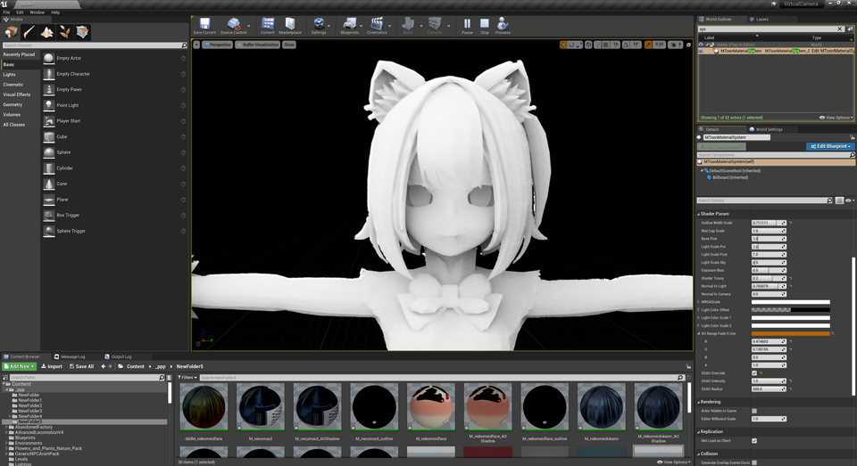
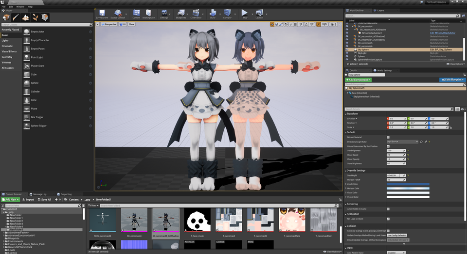
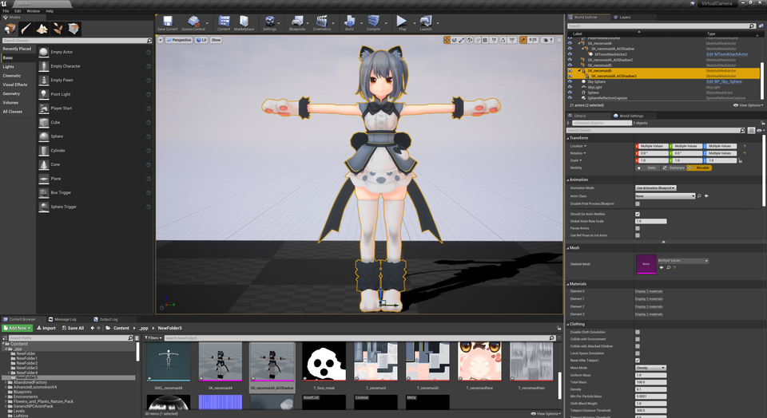
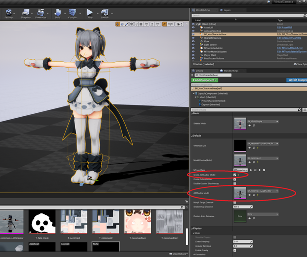
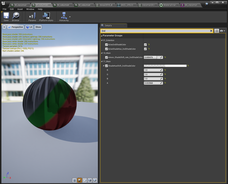

||
|-|
||
|モデル：[NecoMaid](https://booth.pm/ja/items/1843586) （fbx -> VRM変換）|
|アニメーション：[ミライ小町](https://www.bandainamcostudios.com/works/miraikomachi/dlcguideline.html)（fbx -> humanoidリターゲット）|

----
## Toon AO とは

AmbientOcculusionをToonの影色で塗ります。

「Toon AO」という単語はVRM4Uが勝手に名付けているだけのものです。一般名称ではありません。
{: .notice--info}

標準的なAOは黒色が合成されます。下図に差異を並べました。
なおレイトレースでAOの精度を高くしています。

細かな凹凸に対して影色が入っています。AOの暗い箇所について閾値（`MToonMaterialSystem`で設定）をつけて影色を入れることができます。

|AOなし|Toon AO|AO|
|-|-|-|
||||

----
## Toon AO の作り方

`AssetUtil`でメッシュを選択し「CreateAOModel」ボタンを押します。
新しくメッシュが生成されます。末尾に「_AOShadowMesh」という名前がついています。

通常メッシュとAOShadowMeshを同一座標に配置したら完成です。
AOを調整して影色の変化を見ましょう。

|通常MeshとAOShadowMesh並べたもの|2つを重ねたら完成|
|-|-|
|||

`VRMCharacterBase`からも利用することができます。以下のようにAOShadowModelをセットして、チェックボックスをONにしてください。
ただ注意点がありPlay中のみ表示されます。Previewでは確認できません。

||
|-|
||

----
## 2号影の設定（テスト実装）

マテリアルで2号影を指定することが出来ます。テスト実装となっています。

扱いにくいパラメータになっています。
なおカラーRGBAのうちの、Aで色相が変わります。
{: .notice--info}

||
|-|
||

----
## Toon AOの仕組み解説、2号影の実装（余談）

ここは読み飛ばしてもらって構いません。開発者が語りたいだけのコーナーです。

### Toon AOの仕組み

Meshを2回描画しています。1回目(通常Mesh)は不透明、2回目(AOShadowMesh)は半透明です。

1回目の描画はAO計算用です。
2回目の描画ではAOのバッファを参照し、影色の判定を行っています。
UE4ってこんなことができるんですね。

### 2号影のテスト実装について

開発者の美的センスが足りないため、調整の勘所がわかりません。
何かを会得したらパラメータを変更するかもしれません。

