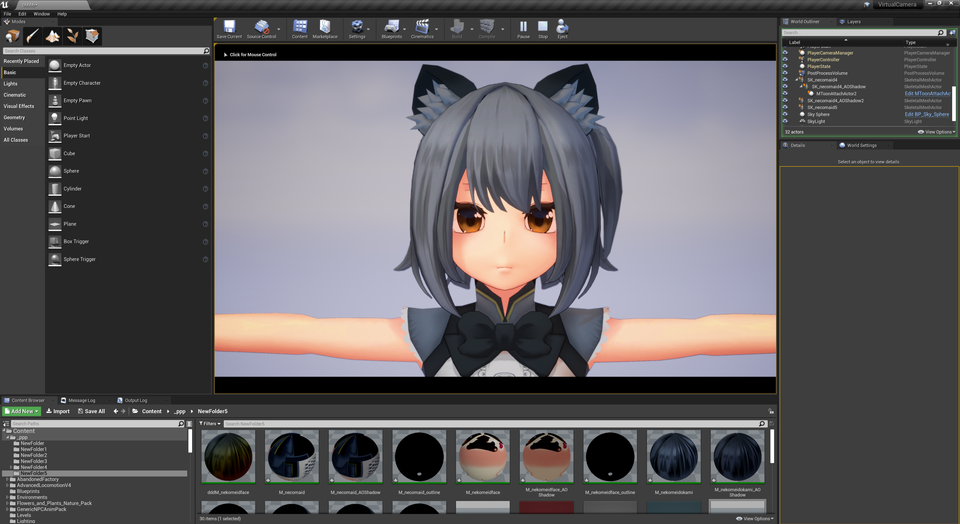

||
|-|
||
|モデル：[ドラゴニュート・シアノス](https://booth.pm/ja/items/3224415)|
|UE4.27 レイトレースON||

----

----

## やや上級者向けです

細かな調整をするためには、ある程度のエディタ操作やVRM4U設定の知識が必要です。
{: .notice--info}

----
## PostToon で豪華にする

サンプルマップ `VRM4U_PostToon.umap` を参照ください。
モデルを3つの領域（主/影/ハイライト）で塗り分けます。

セットアップ手順は以下のとおりです。

 - 手順 1. SkeletalMeshを配置し、アニメーションやゲーム処理などを組み込む
 - 手順 2. `BP_PoseCopyToon` のTargetActorに上記SkeletalMeshを設定し、パラメータ調整する

PostToonの描画には、ベースとなるSkeletalMeshComponentが必要です。そのため、シーンにはモデルが2通り配置されます。
必要に応じて、通常モデルを非表示にして利用ください。

|SkeletalMeshをControlRigでポーズを設定し、Toonモデルとして再描画した様子|
|-|
||

### 仕組み＆調整方法

内部的には以下のようなバッファがあります。

|最終結果|陰影検出用PBR|陰影・ハイライト検出|
|-|-|-|
||||

陰影の検出、ハイライトの設定を`BP_PoseCopyToon` で行います。
陰色はMToonの設定を利用します。

細かな陰影を得るためには、レイトレースシャドウを利用したり、UE5のVirtualShadowMapを使うと効果的です。

### より細かい調整項目

- VRM4Uの法線補正機能を利用すると、陰影を調整できます。
- 白目が暗くなりがちです。BP_EyeWhiteで補正できます。

----

## （古い仕組み）Toon AO で豪華にする

||
|-|
||
|モデル：[NecoMaid](https://booth.pm/ja/items/1843586) |

「Toon AO」という単語はVRM4Uが勝手に名付けているものです。一般名称ではありません。
{: .notice--info}

AmbientOcculusionをToonの影色で塗ります。（一般的にはAOは黒色が合成されます）

下図に差異を並べました。
なおレイトレースでAOの精度を高くしています。

細かな凹凸に対して影色が入っています。AOで暗くなる箇所について閾値（`MToonMaterialSystem`で設定）をつけて影色を入れることができます。

|AOなし|Toon AO|AO|
|-|-|-|
||||

----
## （古い仕組み）Toon AO の作り方

`AssetUtil`でメッシュを選択し「CreateAOModel」ボタンを押します。
新しくメッシュが生成されます。末尾に「_AOShadowMesh」という名前がついています。

通常メッシュとAOShadowMeshを同一座標に配置したら完成です。
AOを調整して影色の変化を見ましょう。

|通常MeshとAOShadowMesh並べたもの|2つを重ねたら完成|
|-|-|
|||

`VRMCharacterBase`からも利用することができます。以下のようにAOShadowModelをセットして、チェックボックスをONにしてください。
ただ注意点がありPlay中のみ表示されます。Previewでは確認できません。

||
|-|
||

----
## 2号影の設定（テスト実装）

マテリアルで2号影を指定することが出来ます。

扱いにくいです。テスト実装です。
なおカラーRGBAのうちの、Aで色相が変わります。
{: .notice--info}

||
|-|
||

----
## Toon AOの仕組み解説、2号影の実装（余談）

ここは読み飛ばしてもらって構いません。開発者が語りたいだけのコーナーです。

### Toon AOの仕組み

Meshを2回描画しています。1回目(通常Mesh)は不透明、2回目(AOShadowMesh)は半透明です。

1回目の描画はAO計算用です。
2回目の描画ではAOのバッファを参照し、影色の判定を行っています。
UE4ってこんなことができるんですね。

### 2号影のテスト実装について

開発者の美的センスが足りないため、調整の勘所がわかりません。
何かを会得したらパラメータを変更するかもしれません。

