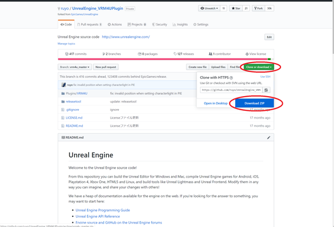

----

GitHubアカウントとEpicGamesアカウントの紐付けが必要です。
VRM4Uフォルダにソースファイルを上書き追加します。
{: .notice--info}

VisualStudioが必要です。時間がかかります。
{: .notice--info}

おおまかな手順は以下です。

 - ソースをダウンロードし、プラグインフォルダに展開する
 - 試しにEXEを作成する
 - エラーがでなければ完了。エラーが出た場合は、/VRM4U/Util/Actor/latest 以下を削除し、再度EXE作成する

## EXE作成に必要なファイルをダウンロードする

[こちらのリンク](https://github.com/ruyo/UnrealEngine_VRM4UPlugin)より、VRM4Uのソース入りzipをダウンロードします。

このページを自動翻訳で見ている場合、リンクが正しいか十分確認ください。

https://github.com/ruyo/UnrealEngine_VRM4UPlugin


404エラーページが出る場合は紐付けが必要です。[こちらのリンク](https://www.unrealengine.com/ja/blog/updated-authentication-process-for-connecting-epic-github-accounts)よりGitHubアカウントの紐付けを行ってください。

https://www.unrealengine.com/ja/blog/updated-authentication-process-for-connecting-epic-github-accounts

**メールによる確認**で紐付け完了です。ユーザ情報にEpicのアイコンが表示されていることを確認ください。

||
|-|
|[](../assets/images/03e_con.png)|


||
|-|
|[](../assets/images/03e_exe.png)|


ダウンロードしたファイルを従来のプラグイン置き場に上書き保存します。 
最終的に以下のようなディレクトリ構成になっていればOKです。

```
-MyGame
  -MyGame.uproject
  -Config
  -Content
  -Plugins
    -VRM4U
      -VRM4U.uplugin
      -Source          <- new
      -ThirdParty      <- a few files will be added
      - :
```


----
## EXEを作る

ひとまずUE4のメニューからパッケージ作成してみて、エラーが出るようならVisualStudioのセットアップを行います。

エラーが出る場合は[こちらのページ](https://visualstudio.microsoft.com/ja/vs/older-downloads/)
より、「VisualStudioのダウンロード」をクリック「Community2019」を選択します。(UE4.23以前であれば2017が必要です)

インストールオプションは[こちら](https://docs.unrealengine.com/ja/Programming/Development/VisualStudioSetup/index.html)
を参照ください。表記のVisualStudioのバージョンが古いですが、適宜読み替えてOKです。
項目は「VisualStudioのインストール」まで辿ればOKです。「推奨設定」以降はスキップです。


----
## よくあるトラブル

### Githubページで404エラーが出る

あなたのブラウザでEpicのリポジトリは参照できますか？

https://github.com/EpicGames/UnrealEngine

こちらで404エラーが出ている場合、あなたのアカウントが正しく紐付けできていません。手続きには**メールによる認証**が必要です。githubから確認メールが届いていない場合、紐付けしなおしてください。

Epicのページからアカウントを紐付けする際は、githubのメールアドレスの入力が必要です。アカウント名ではありません。

### `/VRM4U/Util/Actor/latest` のアセットでエラーが出る

エラーが出る場合は `/VRM4U/Util/Actor/latest` のディレクトリごと削除してください。
これは実験的なデータ（ControlRigやFaceTrackingのActor）が入っています。プロジェクト設定によって、エラーが出ないこともあります。

### 日本語ファイル名によるエラー対応

プロジェクトのフルパス内に日本語があるとEXE化できません。EpicGamesLauncherでプロジェクトをCloneするか、エクスプローラでプロジェクトフォルダごと移動してください。

エディタが起動しない場合は、以下のキャッシュフォルダを削除してから再度起動してください。
- 「MyProject/Intermediate」
- 「MyProject/Plugins/VRM4U/Intermediate」

複数のUE4バージョンを行き来したり、プロジェクトをBP→CPPに切り替えた直後にエラーが起きやすいです。

### ビルド時の警告の対応

ビルドやCook時に一部警告が出ますが、そのままで問題ありません。
対応したい場合は、`VRM4U.plugin`内のコメントを参照し、`Developer` -> `UncookedOnly` へ書き換えてください。
VRM4Uは対応するUE4バージョン全てに対し、同一のソースコードを使っています。バージョン毎に書きわけできない箇所は古い書式を採用しています。

----
## エラーが出た場合

以下のログファイルを [GitHubIssues](https://github.com/ruyo/VRM4U/issues) または [@ruyo_h](https://twitter.com/ruyo_h)のDM などでお送りください。

ログ内にはユーザー名やファイルパス名が含まれます。気になる方はテキストエディタ等で該当文字列を削除の上でお知らせください。

- MyProject/Saved/Log/MyProject.log

----
## （VRM4U_20200625以前を使っている場合）C++プロジェクトにする
[こちらのリンク](https://docs.unrealengine.com/ja/Programming/QuickStart/2/index.html)を参考に、新規のC++ファイルを追加してください。

「Choose Parent Class」はNoneのまま、他も初期設定のままでOKです。
完了するとプロジェクトファイルと同じ場所に「sln」ファイルが生成されます。
（例えば「MyProject.uproject」と同じ場所に「MyProject.sln」が生成される）

----
## なんでこんなに面倒くさいの？

プラグインを作る際、一部エンジンのソースを参考にしているためです。主にランタイムロード機能です。

念の為にEpic紐付けのアカウントで公開しています。（もしかしたら問題ないかもしれません）

