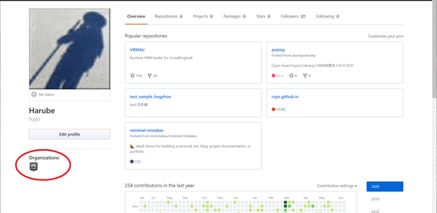
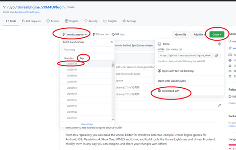

----

GitHubアカウントとEpicGamesアカウントの紐付けが必要です。
{: .notice--info}

C++プロジェクトにする必要があります。Blueprintプロジェクトの場合は、C++ファイルを追加してC++プロジェクトにします。後述します。
{: .notice--info}

## EXE作成に必要なファイルをダウンロードする

[こちらのリンク](https://github.com/ruyo/UnrealEngine_VRM4UPlugin)より、VRM4Uのソース入りzipをダウンロードします。

404エラーページが出る場合は紐付けが必要です。[こちらのリンク](https://www.unrealengine.com/ja/blog/updated-authentication-process-for-connecting-epic-github-accounts)よりGitHubアカウントの紐付けを行ってください。

ブラウザからの操作とメールによる確認で紐付け完了です。ユーザ情報にEpicのアイコンが表示されていることを確認ください。

||
|-|
||

||
|-|
||

導入は従来のプラグイン同様 `MyProject/Plugins/VRM4U` となるよう配置すれば完了です。

----
## C++プロジェクトにする
[こちらのリンク](https://docs.unrealengine.com/ja/Programming/QuickStart/2/index.html)を参考に、新規のC++ファイルを追加してください。

「Choose Parent Class」はNoneのまま、他も初期設定のままでOKです。
完了するとプロジェクトファイルと同じ場所に「sln」ファイルが生成されます。
（例えば「MyProject.uproject」と同じ場所に「MyProject.sln」が生成される）

----
## EXEを作る

VisualStudioによるビルド環境が必要です。セットアップ済であれば、UE4のメニューからパッケージ作成可能です。

----
## よくあるトラブル

プロジェクトのフルパス内に日本語があるとEXE化できません。EpicGamesLauncherでプロジェクトをCloneするか、エクスプローラでプロジェクトフォルダごと移動してください。

エディタが起動しない場合は、以下のキャッシュフォルダを削除してから再度起動してください。
「MyProject/Intermediate」
「MyProject/Plugins/VRM4U/Intermediate」

複数のUE4バージョンを行き来したり、プロジェクトをBP→CPPに切り替えた直後にエラーが起きやすいです。

----
## なんでこんなに面倒くさいの？

プラグインを作る際、一部エンジンのソースを参考にしているためです。主にランタイムロード機能です。

念の為にEpic紐付けのアカウントで公開しています。（もしかしたら問題ないかもしれません）

