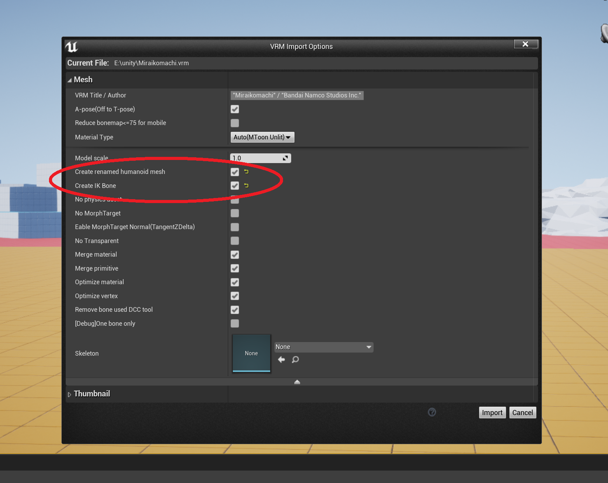
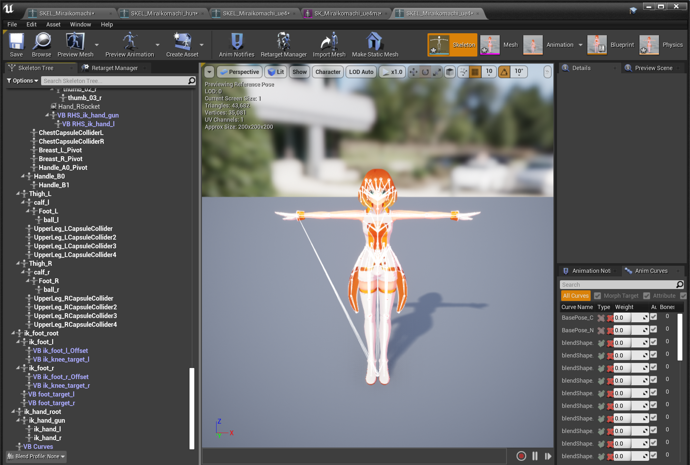
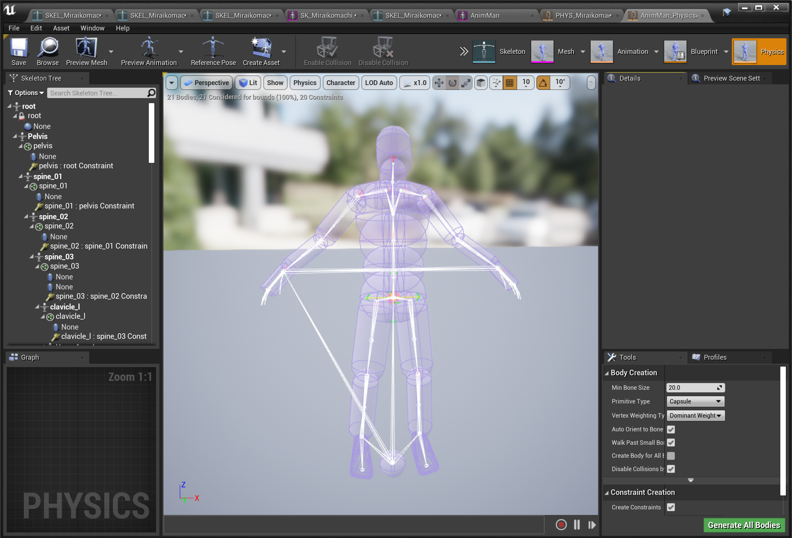

||
|-|
||
|モデル：[ミライ小町](https://www.bandainamcostudios.com/works/miraikomachi/dlcguideline.html)|

----

## Advanced Locomotion System に適用する

[Advanced Locomotion System](https://www.unrealengine.com/marketplace/en-US/product/advanced-locomotion-system-v1)に適用するチュートリアルビデオがあります。



----
## スケルトンをUE4の骨名で作成する

インポート時に`HumanoidMesh`と`IKBone`にチェックを入れます。

||
|-|
||

メッシュが3つ出力されます。それぞれ骨名の命名規則が異なります。

|種類|用途|
|-|-|
|標準|ほとんどの場合これでOKです。よくわからない場合はこれ|
|UE4マネキン命名規則|グレイマン用の複雑なシステムを流用する場合|
|VRM命名規則|複数のVRMをターゲットにした複雑なシステムを構築する場合|

Humanoidの骨が以下のような名前になります。それぞれにIKBoneも追加されます。

|左：標準、中央：VRM命名規則、右：グレイマン命名規則|
|-|
||

----
## VirtualBone、Socketを複製する

`AssetUtil` を利用して、VirtualBoneとSocketを複製することができます。
対象はHumanoid骨の子供になっているものだけです。

Socketはプレビューで位置が異なるように見える場合がありますが、問題ありません。初期姿勢がA-pose/T-poseで異なる影響です。同じポーズをとった時に座標が一致します。
{: .notice--info}

||
|-|
||

----
## PhysicsAssetを複製する

`AssetUtil` を利用して、PhysicsAssetを複製することができます。
対象はHumanoid骨についているコリジョンのみです。

コリジョンの回転は反映されません。骨の軸向きを補正できないためです。正確に当てはめる場合は手動で調整ください。
{: .notice--info}

|元データ|VRMモデルにコピーしたもの|
|-|-|
|||

----
## 最後の仕上げを忘れずに

輪郭線や影を反映させましょう。キャラクタのBlueprintにMToonAttachActorをアタッチすればOKです。

揺れ骨を正確に動かしましょう。AnimBlueprintの最後に `VRMSpringBone`ノードを追加すればOKです。

リターゲットの結果が変な場合は、SkeletonのA-pose/T-poseを確認してください。

||
|-|-|
||
