||
|-|
||
|モデル：[ミライ小町](https://www.bandainamcostudios.com/works/miraikomachi/dlcguideline.html)|

----

## 概要

グレイマン（EpicSkeleton準拠）をVRMモデルに置き換える手法を紹介します。
2つのアプローチがあります。

 - 手法その１：リアルタイムリターゲット（VRM4U独自機能）
   - レベル上で動いているグレイマン(EpicSkeletonのモデル)のアニメーションを、直接VRMモデルに割り当てます。
   - 良い点：圧倒的に簡単。
   - 悪い点：微調整できない。厳密なコリジョンや接地感を出すことが難しい。
 - 手法その２：エディタでリターゲット（UE標準機能）
   - リターゲットマネージャでAnimSequenceを複製したり、AnimBPを作成します。
   - 良い点：標準機能なので安心。細かく調整できる
   - 悪い点：圧倒的に手間がかかる。特にAnimBPが複雑な場合は組み直しが大変。骨向きの補正が難しい

具体的な手順を解説後、ユースケースを紹介します。

----

## リアルタイムリターゲットする（VRM4Uの機能）

### モデルをレベルに配置して利用する

`BP_VrmMannequinRetarget` を配置し、`Targetmannequin` にコピー元となるグレイマンを指定します。

PlayInすると、VRM標準モデルにリターゲットされます。完了です。

|TargetMannequinをセットして、、|PlayInで動く|
|-|-|
|||

モデルを差し替えるには、VrmAssetListOverride にアセットを設定します。
`GenerateRegargetPoseCopy` ボタンを押すと、エディタ上にプレビューモデルが生成されます。

|VrmAssetListOverrideをセット、ボタンを押すとプレビュー表示|PlayInで動く|
|-|-|
|[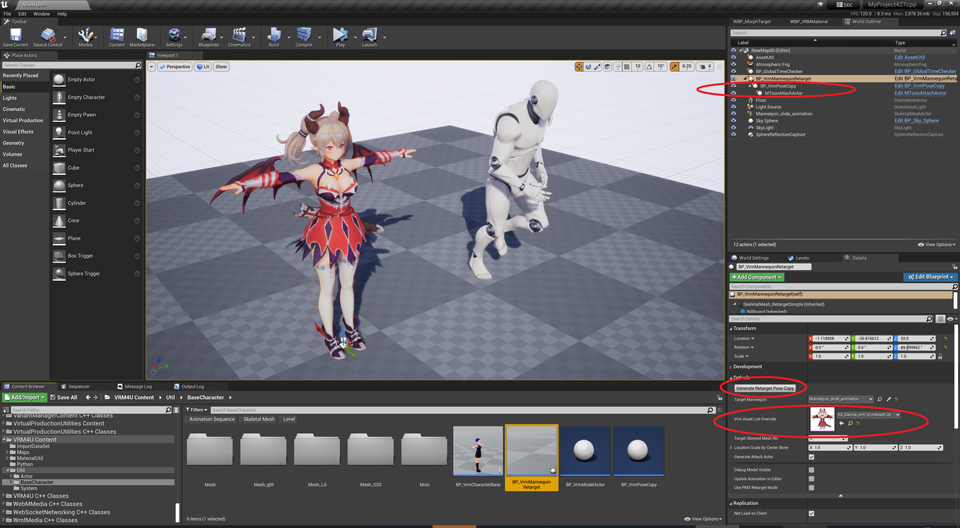](../assets/images/03r_setM1.png)||
|モデル：[【オリジナル3Dモデル】ドラゴニュート・シェンナ](https://booth.pm/ja/items/2661189)||

**選択するActorに注意ください。** リターゲット設定は `BP_VrmMannequinRetarget` で操作します。プレビューモデルをクリックすると、子Actorである `BP_VrmPoseCopy` が選択されます。
{: .notice--info}

| ↑の注意書きの図解。プレビューモデルをクリックすると `BP_VrmPoseCopy` が選択される。選択Actorはアウトライナで確認ください。|
|-|
||

### モデルをSpawnして利用する

差し替え対象のActorの中で `BP_VrmMannequinRetarget` を作成、初期化ノードを呼び出してください。

|PawnのChildActorとしてセットし、BeginPlayで初期化、元モデルを表示OFFにする|PlayInで置き換わる|
|-|-|
|||

アウトラインと揺れ骨は自動設定されます。それぞれオプションで無効化できます。

----

## エディタでリターゲットする（UE5標準機能）

手順が多いです。VRM4Uの簡略化ツールを活用ください。
{: .notice--info}

以下の解説を一通り読んでから 公式ドキュメント参照することをオススメします。VRM4Uでは手順を省略できます。
[公式ドキュメントはこちら。](https://docs.unrealengine.com/5.0/ja/ik-rig-animation-retargeting-in-unreal-engine/)

UE5のリターゲットでは、リターゲット元と先のモデル それぞれに対応するIK_Rigアセットが必要です。

 - リターゲット元のIK_Rig（グレイマン、UE5マネキン）
   - UE5のサードパーソンテンプレートに含まれています。導入方法は後述します。また、VRM4Uの`WBP_Retarget`から生成できます。
 - リターゲット先のIK_Rig（VRMモデル）
   - インポート時に生成されます。

これらを利用し、IKRetargeterを作成します。

|リターゲットに利用するIK_Rig|
|-|
|[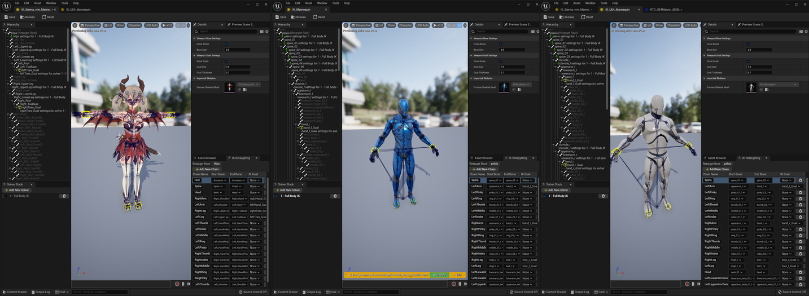](../assets/images/03r_ikrig.png)|

IKRetergeter作成手順
 1. IKRetargeterを作成し、ベース（グレイマン）のIK_Mannequinと リターゲット先のIK_[モデル名]_Mannequin をセットする
 1. WBP_Retarget を起動、IKRetargeterをセットし、ボタンを押す。Aポーズが設定される。完成。
 
|IKRetargeterの作成|WBP_Retargetを起動、IKRetargeterを設定しボタンを押すとAポーズが適用される|
|-|-|
|[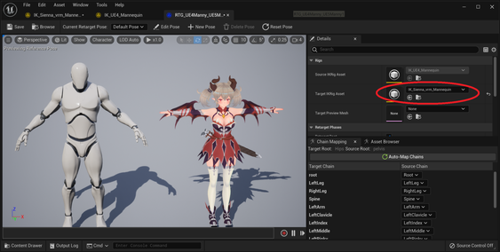](../assets/images/03r_ikrig2.png)|[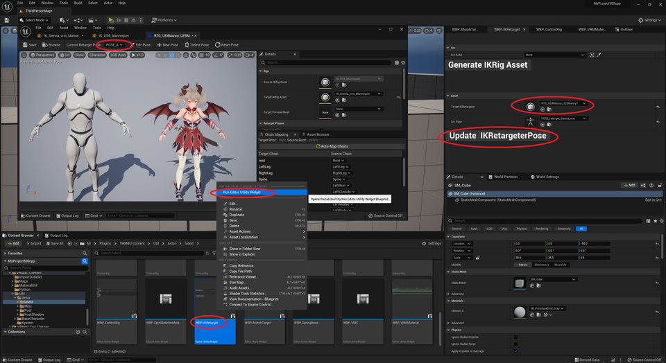](../assets/images/03r_ikrig3.png)|

 AssetBrowserタブより、AnimSequenceを選択するとプレビューできます。他、右クリックからのリターゲット設定で、このIKRetargeterをセットすればOKです。

|AssetBrowserのプレビュー|AnimBPやAnimSequenceを右クリックしてリターゲット|
|-|-|
|[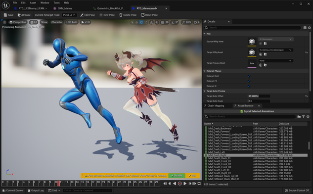](../assets/images/03r_ikrig_r1.png)|[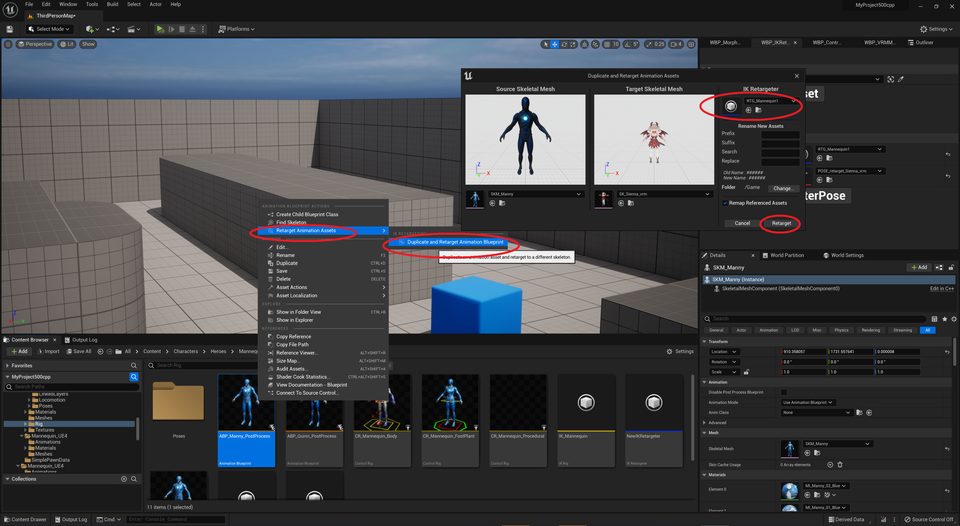](../assets/images/03r_ikrig_r2.png)|

UE5標準のグレイマン用IK_Rigを利用するには、以下よりサードパーソンテンプレートを追加ください。
UE4,UE5それぞれのグレイマンの設定が含まれています。

プラグインコンテンツが表示されない場合は、以下の項目を確認ください。

グレイマンのIK_Rigは以下の手順で生成できます。ただこの手法では、UE4でのリターゲット精度と同等の結果になります。UE5標準IK_Rigを使う方が精度が良いです。

|サードパーソンテンプレートの追加方法|プラグインコンテンツが表示されない場合の対処|WBP_RetargetによるIK_Rigの生成|
|-|-|-|
|[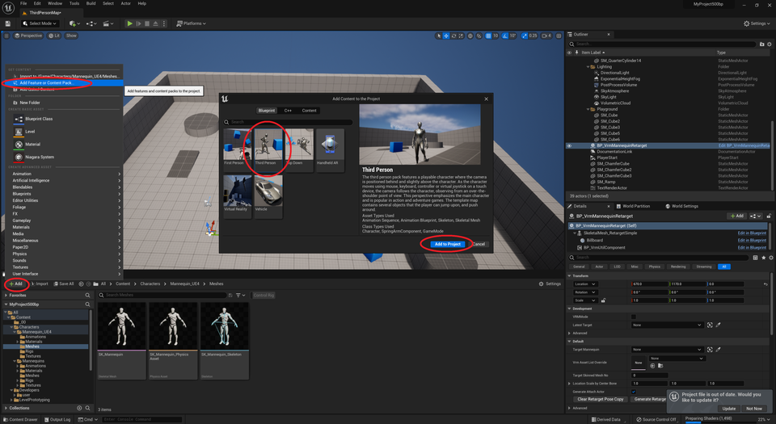](../assets/images/03r_ikrig_add.png)|[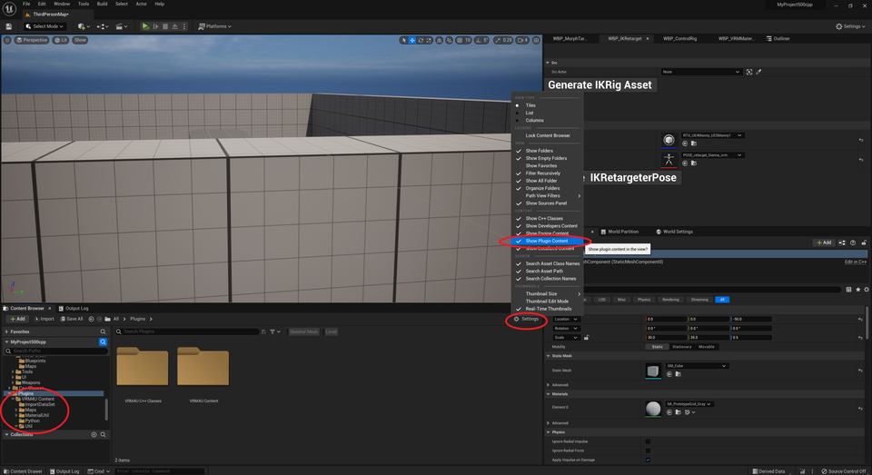](../assets/images/03r_ikrig4.png)|[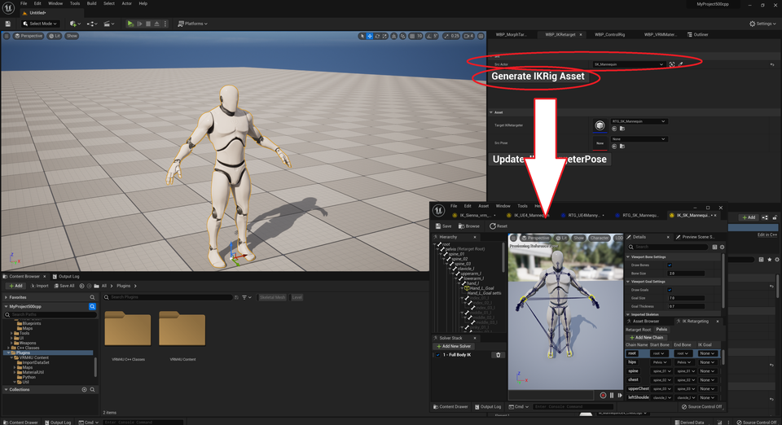](../assets/images/03r_ikrig5.png)|

UE5については、このページ後半に補足解説があります。深く知りたい方は参考にどうぞ。

----

## エディタでリターゲットする（UE4標準機能）

### Advanced Locomotion System に適用する

[Advanced Locomotion System](https://www.unrealengine.com/marketplace/en-US/product/advanced-locomotion-system-v1)に適用するチュートリアルビデオがあります。



以下、動画の要所を解説します。

----
### スケルトンをUE4の骨名で作成する

インポート時に`HumanoidMesh`と`IKBone`にチェックを入れます。

骨名が変わるだけです。骨の向きは変化しません。
{: .notice--info}

VRMモデルとグレイマンのSkeleton共通化は、正しく動作しません。
{: .notice--info}

||
|-|
||

メッシュが3つ出力されます。それぞれ骨名の命名規則が異なります。

|種類|用途|
|-|-|
|モデル骨名|ほとんどの場合これでOKです。モデルの骨名を利用します。よくわからない場合はこれ|
|グレイマン命名規則|グレイマン用に組まれた複雑なシステムを流用する場合|
|VRM命名規則|滅多に使わない。複数のVRMをターゲットにした複雑なシステムを構築する場合|

Humanoidの骨が以下のような名前になります。それぞれにIKBoneも追加されます。

|左：モデル骨名、中央：VRM命名規則、右：グレイマン命名規則|
|-|
||

----

### VirtualBone、Socketを複製する

`AssetUtil` を利用して、既存のSkeletalMeshからVirtualBoneとSocketを複製することができます。
対象はHumanoid骨の子供だけです。

VirtualBoneでIKを制御したり、Socketで武器をアタッチするためのものです。

Socketはプレビューで位置が異なるように見える場合がありますが、問題ありません。初期姿勢がA-pose/T-poseで異なる影響です。同じポーズをとった時に座標が一致します。
{: .notice--info}

||
|-|
||

----

### PhysicsAssetを複製する

`AssetUtil` を利用して、既存のSkeletalMeshからPhysicsAssetを複製することができます。
対象はHumanoid骨についているコリジョンだけです。

ラグドールの下地として有用です。

コリジョンの回転は反映されません。骨の軸向きを補正できないためです。正確に当てはめる場合は手動で調整ください。
{: .notice--info}

|元データ|VRMモデルにコピーしたもの|
|-|-|
|||

----

### 最後の仕上げを忘れずに

輪郭線や影を反映させましょう。キャラクタのBlueprintにMToonAttachActorをアタッチすればOKです。

揺れ骨を正確に動かしましょう。AnimBlueprintの最後に `VRMSpringBone`ノードを追加すればOKです。

リターゲットの結果が変な場合は、SkeletonのA-pose/T-poseを確認してください。

||
|-|
||

----

## 総括

リアルタイムリターゲットの手軽さが光りますね！

…とはいえ厳密な調整には向かないため、用途に応じて手法を使い分けください。
以下に状況別で紹介します。

 - リアルタイムリターゲット向き
   - メインキャラクターをEpicSkeleton準拠で作成している
   - 既にグレイマンを用いて、ある程度の規模のゲームが動作している
   - 試しにキャラクタをVRMモデルに差し替えてみたい。オマケでVRM対応したい
 - リターゲットマネージャ向き
   - メインキャラクターをVRMモデルで作成している
   - 厳密な当たり判定、インタラクションが必要である

----

----

----

## リアルタイムリターゲット おまけ

### PMX リターゲット
PMXモデルに対するリアルタイムリターゲットも可能です。`BP_VrmMannequinRetarget` のオプションを設定ください。内部的には CustomReferencePose と同様の処理が動いています。

||
|-|
||
|モデル：[初音ミク by む～ぶさん](https://piapro.jp/t/0Hwp)|

### モデルをアタッチする

`BP_VrmPoseCopy`を利用します。

レベル配置の場合は、そのままActorにアタッチしてください。
Spawnしている場合は、`BP_VrmMannequinRetarget` より、関数 `GetRetargetSkeletalMeshComponent` で対象を取得できます。

MorphTargetを設定する際も同様です。

|モデルのアタッチやMorphTargetの設定は BP_VrmPoseCopyを利用する|
|-|
||

`BP_VrmPoseCopy`の使い方は[こちらも参照ください](../05_limitedanim/)

### 異なる骨名のEpicSkeletonからリターゲットする

対象のMetaファイルを作成・設定することで対応します。

事前に対象のモデルについて、HumanoidのBoneMapを作成しておきます。
WBP_EpicSkeletonMeta を開き、BaseEpicSkeletonに対象のActorをセットし、ボタン`GenerateEpicSkeletonMetaFile`を押します。
OutputAssetName の場所にMetaファイルが生成されます。
これを`BP_VrmMannequinRetarget`にセットすれば完了です。

|対象のBoneMap。腕の名前がEpicSkeletonと異なる|ボタン`Generate`でMetaファイルを作成|
|-|-|
|[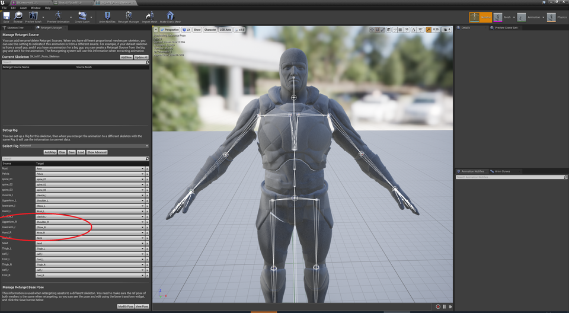](../assets/images/03r_skeleton1.png)||

|そのままでは腕の骨名が異なるのでリターゲットできない|Metaファイルをセットすると腕をリターゲットできる|
|-|-|
|||
|モデル：[NecoMaid](https://booth.pm/ja/items/1843586) ||

### 異なるリファレンスポーズからリターゲットする

標準モデルで任意姿勢のAnimSequenceを作成し、`BP_VrmMannequinRetarget` の `CustomReferencePose` にセットすれば完了です。

デフォルトでは、対象はA-poseのモデルを想定しています。異なる姿勢の場合は、対応するAnimSequenceを作成します。
手の向き・足の開き方が異なる場合も、同じように調整します。

|対象がTポーズの場合|
|-|
||

|デフォルトはAポーズを想定している|←をベースに、対象に合わせてTポーズを作る|
|-|-|
|||

|そのままではAポーズなので肩の向きがおかしい|Tポーズを指定すると正しくリターゲットできる|
|-|-|
|||

### 身長差の補正を制御する

自動で身長差を補正しています。オプションで補正を解除したり、腰をActor原点に揃えることができます。

アニメーションに応じて 補正方法を切り替えてください。

|初期状態|身長差補正なし。腰座標が一致する|
|-|-|
|||

|初期状態|XY軸のみ補正なし。接地感が残る|移動を無効化。腰座標はActor原点になる|
|-|-|-|
||||

----

----

----

## UE5標準機能によるリターゲット の補足

### IK_Rigの自動生成

VRM4Uは インポート時に、以下3タイプのIK_Rigを生成します。

|タイプ|用途|
|-|-|
|1. UE5のChainName基準|これを使えばOK。UE5標準。テンプレートのIK_Rigとペアで利用する|
|2. VRMのHumanoidBone基準|VRM同士でのリターゲットに利用する|
|3. UE4マネキンの骨名基準|WBP_Retargetで生成したIK_Rigとペアで利用する|

WBP_Retargetを利用してUE4マネキンのIK_Rigを生成した場合は、2,3番が生成されます。VRM側のIK_Rigと対応するものを利用ください。

### FullBodyIK設定を有効化する

IK_RigにはFullBodyIKを設定済です。用途に応じてONにして利用ください。
設定はグレイマンと同等です。

FullBodyIKを使うと肩が破綻しやすいです。有効化する際は十分確認ください。モデルの肩幅の差が大きい場合、より大きく破綻します。
{: .notice--info}

|FullBodyIKの有効化|
|-|
|[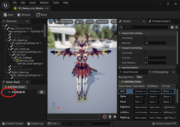](../assets/images/03r_ikrig_ik.png)|

### Aポーズ自動生成・調整

VRM4Uは リターゲットポーズを ポーズアセットから読み込めます。

インポート時に自動的にAポーズ用のアセットを生成します。大抵は問題ないですが、気になる場合はIKRetargeterより微調整ください。標準VRoidを基準にしています。

|自動設定Aポーズ|
|-|
|[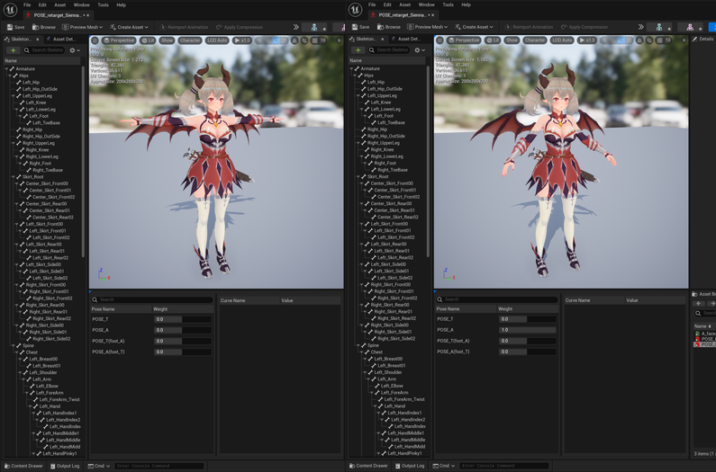](../assets/images/03r_ikrig_pose.png)|
