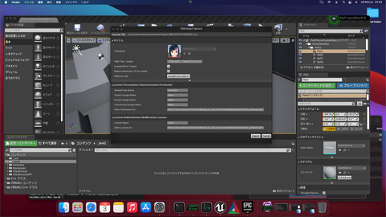
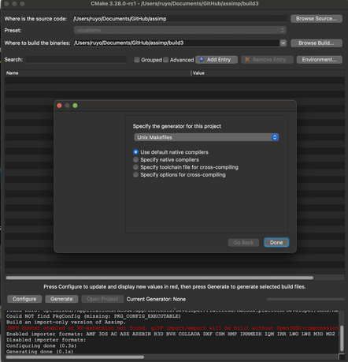
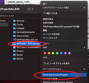
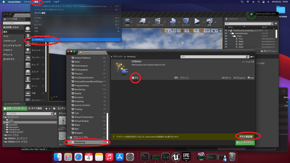

||
|-|
||
|モデル：[ネミア -Nenmir-](https://rokota.booth.pm/items/4376366)|
|衣装：[メイガスバニー](https://booth.pm/ja/items/4911160)|

----

## 概要

MacでVRM4Uを動かすための環境設定をします。
慣れ次第で、数分～1時間くらいでセットアップ完了します。気軽にお試しください。

ソースの取得とプロジェクトビルドを行います。エンジンビルドは不要です。

### 手順の要約

 - カスタム版assimpをダウンロード、makeする。
 - VRM4Uのソースをダウンロード、展開する
   - assimp.aをThirdParty以下にコピー
 - EpicGamesLauncherからプロジェクトを選択、ダイアログに従ってプロジェクトをビルド。

ソースの取得方法や展開場所は[こちらのページを参照ください。](../03_exe/)

私はMacの開発環境に不慣れです。詳しい方はより適した手順で導入ください…
{: .notice--info}

### assimpのビルド

こちらからカスタム版assimpのソースをダウンロード、makeします。
後述しますが、UE5.1以前を利用する場合はx86_64でmakeします。

https://github.com/ruyo/assimp

`cmake-gui`を利用する手順を紹介します。guiでパスを設定後、`Configure`を押します。途中で出るダイアログはデフォルトままでOKです。

||
|-|
||

もしエラーが出る場合、Xcodeのセットアップが不十分かもしれません。AppStoreよりXcodeのインストール、起動後にmacOS用のコンポーネントを追加ください。

その後、下図のように設定ください
 - `ASSIMP_BUILD_ALL_EXPORRTERS_BY_DEFAULT` を `OFF`
 - `ASSIMP_WARNINGS_AS_ERRORS` を `OFF`
 - `BUILD_SHARED_LIBS` を `OFF`
 - `CMAKE_BUILD_TYPE` を `Release` （手動で入力します）
 - `Generate` を押す

オプションが多数ありますが、そのままで構いません。

||
|-|
||

続いてターミナルより、assimpディレクトリで、`make` コマンドを実行します。

完了すると、libディレクトリ（上の例だとassimp/build3/lib）に`libassimp.a` が生成されます。

UE5.1以前を利用している場合は、明示的にx86_64としてビルドする必要があります。上記の例では、ターミナルとcmake-gui をRosettaを利用して起動し、手順を辿ります。UE5.2からは特別な手順は不要です。
{: .notice--info}

### プロジェクトのビルド

UEからC++プロジェクトを作成しておきます。
VRM4Uのソースをプロジェクトに展開し、前段でmakeしたassimpライブラリを以下に置きます。

MyProject/Plugins/VRM4U/ThirdParty/assimp/lib/Mac/libassimp.a

その後、MyProject.uprojectをダブルクリック、ダイアログでYesを選択し、ビルドします。

|ダイアログの Yes でプロジェクトがビルドされます|
|-|
||

エラーが出る場合は、フォルダ `Binaries`と`intermediate` を削除して、再度ダブルクリックください。
削除するのは以下のフォルダです。
- MyProject/Binaries
- MyProject/Intermediate
- Myproject/Plugins/VRM4U/Binaries
- Myproject/Plugins/VRM4U/Intermediate

それでもエラーが出る場合は、ログを確認ください。
以下のようなパスに出力されています。
`~/Library/Logs/Unreal Engine/MyProjectEditor`

以下はXcodeでのビルドです。 **ただXcodeのバージョンが変わると、すぐ動かなくなります。** できれば、上記のタイアログによるビルドをご利用ください。
手順だけ書き残しておきます。
.uprojectファイルを右クリック、Xcodeプロジェクトを作成します。.xcworkspaceが生成されるので開きます。

Xcodeでビルド。Product > Build を選択します。起動時にエラーがでてエディタが立ち上がらない場合、ビルド設定がGameになっているかもしれません。Editorビルドに切り替えてください。完了後はMyProject.uprojectをダブルクリックで起動します。

### プラグインの有効化、ビルド

初回起動時はプラグインは無効です。プラグイン設定から有効化してください。有効化後、ビルド確認ダイアログに従ってビルドしてください。

||
|-|
||

完了です。

|Mac上でのモデルインポート|
|-|
||

蛇足：もしiOSアプリを作成したい場合、Windowsからのリモートビルドも利用することができます。用途に応じて環境をご利用ください。
{: .notice--info}
