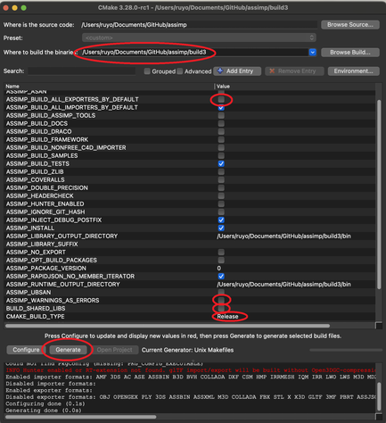

||
|-|
||
|モデル：[千駄ヶ谷 渋](https://hub.vroid.com/characters/675572020956181239/models/4479743608263344465)|

----

## 概要

Macで動かすには、ソースの取得とプロジェクトビルドが必要です。

UE4が動作できるスペックがあれば数分で完了します。
エンジンビルドは不要です。

### 手順の要約

 - VRM4Uのソースをダウンロード、プロジェクトフォルダに展開する
 - カスタム版assimpをダウンロード、makeする。
     - make結果を展開 VRM4U/ThirdParty/assimp/lib/Mac/libassimp.dylib
 - MyProject.uprojectを右クリック、Xcodeプロジェクトを作成し、ビルド。
 - 完了

ソースの取得や展開場所は[こちらのページを参照ください。](../03_exe/)

私はMacの開発環境に不慣れです。詳しい方はより適した手順で導入ください…
{: .notice--info}

### assimpのビルド

こちらからカスタム版assimpのソースをダウンロードしてmakeします。

https://github.com/ruyo/assimp

私は`cmake-gui`を利用しました。参考にどうぞ。
`ASSIMP_INSTALL`はOFFが良いと思いますが、よくわからなければそのままで構いません。

パスを設定後、`Configure`、`Generate` を押せば完了です。途中で出るダイアログはデフォルトままでOKです。

||
|-|
||

assimpディレクトリで、`make` コマンドを実行します。

完了すると、binフォルダ（上の例だとassimp/build2/bin）に`libassimp.dylib` などが生成されます。

### プロジェクトのビルド

あらかじめUE4からC++プロジェクトを作成しておくことをオススメします。
VRM4Uのソースをプロジェクトに展開し、前述のmakeしたassimpライブラリを以下に置きます。リンクでも構いません。

MyProject/Plugins/VRM4U/ThirdParty/assimp/lib/Mac/libassimp.dylib

その後、MyProject.uprojectを右クリック、Xcodeプロジェクトを作成し開きます。

||
|-|
||

Xcodeでビルドします。Product > Build を選択します。

https://docs.unrealengine.com/en-US/ProductionPipelines/DevelopmentSetup/CompilingProjects/index.html

初回起動はプラグインは無効です。プラグイン設定から有効化し、Xcodeで再度ビルドしてください。[詳しくはこちら](../01_quick-start/)

xCodeでのビルドは以下を参照ください。

|||
|-|-|
|||
