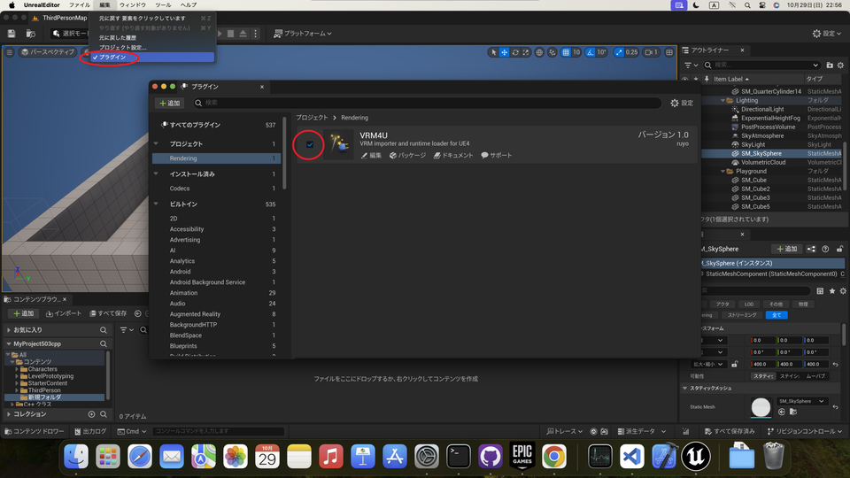

||
|-|
||
|モデル：[千駄ヶ谷 渋](https://hub.vroid.com/characters/675572020956181239/models/4479743608263344465)|

----

## 概要

MacでVRM4Uを動かすための環境設定をします。
慣れ次第で、数分～1時間くらいでセットアップ完了します。気軽にお試しください。

ソースの取得とプロジェクトビルドを行います。エンジンビルドは不要です。

### 手順の要約

 - カスタム版assimpをダウンロード、makeする。
 - VRM4Uのソースをダウンロード、展開する
   - assimp.aをThirdParty以下にコピー
 - EpicGamesLauncherからプロジェクトを選択、ダイアログに従ってプロジェクトをビルド。

ソースの取得方法や展開場所は[こちらのページを参照ください。](../03_exe/)

私はMacの開発環境に不慣れです。詳しい方はより適した手順で導入ください…
{: .notice--info}

### assimpのビルド

こちらからカスタム版assimpのソースをダウンロード、makeします。後述しますが、M1 Macを利用している場合はx86_64でmakeします。

https://github.com/ruyo/assimp

私は`cmake-gui`を利用しました。guiでパスを設定後、`Configure`を押します。途中で出るダイアログはデフォルトままでOKです。
`BUILD_SHARED_LIBS` をOFFにしてから、`Generate` を押します。

オプションが多数ありますが、そのままで構いません。

||
|-|
||

続いてターミナルより、assimpディレクトリで、`make` コマンドを実行します。

完了すると、libディレクトリ（上の例だとassimp/build2/lib）に`libassimp.a` が生成されます。

M1 Macを利用している場合は、明示的にx86_64としてビルドする必要があります。上記の例では、ターミナルとcmake-gui をRosettaを利用して起動し、手順を辿ります。
{: .notice--info}

### プロジェクトのビルド

UE4からC++プロジェクトを作成しておきます。
VRM4Uのソースをプロジェクトに展開し、前段でmakeしたassimpライブラリを以下に置きます。

MyProject/Plugins/VRM4U/ThirdParty/assimp/lib/Mac/libassimp.a

その後、MyProject.uprojectをダブルクリック、ダイアログでYesを選択し、ビルドします。

|ダイアログの Yes でプロジェクトがビルドされます|
|-|
||

起動した場合は次の手順へ進んでください。

途中でエラーが出る場合は、Xcodeからビルドします。 **が、UE4.27ではうまく動作しないようです。** できれば、上記のタイアログによるビルドをご利用ください。

手順だけ書き残しておきます。
.uprojectファイルを右クリック、Xcodeプロジェクトを作成します。.xcworkspaceが生成されるので開きます。

||
|-|
||

Xcodeでビルド。Product > Build を選択します。完了後はMyProject.uprojectをダブルクリックで起動します。

||
|-|
||

初回起動時はプラグインは無効です。プラグイン設定から有効化してください。有効化後、ビルド確認ダイアログに従ってビルドしてください。

||
|-|
||

完了です。

|Mac上でのモデルインポート||
|-|-|
|||

蛇足：もしiOSアプリを作成したい場合、Windowsからのリモートビルドも利用することができます。用途に応じて環境をご利用ください。
{: .notice--info}
