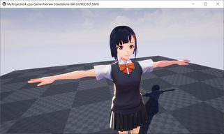
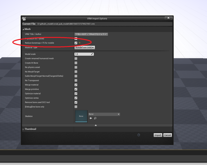
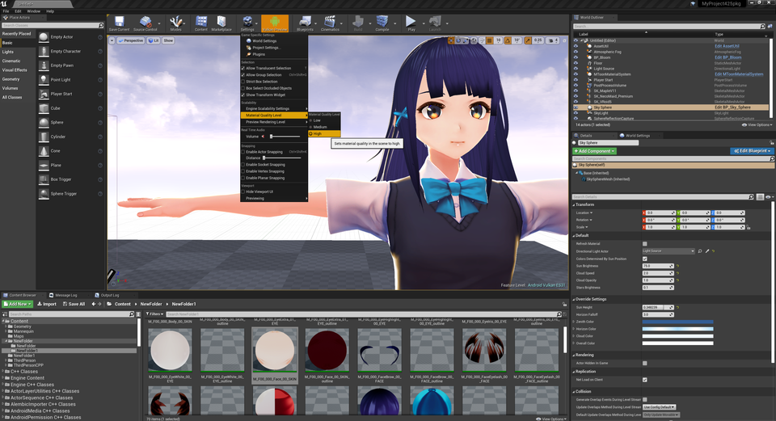
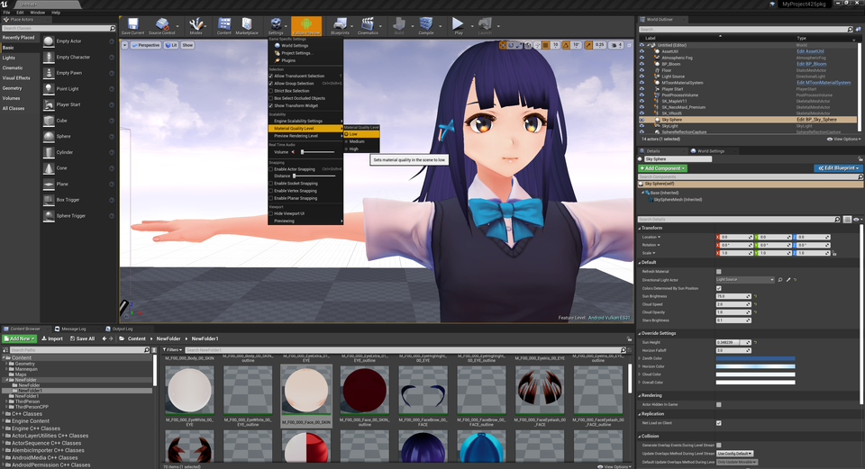
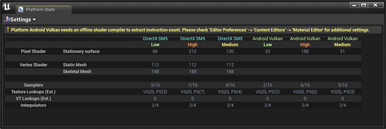

||
|-|
||
|モデル：[千駄ヶ谷 渋](https://hub.vroid.com/characters/675572020956181239/models/4479743608263344465)|

----

## PCVRでの動作

特別な設定は不要です。そのままVRPreviewで動作します。

`deferred`と`forward`両方の描画方式にも対応しています。
レイトレースも並用可能です。

## モバイル用インポートオプション

モバイル向けには、モデルインポート時に `Reduce bonemap <=75`のオプションを有効にします。

1パーツ内の骨数が多くUEで表示できないモデルを自動でリダクションします。制限内のモデルには影響ありません。

||
|-|-|
||

## エディタで確認する

モバイルプレビューで見た目を確認可能です。PCと比べて多少色味が異なります。描画負荷軽減の影響です。

||
|-|-|
||

## モバイル、OculusQuestで利用する

VRM4Uのソースが必要です。[EXEを作成する](../03_exe/)の解説より、VRM4Uのソースコードを配置してください。

配置後はそのまま転送できます。

描画負荷が高い場合は、`MaterialQualityLevel`で負荷を下げることができます。
切り替えには コンソールコマンド `r.MaterialQualityLevel 0` を利用ください。`1`で戻ります。

軽量版(Low)では描画負荷は半分以下になります。
かわりにシェーディングが簡略化され、リムライトやエミッシブの省略、色味の再現度などが下がります。

|標準(High)|軽量版(Low)|
|-|-|
||

|シェーダの負荷（参考）|
|-|
||

同時にモバイル向けの一般的な最適化（MobileHDRの無効化やシェーダ機能のOFFなど）を検討ください。
