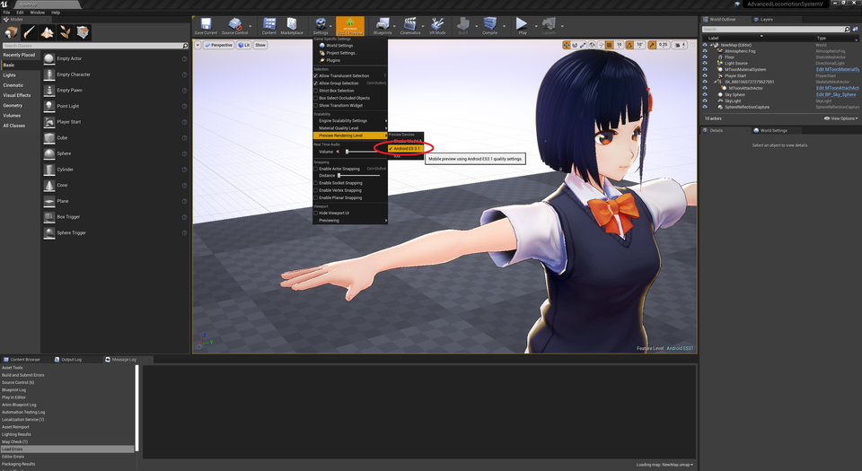

||
|-|-|
||
|モデル：[千駄ヶ谷 渋](https://hub.vroid.com/characters/675572020956181239/models/4479743608263344465)|

----

## PCVRでの動作

特別な設定は不要です。そのままVRPreviewで動作します。

`deferred`と`forward`両方の描画方式にも対応しています。
レイトレースも並用可能です。

## モバイル用インポートオプション

モバイル向けには、モデルインポート時に `Reduce bonemap <=75`のオプションを有効にします。

1パーツ内の骨数が多くUE4で表示できないモデルを自動でリダクションします。制限内のモデルには影響ありません。

||
|-|-|
||

## エディタで確認する

モバイルプレビューで確認可能です。PCと比べて多少色味が異なります。描画負荷軽減の影響です。

||
|-|-|
||

## モバイル、OculusQuestで利用する

そのまま転送でOKです。

描画負荷が高い場合は、`MaterialQualityLevel`を下げることで負荷を下げることができます。シェーディングが簡略化され、色味が変わります。

