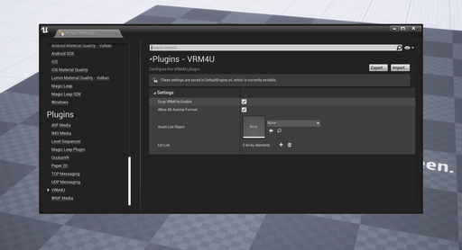

----

## ゲーム実行中にモデルを読み込む

サンプルマップ、`VRM4U/Maps/VRM4U_runtimeload` を参照ください。

以下のように、ファイルのドラッグ＆ドロップを有効化してエディタを再起動します。

Play中に「ゲームウインドウ」にVRMファイルを送ると、その場でSkeletalMeshを生成します。

|||
|-|-|
||

内部的には常にVRoidSimpleのSkeletonが動作しており、そのアニメーションがランタイムでリターゲットされています。

サンプルでは、生成したキャラクタに操作キャラクタのアニメーションが流し込まれます。

なお`BP_VrmCharacterBase`もランタイムリターゲットで動作しています。フォトモードにてアニメーションをVRoidSimpleにリターゲットするのは このためです。

