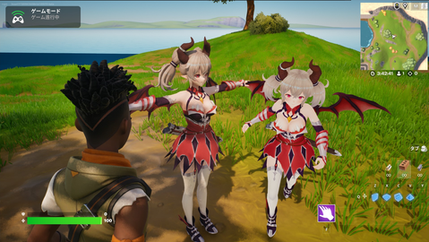
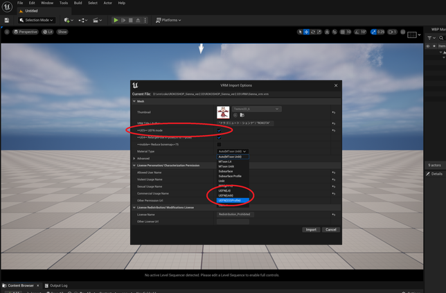
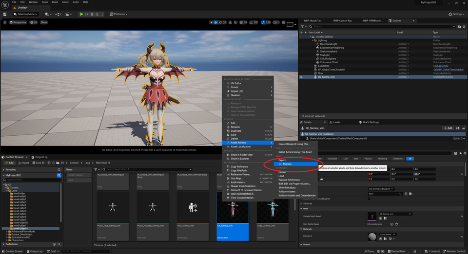
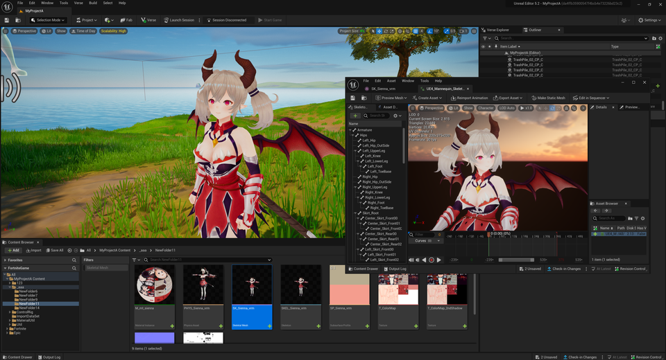

|||
|-|-|
||
|モデル：[【オリジナル3Dモデル】ドラゴニュート・シェンナ](https://booth.pm/ja/items/2661189)|

----

モデルをUE5でインポートし、UEFNにmigrateします。

## UE5にインポートする

インポートオプションより、以下を設定ください。
 - UEFNのチェックボックスをON
 - UEFN用のマテリアルを選択します。オススメはUEFN(SSSProfile) です。

|||
|-|-|
||

インポート後は、アセットを保存してください。
保存していない場合、後段のmigrateが正しく動作しません。

## UEFNプロジェクトにmigrateする

SkeletalMeshを右クリックより、migrateを選択、migrate先をUEFNプロジェクトのContentフォルダに指定します。

設定はデフォルトのまま利用ください。（依存するアセットが全てチェックONになっている状態）

|||
|-|-|
||

完了です。

|||
|-|-|
||

## 詳しい動作の解説

インポート時のUEFNのチェックボックスをONにすることで、以下が設定されます
 - MorphTargetの削除
 - PhysicsAssetの削除
 - HumanoidRigの削除(UE4向けのリターゲットデータ)
 - SingleAssetの無効化(アセットの数ぶんファイルが作成される)
