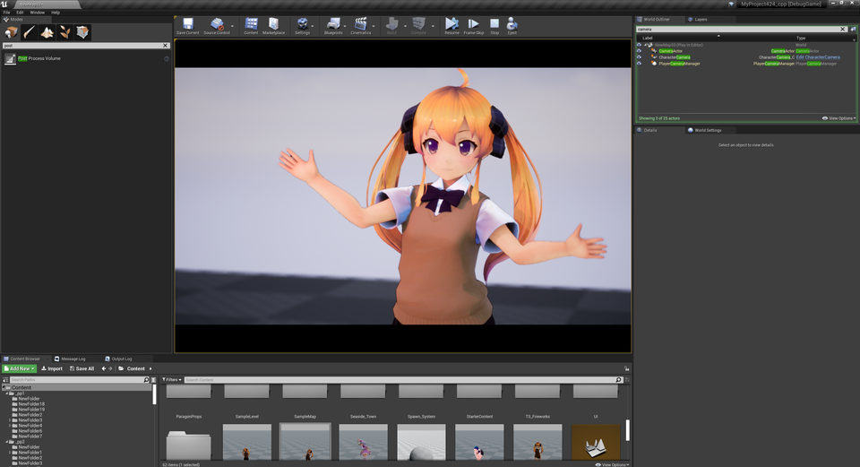
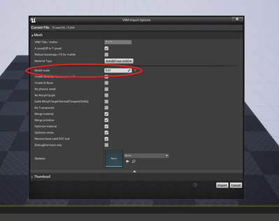
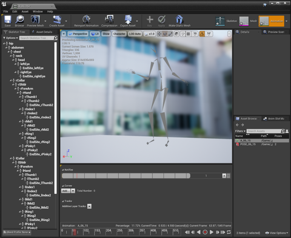
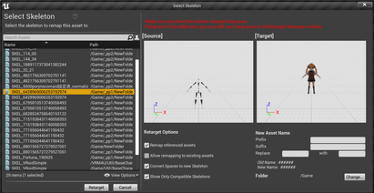

||
|-|
||
|モデル：[ついんてちゃん](https://hub.vroid.com/characters/6515310034341535951/models/6479090333116559171) |
|アニメーション：[CMU's motion capture database](https://sites.google.com/a/cgspeed.com/cgspeed/motion-capture/cmu-bvh-conversion)（bvhインポート）|
|アニメーションプレビュー：[BVH WEB VIEWER](http://motion.hahasoha.net/)|

----

## BVHをインポートする

実験的な実装です。骨の向きがずれることがあります。
{: .notice--info}

BVHファイルをコンテンツブラウザにドラッグ＆ドロップします。インポート時のオプションにて、scale を0.01にします。

ファイルを続けて複数インポートする場合は「Skeleton」の項目にベースのSkeletonを設定しましょう。アセットが共通化されます。

|||
|-|-|
|||

## BVHをリターゲットする

標準のリターゲット手順で可能です。HumanoidRIGは登録済です。A-pose/T-pose切り替えも可能です。

||
|-|
||

色々なアニメーションを適用してみましょう。

||
|-|
||

