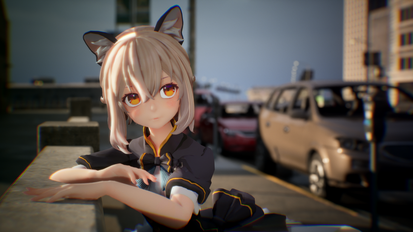
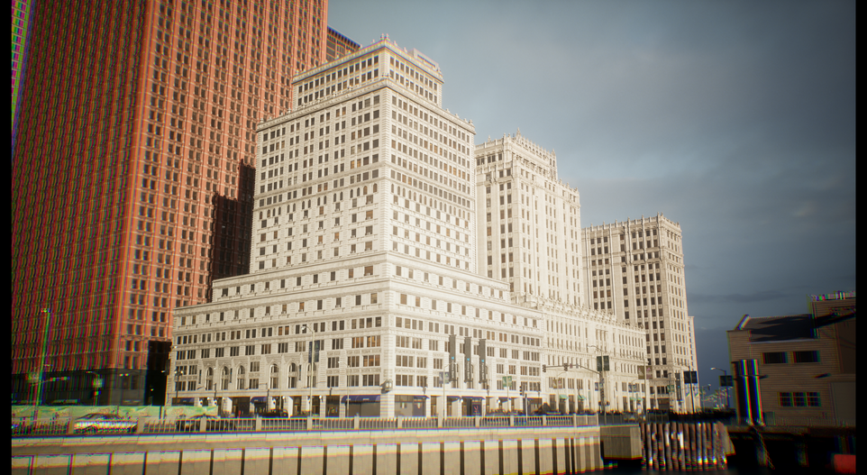
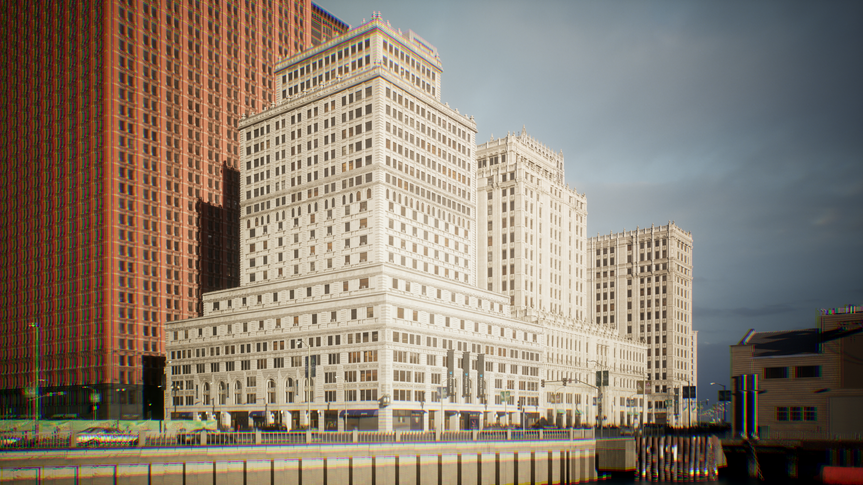
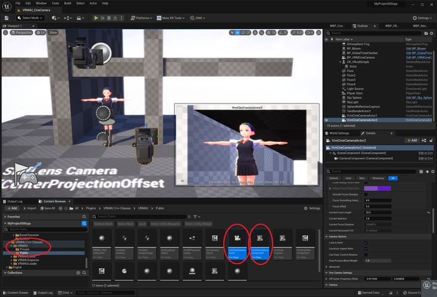
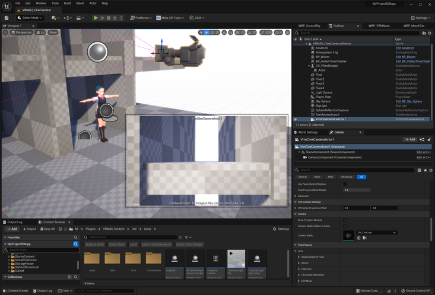
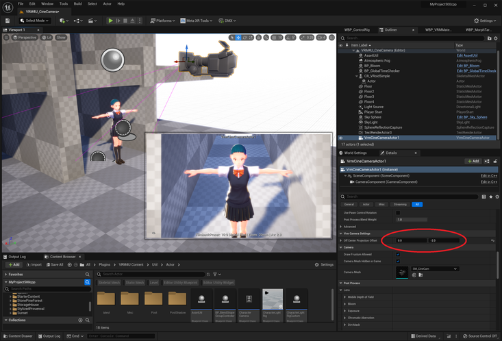
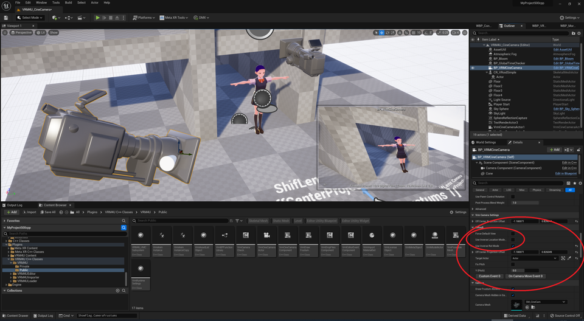

||
|-|
||
|モデル：[New NecoMaid](https://booth.pm/ja/items/4252664)|

----

## 概要

シフトレンズを利用し、歪みの少ない絵や、消失点をずらした絵を撮影できます。

サンプルマップはUE5.0以降対応で Maps/latest/VRM4U_CineCamera.umap にあります。

カメラアセット自体はすべてのバージョンで動作します。

|標準カメラを上に向けたもの 上方がパースによって狭くなる|視錐台を上方にシフトしたもの 建物が垂直になる|
|-|-|
|||

----

## 使い方

VrmCineCameraActor を利用ください。コンポーネントとして利用する場合は VrmCineCameraComponent です。

|サンプルマップ、カメラのアセット|
|-|
||

VRMCineCameraActor を配置します。OffCenterProjectionOffset に値を入力したら完了です。
撮影範囲が 上下左右にシフトします。

コンソールコマンド `ShowFlag.CameraFrustums 1` によってカメラの視錐台をデバッグ描画できます。

|標準（カメラの正面が映る）|視錐台を下方にシフトした（カメラの下方が映る）|
|-|-|
|||

## 応用編

BP_VRMCineCamera を利用することで、対象Actorを画面中心に捉えたまま、撮影範囲をシフトできます。
カメラを常に水平に保つ機能もあります。

このBlueprintはUE5.0以降でのみ動作します。（同じノードを組めば以前のバージョンでも動作します）

|撮影範囲をシフトさせているが、カメラ回転によって対象を画面中心に捉えづつける|
|-|
||
