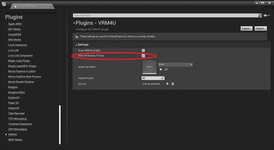
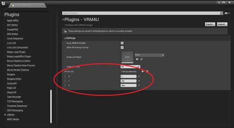

----

多種多様な3Dモデルフォーマットについて、インポートを試みます。

モデルのライセンスを十分ご確認ください。
{: .notice--info}

実験的な機能です。エラーが起きたりエディタがクラッシュすることがあります。
{: .notice--info}

----
## なんでもインポート機能を有効化する

プロジェクト設定より、VRM4U > `Allow All AassImp Format` をONにして、エディタを再起動します。

ドラッグ&ドロップで読み込めるモデルフォーマットが増えます。

||
|-|
||

[読み込めるファイルフォーマットはこちら](https://github.com/assimp/assimp/blob/master/doc/Fileformats.md)

ファイルによっては、インポートオプションやエラーが出ない場合があります。
ExtList より読み込みたいファイルの拡張子を追加し、エディタを再起動してください。

既存のインポータとの干渉を避けるため、明示的な指定が必要になっています。

||
|-|
||

----
## 内部処理の話

VRM4Uはモデルローダとして[AssImp](https://github.com/assimp/assimp)を拡張して利用しています。
普段は読み込みフォーマットを制限しています。がオプションにより制限を解除できるようにしています。

運が良ければ、SkeletalMesh、Animation、Blendshape を読み込むことができます。