||
|-|
|[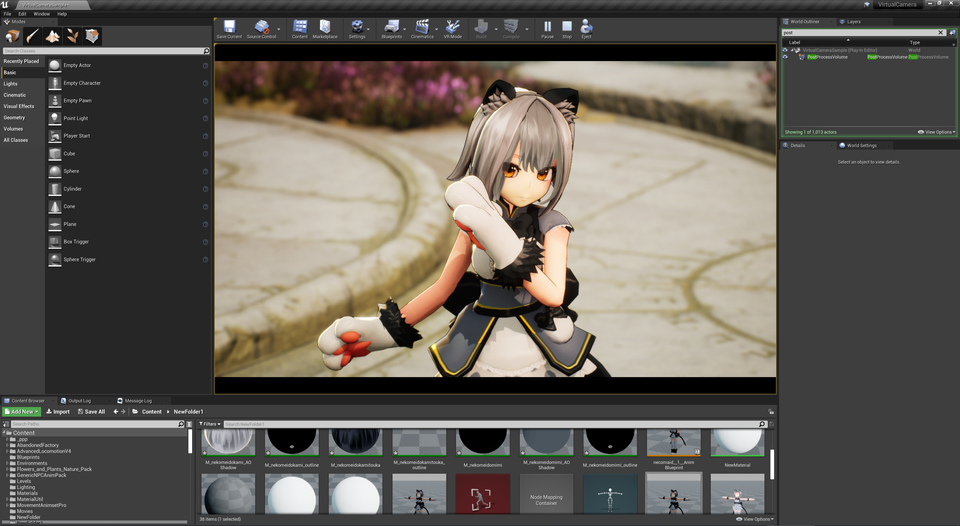](../assets/images/04a_top.png)|
|モデル：[NecoMaid](https://booth.pm/ja/items/1843586) （fbx -> VRM変換）|
|アニメーション：[ミライ小町](https://www.bandainamcostudios.com/works/miraikomachi/dlcguideline.html)（fbx -> humanoidリターゲット）|

----

## ここはUEでVRChatアバターを利用するための解説ページです
Google検索でこのページに来られた方、よくご確認ください。

## UnityでVRM変換する

### 手軽な方法、Unityわからない人向け
Unityにインポートし、そのままVRM出力すればOK。
Unity上でのプレビューが紫色でも問題ありません。UE側である程度設定されます。ただし揺れ骨は動作しません。

### Unity詳しい人向け

一般的なVRMセットアップと同じです。
ある程度MToonマテリアルを組んでおくと後段の手順が減ります。

アニメーションも考慮するなら、DynamicBoneからVRMSpringBoneへの置き換え、BlendShapeの登録があるとスムーズです。

----
## マテリアルをセットアップする

インポート時にMaterialTypeを`MToonLit`に、最適化をOFFにします。
これは共通マテリアルをマージする機能です。今回はVRM用のマテリアルでないため、マージすると不都合が起きてしまいます。

生成されたマテリアルより2箇所に同じテクスチャをセットすればOKです。影色テクスチャがある場合はそれを割り当てましょう。

|||
|-|-|
|[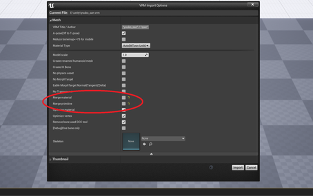](../assets/images/04a_merge.png)|[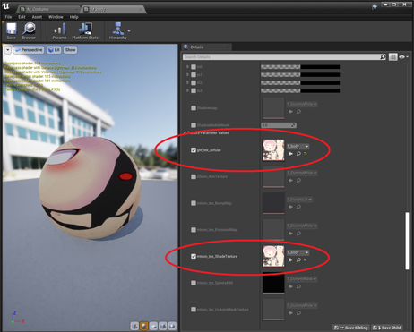](../assets/images/04a_tex.png)|

なお、影色は`MToonMaterialSystem`で一括適用できます。ある程度あたりを付けた後、マテリアル毎に設定すると良いでしょう。

他の調整は基礎編や撮影編を参照ください。

----
## 揺れ骨をセットアップする（中級者向け）

簡易的な機能です。突き抜け対処や微調整が必要な場合はUniVRMで設定ください。
{: .notice--info}

### 手順

下図の赤丸を設定します。煩雑なテキストですが順を追って設定していきましょう。

|揺れ骨をVrmMetaに書き込み|←で作成したVrmMetaを利用して揺らす|
|-|-|
|[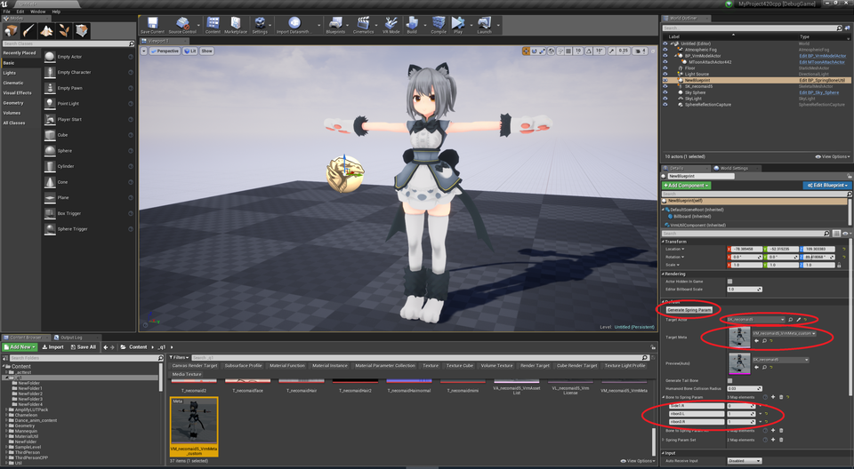](../assets/images/04a_spr1.png)|[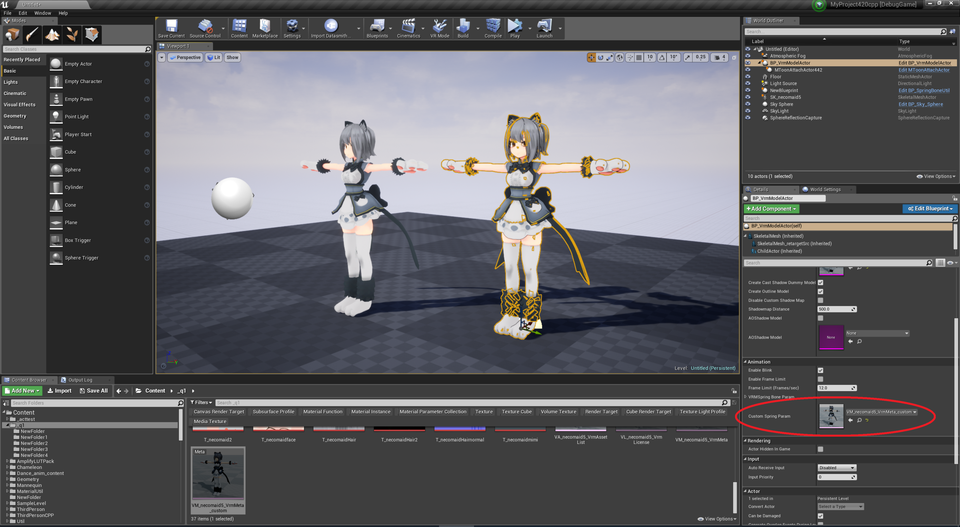](../assets/images/04a_spr2.png)|

- 対象キャラクタのVrmMetaアセットを複製する。
- 対象キャラクタのSkeletalMeshを配置する。
- `BP_SpringBoneUtil`を配置し、TargetActorに↑のActorをセット、TargetMetaに↑の複製したVrmMetaをセットする。
- BoneToSpringParamに揺らしたい根本の骨名と、SpringParamIDを入力する。（後述。WBP_SpringBoneで自動入力できる）
- `GenerateSpringParam`を押す。
- `BP_VrmModelActor`を配置し、`CustomSpringParam`に上記のVrmMetaをセットする

### 詳細

揺れ方パラメータを`SpringParamSet`で設定可能です。初期値として0番に髪揺れ、1番にスカート揺れ を設定済です。
どのパラメータを利用するかSpringParamIDで選択できます。任意に編集・追加可能です。

骨名の選択には、`WBP_SpringBone`を利用することもできます。UIが煩雑ですが、`BP_SpringBoneUtil` のパラメータを半分くらい自動設定できます。

揺れ骨で指定する骨は、子が一直線に繋がるものを選択ください。途中で枝分かれする場合は、奇妙な動きをすることがあります。

手足コリジョンの大きさを`HumanoidCollisionRadius`で設定可能です。

設定した揺れ骨はAnimBlueprintから確認可能です。

|揺れ骨デバッグ表示|
|-|
|[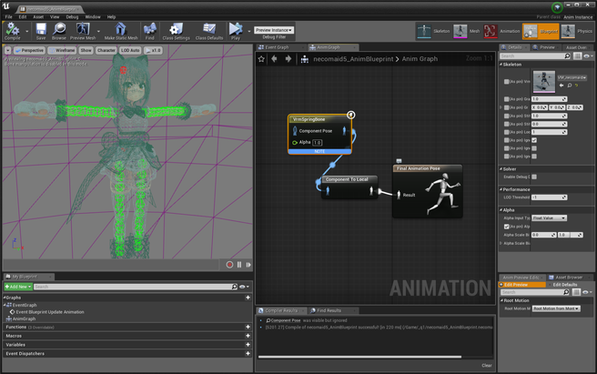](../assets/images/04a_spr3.png)|

揺れ骨が足りず突き抜けが発生する場合は`BoneToSpringParam`の代わりに`BoneToSpringParamAll`に骨名を設定します。`GenerateTailBone`をONにすると揺れ骨先端に骨が追加されコリジョンが増えます。

あくまで簡易設定です。細かな設定はできません。

----
## 目を前面に描画する（中級者向け）

目や眉毛を前髪より手前に描画します。

 - 簡単な方法
   - マテリアルパラメータより、ZOffsetを調整ください。
 - 厳密な方法
   - StencilMaskを有効化します。
   初期状態では、Stencilが2の場所について、透明度を任意に設定できるようになっています。マテリアルより有効化できます。
   - モデルは3回描画が分必要です。(Stencil1, Stencil2, 半透明の3回)

|Stencilで目を手前にした例|Stencil値|
|-|-|
|[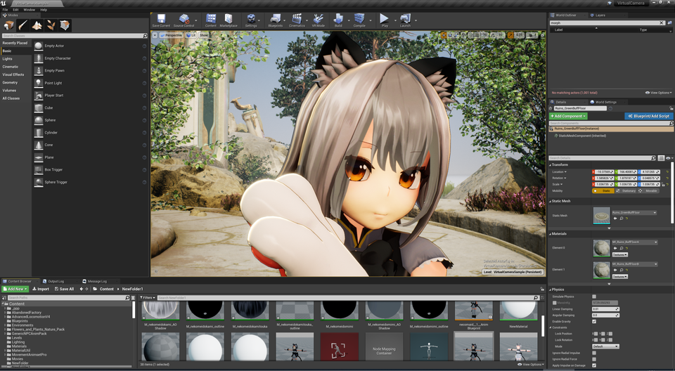](../assets/images/04a_mask1.png)|[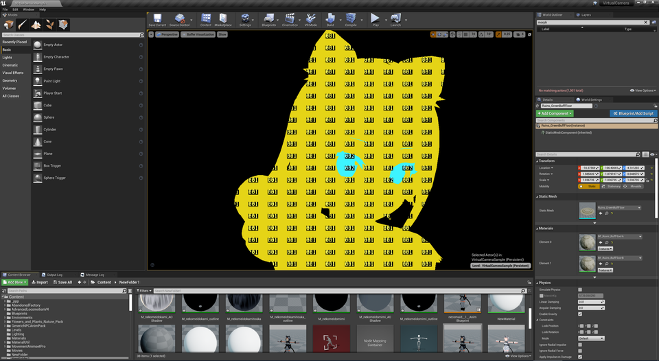](../assets/images/04a_mask2.png)|

----

## AngelRingを描画する（上級者向け）

UTS2（ユニティちゃんトゥーンシェーダー2.0）を割り当ててAngelRingを設定しているモデルのみ。

AngelRingの描画にはUV2の情報が必要です。UniVRM（の中のUniGLTF）を拡張し、UV2を持ったVRMを出力します。

|AngelRingなし|AngelRingあり|
|-|-|
|[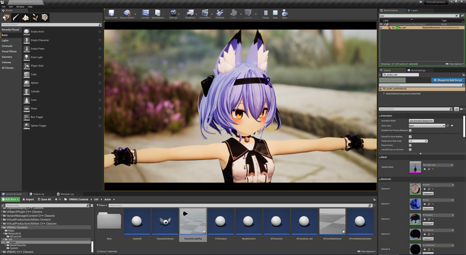](../assets/images/04a_angel2.png)|[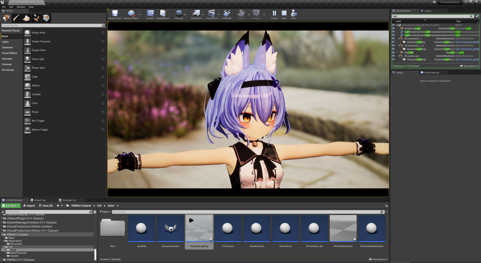](../assets/images/04a_angel3.png)|
|モデル：[幽狐族のお姉様](https://booth.pm/ja/items/1484117) （fbx -> VRM変換）|

### UniGLTFでUV2を出力する

起点のソースは`MeshExporter.cs`です。

キーワード`TEXCOORD_0`で検索し、その行の後ろに`TEXCOORD_1`として同じ処理を追加します。
`TEXCOORD_0`のデータ作成時には`.uv`を参照しています。`TEXCOORD_1`向けには`.uv2`を参照するよう書き換えます。

Unityでソースをビルドすると何度かエラーが出ます。その都度 `TEXCOORD_1`の処理を追加すればOKです。

### テクスチャをセットする

マテリアル設定により、AngelRingのテクスチャを設定すればOKです。

||
|-|
|[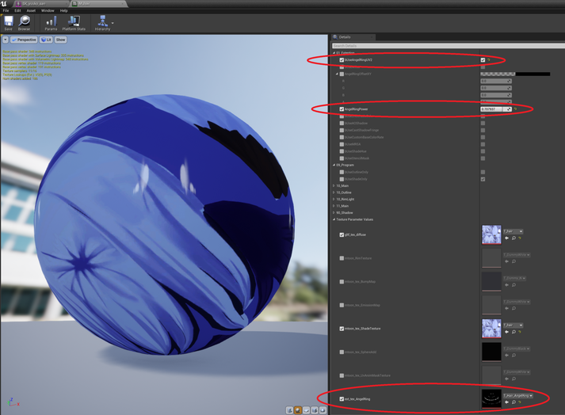](../assets/images/04a_angel1.png)|

厳密には再現されません。簡略化した処理を行っています。
