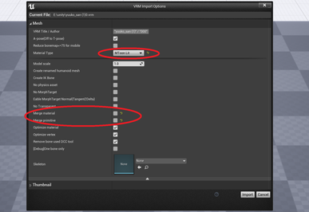

||
|-|
||
|モデル：[NecoMaid](https://booth.pm/ja/items/1843586) （fbx -> VRM変換）|
|アニメーション：[ミライ小町](https://www.bandainamcostudios.com/works/miraikomachi/dlcguideline.html)（fbx -> humanoidリターゲット）|

----

## UnityでVRM変換する

### 手軽な方法、Unityわからない人向け
Unityにインポートし、そのままVRM出力すればOK。
Unity上でのプレビューが紫色でも問題ありません。UE4側で設定します。ただし揺れ骨は動作しません。

### Unity詳しい人向け

一般的なVRMセットアップと同じです。
ある程度MToonマテリアルを組んでおくと後段の手順が減ります。

アニメーションも考慮するなら、DynamicBoneからVRMSpringBoneへの置き換え、BlendShapeの登録があるとスムーズです。

----
## マテリアルをセットアップする

インポート時にMaterialTypeを`MToonLit`に、最適化をOFFにします。
これは共通マテリアルをマージする機能です。今回はVRM用のマテリアルでないため、マージすると不都合が起きてしまいます。

生成されたマテリアルより2箇所に同じテクスチャをセットすればOKです。影色テクスチャがある場合はそれを割り当てましょう。

|||
|-|-|
|||

なお、影色は`MToonMaterialSystem`で一括適用できます。ある程度あたりを付けた後、マテリアル毎に設定すると良いでしょう。

他の調整は基礎編や撮影編を参照ください。

----
## 目を前面に描画する（中級者向け）

目や眉毛を前髪より手前に描画します。

StencilMaskを有効化します。
初期状態では、Stencilが2の場所について、透明度を任意に設定できるようになっています。マテリアルより有効化できます。

|Stencilで目を手前にした例|Stencil値|
|-|-|
|||

----

## AngelRingを描画する（上級者向け）

UV2でAngelRingを設定しているモデルのみ。
UniVRM（の中のUniGLTF）を拡張しUV2を利用します。

|AngelRingなし|AngelRingあり|
|-|-|
|||
|モデル：[幽狐族のお姉様](https://booth.pm/ja/items/1484117) （fbx -> VRM変換）|

### UniGLTFでUV2を出力する

起点のソースは`MeshExporter.cs`です。

キーワード`TEXCOORD_0`で検索し、その行の後ろに`TEXCOORD_1`として同じ処理を追加します。
`TEXCOORD_0`のデータ作成時に`.uv`を参照している箇所があります。`TEXCOORD_1`向けには`.uv2`に書き換えます。

Unityでソースをビルドすると何度かエラーが出ます。その都度 `TEXCOORD_1`の処理を追加すればOKです。

### テクスチャをセットする

マテリアル設定により、AngelRingのテクスチャを設定すればOKです。

||
|-|
||

厳密には再現されません。簡略化した処理を行っています。
