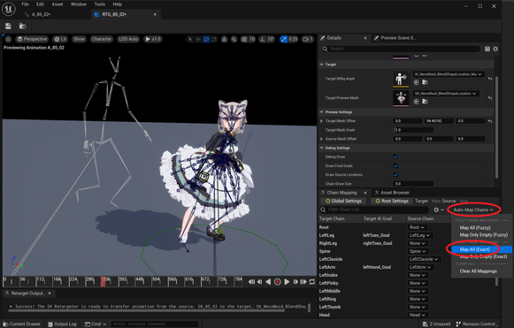

||
|-|
||
|モデル：[New NecoMaid](https://sonovr.booth.pm/items/4252664) |
|アニメーション：[CMU's motion capture database](https://sites.google.com/a/cgspeed.com/cgspeed/motion-capture/cmu-bvh-conversion)|
|アニメーションプレビュー：[BVH WEB VIEWER](http://motion.hahasoha.net/)|
|VRMA変換：[bvh to VRMA](https://github.com/vrm-c/bvh2vrma)|

----

## VRMAをインポートする

実験的な対応です。2023/08現在、VRMAはドラフトです。将来的に変更されます。
{: .notice--info}

VRMAファイルをコンテンツブラウザにドラッグ＆ドロップします。インポート時のオプションはデフォルトでOKです。

ファイルを続けて複数インポートする場合は「Skeleton」の項目にベースのSkeletonを設定しましょう。アセットが共通化されます。

インポートすると、SkeletalMesh、AnimSequence、IKRig などが生成されます。メッシュ情報は無いので、モデル自体は何も表示されません。

||
|-|
||

プレビューの際は Characterメニューより、骨の表示をONに設定して確認ください。

||
|-|
||

## VRMAをリターゲットする

UE5の標準のリターゲット手順で可能です。インポート時に生成されるIKRigを利用ください。

ただ標準の自動設定のままでは、うまく骨の対応関係がとれない場合があります。（ChainMappingがずれてしまう）
その場合はAuto-MapChainsを`MapAll(Exact)`に設定ください。Humanoidとして一致する骨のみがリターゲットされます。

||
|-|
||

