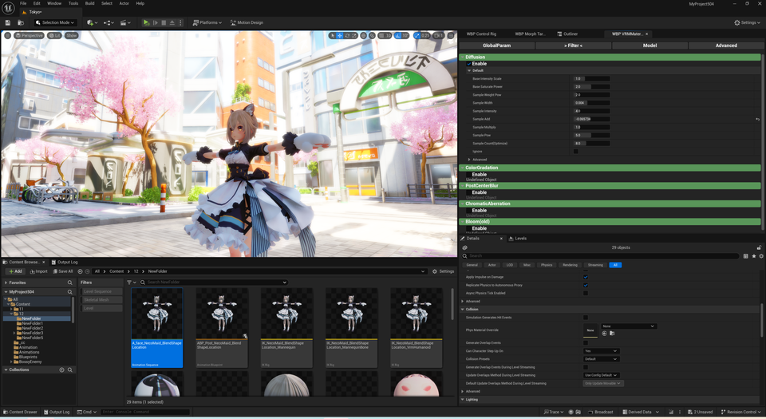
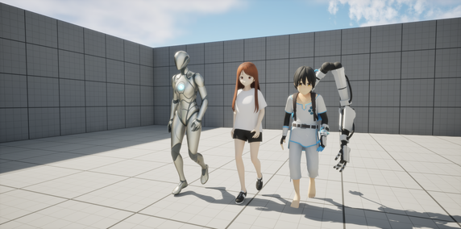
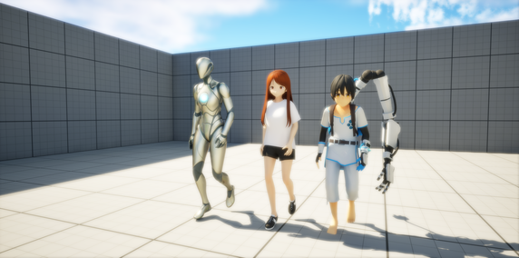
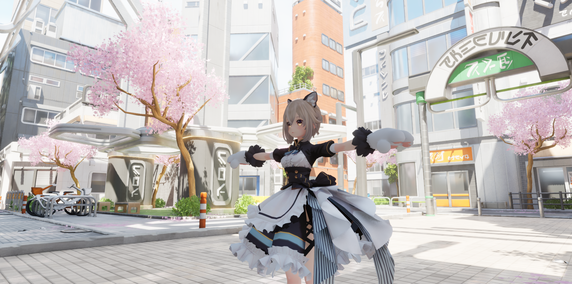
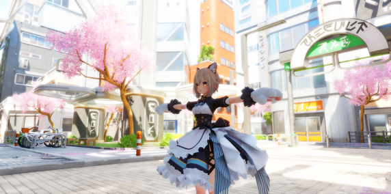
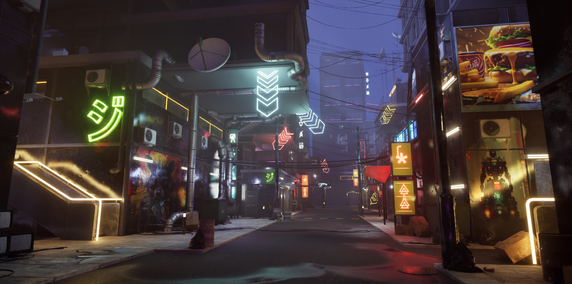
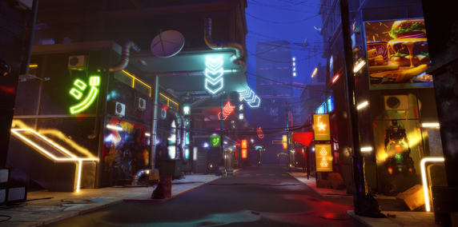

||
|-|
||
|モデル：[VRM1 サンプルモデル](https://github.com/vrm-c/vrm-specification/tree/master/samples) |

----

## 概要

Toonやアニメ調の絵と相性の良いフィルタです。

色味を強調したBloomを追加します。同時に 色合いを鮮やかにします。

## 手順

レベルに `BP_DiffusionFilter` を配置すれば完了です。
同様の操作は マテリアル調整パネルのFilter項目からも可能です。

||
|-|
||

|初期状態| Diffusionフィルタ適用後|
|-|-|
|||
|||
|||

## やや突っ込んだ話

類似の操作はPostProcessVolumeでも可能です。ただ、破綻なく調整するのは難しいです。

UE標準では画面の彩度が低くなりがちです。トーンマップからカラーグレーディングまで 広範囲のパラメータ変更が必要です。

UE標準でのBloomは、広範囲に 白くボケがちです。調整には 多くのパラメータ変更が必要です。

このフィルタは これらの手間を軽減します。ただ少々描画負荷がかかります。

