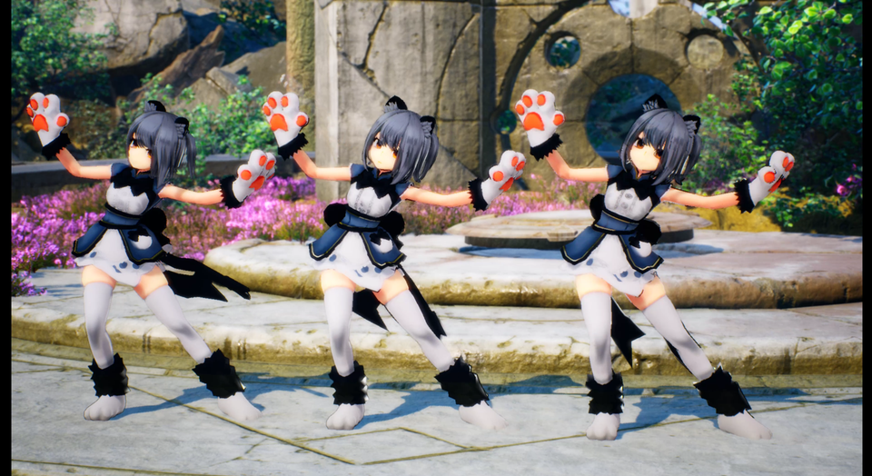
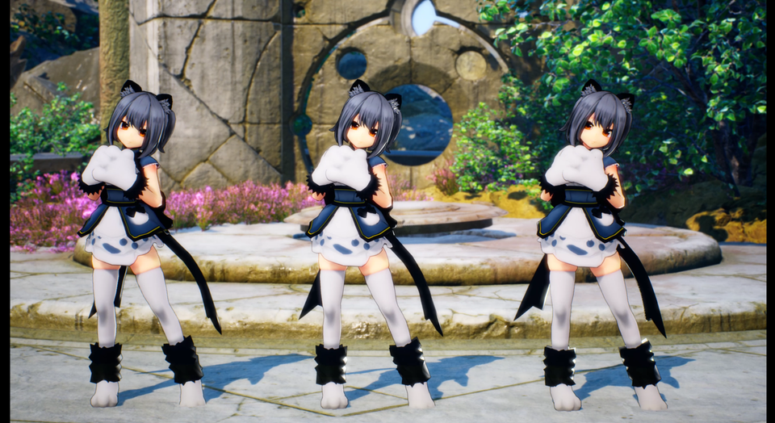
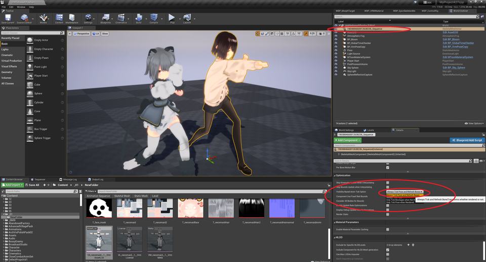
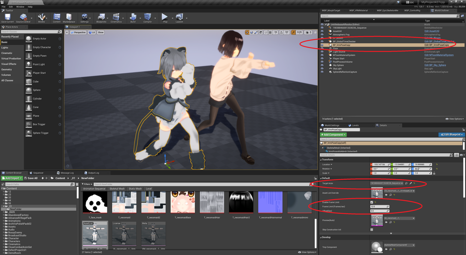

||
|-|
||
|モデル：[NecoMaid](https://booth.pm/ja/items/1843586)|

----

## 実行結果の動画

以下のリンクを参照ください。
コマ送りしているような見た目になります。アニメーションの中間フレームをスキップしています。

[https://youtu.be/AXL1UC1UKm0](https://youtu.be/AXL1UC1UKm0)

||
|-|
||

## 設定方法

レベル上に、通常のアニメーションをするSkeletalMeshActorを配置します。
画面外でもアニメーションを動かすため「Always Tick Pose and Refresh Bones」に設定します。

`BP_VrmPoseCopy` を配置し、TargetActorに上記Actorをセットします。
LimitedAnimをONにし、再生したいフレームレート（12や24など。1秒あたりのコマ数）を記入すると完了です。

|通常アニメーション側|リミテッド・アニメーションモデル側|
|-|-|
|||

なおグレイマンのリアルタイムリターゲット時もBP_VrmPoseCopyを利用しています。上記設定にて、同じようにコマ数を指定できます。

## オススメの使い方

元Actorをリミテッド・アニメーションモデルで置き換えましょう。元Actorを非表示にし、VP_VrmPoseCopyをアタッチすればOKです。

内部的には、滑らかに動く元Actorと コマ落ちしたActorが両方動作しています。
作りたい画面効果に応じて、どちらのActorを参照するか切り替えます。
カメラやエフェクトを滑らかに動かしたい場合は、元Actorの座標を参照するのが良いでしょう。

