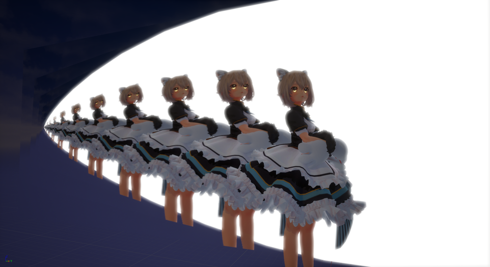
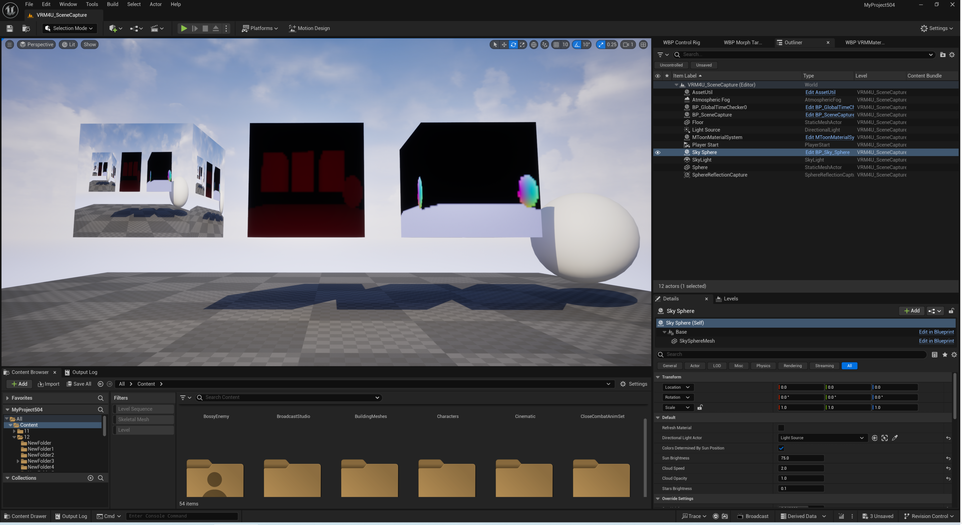

||
|-|
||
|モデル：[New NecoMaid](https://sonovr.booth.pm/items/4252664) |

----

## 解説

メイン画面をコピーできます。全画面エフェクトや賑やかしのための機能です。

サンプルマップ `VRM4U_SceneCapture.umap` を参照ください。

カラーバッファ以外に デプスやノーマル、ベロシティなどのバッファもコピーできます。

サンプルは 解像度が低いです。必要に応じてRenderTargetの解像度を上げてから利用ください。

||
|-|
||
