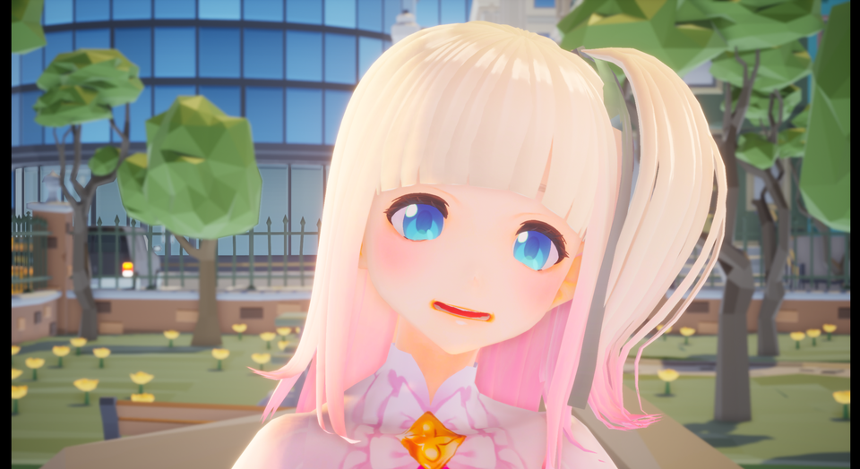
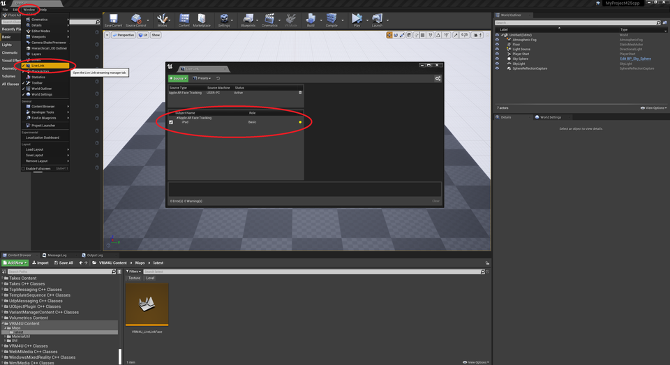
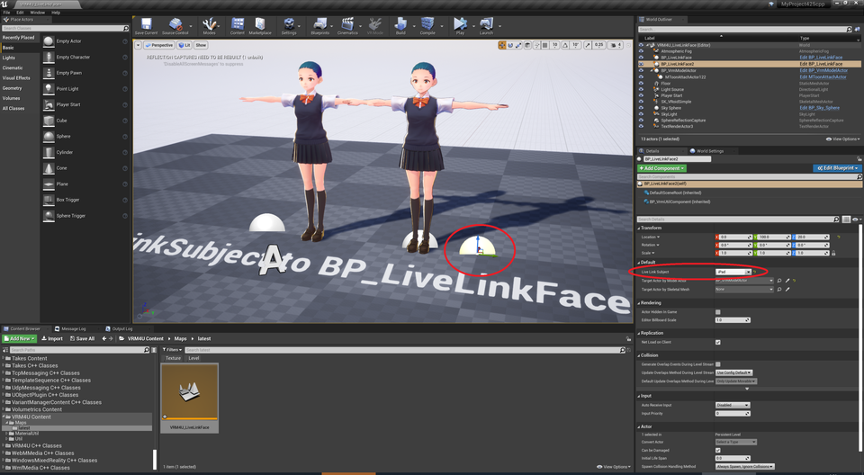
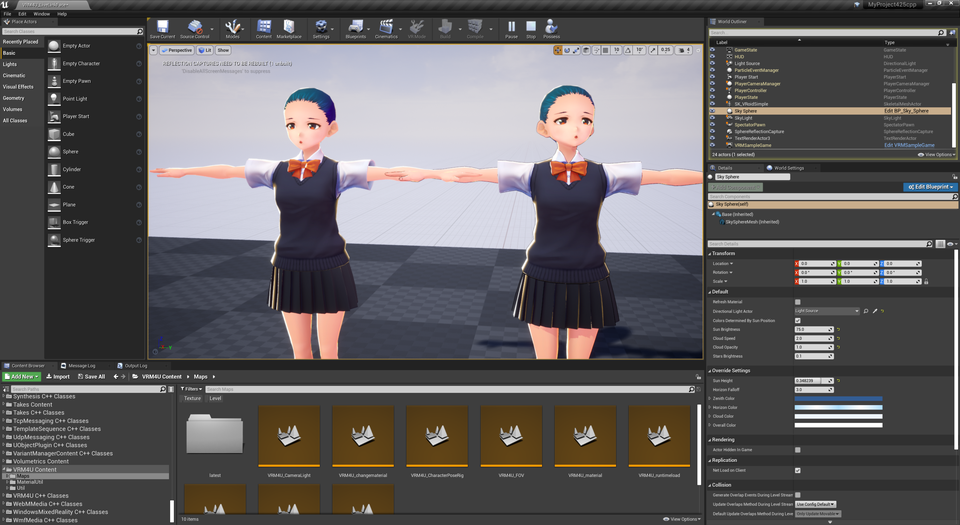
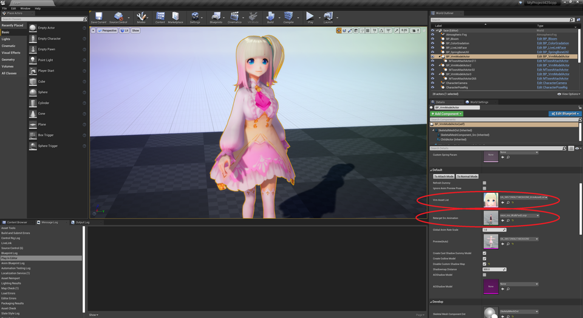
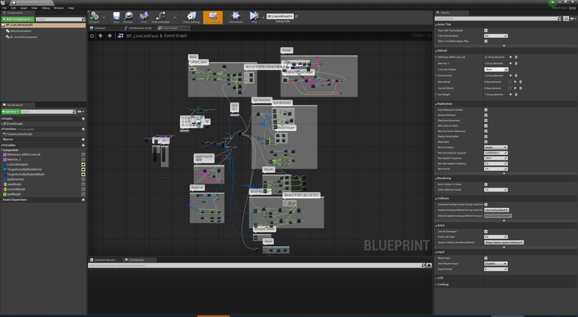
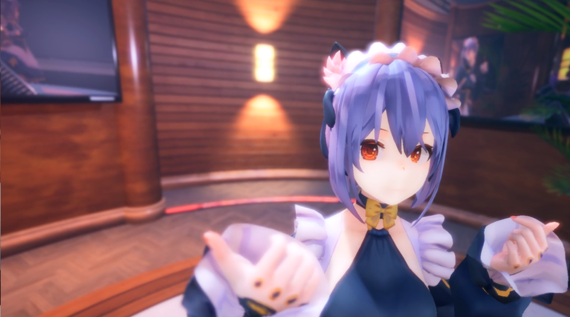

||
|-|
||
|モデル：[ヴィクトリア・ルービン](https://hub.vroid.com/characters/2792872861023597723/models/5013769147837660446)|

----
## フェイシャルキャプチャ

LiveLinkFaceでキャプチャした表情を、キャラクタに適用します。

LiveLinkFaceが動作するiPhone/iPadが必要です。UE4.25以降で動作します。
{: .notice--info}

ここで紹介するのは、VRM4Uのフォトモードやランタイムリターゲットと連動した使い方です。
[UE4での標準的な使い方はドキュメントを参照ください。](https://docs.unrealengine.com/ja/Engine/Animation/FacialRecordingiPhone/index.html)

以下のサンプルマップを参照してください。UE4.25以降でのみコンテンツブラウザに表示されます。

Maps/latest/VRM4U_LiveLinkFace

端末にてLiveLinkFaceを起動し顔を認識させます。
うまく設定されていれば、以下のように端末が認識されます。
iPhone/iPadによって表示される項目は異なります。

||
|-|
||

`BP_LiveLinkFace`に端末の名前をセットします。
認識されていない場合はリストに表示されません。後述の確認事項を参照ください。

表情を変更するターゲットは、BP_VrmModelActorかSkeletalMeshActorを選択可能です。
前者は表情と頭の向きが動作します。後者は頭は動かず、別途AnimationBPを組む必要があります。

||
|-|
||

PlayInで動きます。

||
|-|
||

キャラクタの差し替えやアニメーションの併用が可能です。`BP_VrmModelActor`より設定ください。

||
|-|
||

認識されない場合は設定を確認ください
- エディタの設定
  - プラグイン`LiveLink`, `ARKit`, `AppleARKitFaceSupport`を有効にする
- 端末の設定
  - PCと同じネットワークにつながっているか確認する
  - LiveLinkFaceより`設定 > livelink > ターゲット` にエディタ起動しているPCのIPアドレスを記入する
  - 例えば「192.168.1.---:11111」など。(---には実際のPCのアドレスから数値を入れてください)

### キャラクタ毎にカスタマイズする

BP_LiveLinkFaceをコピーして、カスタマイズして利用ください。

- VRoidモデル
  - ある程度それなりに動作します。
- その他フルスクラッチのモデル
  - VRMのBlendShapeGroupに登録された表情のみ動きます。
  - 任意の表情を利用したい場合はノードを改変してください。(ノードは未整理です…

||
|-|
||

----
## ハンドトラッキング（上級者向け）

OculusQuestで認識した手と指を、キャラクタに適用します。

OculusQuestが必要です。OculusLinkでPCに接続します。
{: .notice--info}

Oculus社が公開しているUE4が必要です。githubよりダウンロードしエディタビルドする必要があります。
{: .notice--info}

[こちらのgithubより、UE4.25をダウンロードします。](https://github.com/Oculus-VR/UnrealEngine)

[ビルドのセットアップは こちらを参照ください。](https://qiita.com/ruyo/items/08ac751ba61cb1201e96)

### VRM4Uのハンドトラッキングを有効化する

`VRM4U.Build.cs`にて、`bUseQuestTracking = true;` としてください。

### ハンドトラッキングする

以下のサンプルマップを利用ください。`VRPreview`で頭と手・指が動きます。

Maps/VRM4U_Tracking

||
|-|
||
