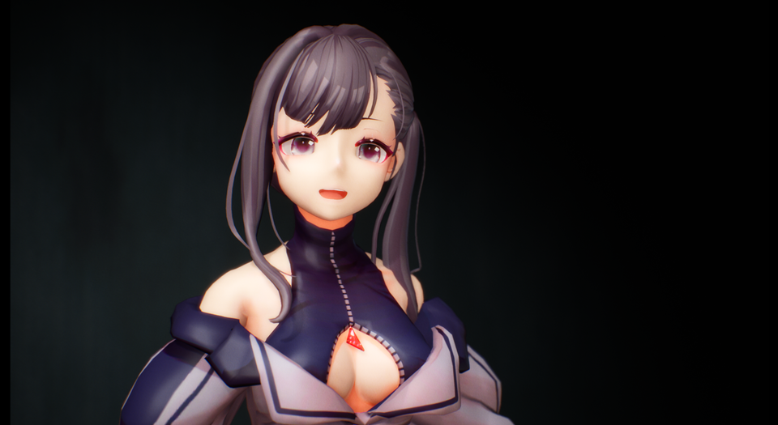

||
|-|
||
|モデル：[ヴィクトリア・ルービン](https://hub.vroid.com/characters/2792872861023597723/models/5013769147837660446)|

----
## VRM4Uがサポートするキャプチャ機能

以下の3タイプの機能があります。状況に応じて、適宜改変して利用ください。

|タイプ|必要なデバイス|解説|
|-|-|-|
|フェイシャルキャプチャ|iPhone iPad|VRMのBlendShapeClipで動かします BPでカーブ設定、AnimBPで骨制御|
|パーフェクトシンク|iPhone iPad|ARKitのBlendShapeLocationで動かします AnimBPでカーブ設定、ControlRigで骨制御|
|ハンドドラッキング|OculusQuest|手/指をキャプチャします AnimBPで骨制御|

iPhone/iPadは LiveLinkFace対応のものが必要です。VRM4UのキャプチャシステムはUE4.26以降で動作します。
{: .notice--info}

OculusQuestは OculusLinkでPCに接続して利用します。
{: .notice--info}

----
## フェイシャルキャプチャ

LiveLinkFaceでキャプチャした表情を、キャラクタに適用します。VRMBlendShapeClipの設定を利用するため、表情パターンがやや少ないです。

ここで紹介するのは、VRM4Uのフォトモードやランタイムリターゲットと連動した使い方です。
UE4での標準的な使い方は[ドキュメント](https://docs.unrealengine.com/ja/Engine/Animation/FacialRecordingiPhone/index.html)を参照するか、後述のパーフェクトシンクを参考にしてください。

以下のサンプルマップを参照してください。UE4.26以降でのみコンテンツブラウザに表示されます。

Maps/latest/VRM4U_LiveLinkFace

端末にてLiveLinkFaceを起動し顔を認識させます。
うまく設定されていれば、以下のように端末が認識されます。
iPhone/iPadによって表示される項目は異なります。

||
|-|
||

`BP_LiveLinkFace`に端末の名前をセットします。
認識されていない場合はリストに表示されません。後述の確認事項を参照ください。

表情を変更するターゲットは、BP_VrmModelActorかSkeletalMeshActorを選択可能です。
前者は表情と頭の向きが動作します。後者は頭は動かず、別途AnimationBPを組む必要があります。

||
|-|
||

PlayInで動きます。

||
|-|
||

キャラクタの差し替えやアニメーションの併用が可能です。`BP_VrmModelActor`より設定ください。

||
|-|
||

認識されない場合は設定を確認ください
- エディタの設定
  - プラグイン`LiveLink`, `ARKit`, `AppleARKitFaceSupport`を有効にする
- 端末の設定
  - PCと同じネットワークにつながっているか確認する
  - LiveLinkFaceより`設定 > livelink > ターゲット` にエディタ起動しているPCのIPアドレスを記入する
  - 例えば「192.168.1.---:11111」など。(---には実際のPCのアドレスから数値を入れてください)

### 任意の表情を割り当てる

BP_LiveLinkFaceをコピーして、カスタマイズして利用ください。

- VRoidモデル
  - ある程度それなりに動作します。
- その他フルスクラッチのモデル
  - VRMのBlendShapeGroupに登録された表情のみ動きます。
  - 任意の表情を利用したい場合はノードを改変してください。(ノードは未整理です…

||
|-|
||

----
## パーフェクトシンク（カスタムする場合は上級者向け）

LiveLinkFaceでキャプチャした表情を、キャラクタに適用します。ARKitのパラメータを全て利用します。パーフェクトシンクに対応したモデルが必要です。

||
|-|
||
|モデル：[QuQuオリジナルアバター “U”](https://booth.pm/ja/items/2736146)|

----

標準的な作りのモデルであれば、前述の `BP_LiveLinkFace`より、`Use ARKit Morph Curve Name`ONにすれば、ある程度利用できます。（Morph名によっては効果がないものがあったり、骨制御による視線は動きません）

機能を全て利用する場合は、モデル毎にBlueprintを作成する必要があります。
実装例は前述のサンプルマップ VRM4U_LiveLinkFace に配置しています。

手順は以下です。/VRM4U/Util/Actor/latest にあるサンプルを参考に、2つのアセットを作成します。ノードをコピペして、要所を変更します。

工程が前後しますが、AnimBPを先に組むのをオススメします。アニメーションを確認しながら進められます。

 - AnimBPを作成する
   - 目的：ARKitパラメータをMorphTargetに適用し、ControlRigに接続する
   - サンプル：ABP_VRoidPostProcess
 - ControlRigを作成する
   - 目的：頭の向きや視線を変更する。骨のアニメーションを制御する
   - サンプル：CR_VRoidSimple_PostProcess
 - SkeletalMesh の PostProcessAnimBlueprint を変更する
   - 目的：PlayIn/プレビューどちらでも動作できるようにする

赤丸で示した箇所について、設定忘れに注意ください。

|AnimBPの作成|ControlRigの作成|
|-|-|
|||

|PostProcessAnimBlueprintの設定|
|-|
||

### 仕組みの解説

 - AnimBlueprintでやっていること
   - LiveLinkFaceからパラメータ（カーブパラメータ）を受け取る
   - POSE_face_ アセットを利用して、カーブ名をMorphTarget名にマッピングする（MorphTarget名がARKitと一致している場合は不要）
   - カーブパラメータをControlRigに渡す
   - 揺れ骨を設定する
 - ControlRigでやっていること
   - カーブパラメータを参照し、骨アニメーションさせる
   （首の向きと視線。視線がMorphTargetで動作する場合は不要）

----
## ハンドトラッキング（上級者向け）

OculusQuestで認識した手と指を、キャラクタに適用します。

UE4.26で動作します。VRM4Uのビルド環境が必要です。
{: .notice--info}

VRM4UのビルドについてはEXE化のページを参照ください。[こちらのページです](../03_exe/)

### VRM4Uのハンドトラッキングを有効化する

`VRM4U.Build.cs`にて、`bUseQuestTracking = true;` としてビルドしてください。

### ハンドトラッキングする

以下のサンプルマップを利用ください。`VRPreview`で頭と手・指が動きます。

Maps/VRM4U_Tracking

||
|-|
||
