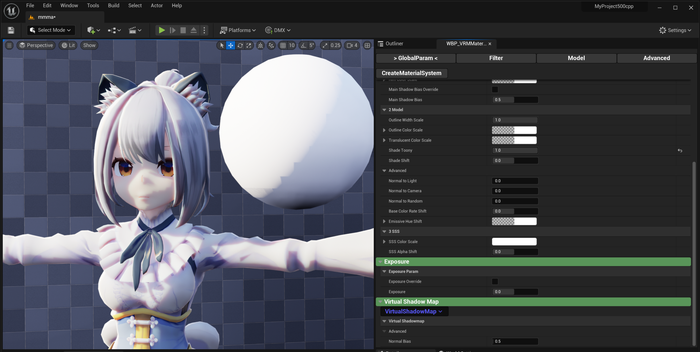
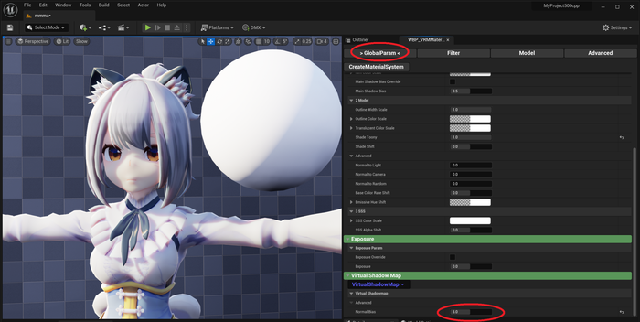
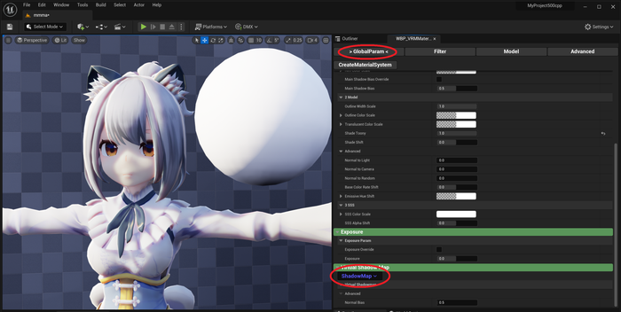
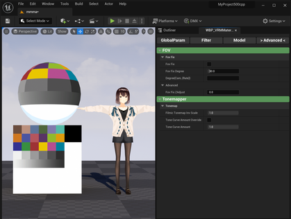
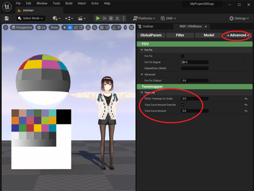
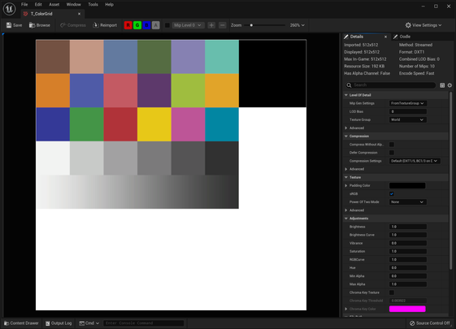

----

## (SubsurfaceProfile) 影にポリゴン形状が出るのを抑える

UE5は非常に細かいポリゴンに向けて調整されているため、モデルによってはキレイな影が出ません。

それを改善するパラメータがあります。

|初期状態|NormalBias調整後（オススメ）|従来のShadowmap|
|-|-|-|
||||
|ポリゴンのエッジに沿った影が出てしまう|←を改善したもの。 影をぼかしたい場合はライト側のパラメータで設定する|影の解像度が低い。全体的にぼけてしまう|
|モデル：[NecoMaid RICH](https://booth.pm/ja/items/2147191)||

### 仕組み

コンソールコマンド r.Shadow.Virtual.NormalBias を利用しています

くわしくはこちらを参照ください。
https://docs.unrealengine.com/5.0/en-US/virtual-shadow-maps-in-unreal-engine/

## (MToonUnlit) 色味を完全に再現する

UEはFilmicTonemapperの影響で、テクスチャの色味を再現できません。

その影響度合いを調整するパラメータがあります。
同時に、VRM4Uで行っている逆変換の強さも調整できます。

背景も含めて色味が変わるため、フォトリアリスティックな表現には向きません。用途に応じて利用ください。

|初期状態|色再現したもの|（参考）再現したいテクスチャの色|
|-|-|-|
||||
|全体的に白っぽくなる|テクスチャの色が適用される。 背景にも影響してしまうのを 割合を調整できる|（参考）この色が再現できればOK|

### 仕組み

PostProcessVolumeのToneCurveAmountパラメータを利用しています。
従来この影響度合いはON/OFFでのみ切り替え可能でした。興味ある方は[Tipsページのマッハバンド対策を参照ください。](../02_shortcut2/)
