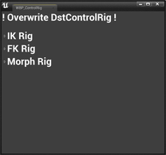
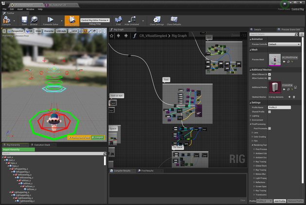
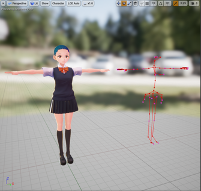

||
|-|
|[](../assets/images/06a_top.png)|
|モデル：[【オリジナル3Dモデル】サタリナ族のメイドさん](https://booth.pm/ja/items/2589069)|

----
## 概要

VRM4Uが用意したControlRigを対象のモデルに割り当てます。

ControlRigとシーケンサーを利用することで、任意のポージング、アニメーションを作成することができます。

開発中のため、このページの操作手順は、適宜に変更されます。
{: .notice--info}

ControlRigはベータ版であり、適切な公式ドキュメントはありません。情報を参照する際は、対象のバージョンを十分確認ください。(UE4.26現在)
モデルのポージング機能としては十分利用可能です。
複雑な操作時にエディタが停止することがあります。
{: .notice--info}

## 下準備

UE4.26以降で動きます。

以下2つのプラグインを有効化し、エディタを再起動します。
 - Python Editor Script Plugin
 - Control Rig

|プラグイン有効化||
|-|-|
|[](../assets/images/06a_p1.png)|[](../assets/images/06a_p2.png)|


有効化後、`/VRM4U Content/Util/Actor/latest` にControlRigのアセットが表示されることを確認します。
また、`WBP_ControlRig`を右クリックから実行し、テンプレート複製UIが起動することを確認します。

||
|-|
|[](../assets/images/06a_ui1.png)|

|テンプレート複製UIが起動します|
|-|
|[](../assets/images/06a_ui2.png)|


## テンプレートからControlRigを作成する

テンプレートは2種類あります。

|||
|-|-|
|IKテンプレート|これを使えばOK。最低限のIKを組んであります|
|FKテンプレート|全ての骨をFK制御したい時のテンプレート|

### IKテンプレートを利用する

|IKテンプレート|
|-|
|[](../assets/images/06a_rig.png)|
|手足と視線はIKです。指(開閉)、頭、肩、つま先、背骨-頭はFKで動作します|

`CR_VRoidSimple`を複製(duplicate)して開きます。
 
**ControlRig編集画面より**
 - プレビューモデルを対象モデルにセット
 - 階層ウインドウを右クリック、Refreshより、対象モデルをセット

|複製したControlRigを開いて、、|
|-|
|[](../assets/images/06a_copy0.png)|


|PreviewMesh と 階層右クリック->Refresh->SelectMesh の2箇所にモデルをセット|
|-|
|[](../assets/images/06a_copy1.png)|


**テンプレート複製UIより**
 - 上記設定を行ったControlRigをセット
 - 対象モデルのVrmAssetListをセット

|ControlRigとVrmAssetListをセット|
|-|
|[](../assets/images/06a_copy2.png)|

左側の`CreateSpace`ボタンを押し、数十秒待ちます。
完了したらControlRigをSaveし、**念の為エディタを再起動します。**

一度スクリプト実行するとエディタが停止しやすくなります。再起動後は問題なく動作します。
{: .notice--info}

### FKテンプレートを利用する

|FKテンプレート|
|-|
|[](../assets/images/06a_fk.png)|
|全ての骨がFKで制御できます。リグの位置(赤線の骨構造)は適宜変更ください。|


手順は上記とほぼ同じです。違いは、
 - テンプレートとして、`RC_VRoidSimpleAll`を複製する
 - UIにセット後、`CreateAllController`ボタンを押す

現在のFKテンプレートの作成には時間がかかります。骨数が100本を超える場合、 **数分の時間を要します。** 将来的なUE4のバージョンアップにより改善されると思われます。

処理の進行状況をログで確認したい場合、UE4起動時のオプションに`-log`を追加してログウィンドウを表示ください。

```
"C:\Program Files\Epic Games\UE_4.26\Engine\Binaries\Win64\UE4Editor.exe" -log
```

|-log オプションで起動したUE4。スクリプト進行状況が表示される|
|-|
|[](../assets/images/06a_log.png)|


----
