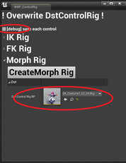

|||
|-|-|
|[](../assets/images/06a_ue5_4.png)|[](../assets/images/06a_top.png)|
|モデル：[AvatarSample_A](https://hub.vroid.com/characters/2843975675147313744/models/5644550979324015604)|モデル：[【オリジナル3Dモデル】サタリナ族のメイドさん](https://booth.pm/ja/items/2589069)|

----
## 概要

VRM4Uが用意したControlRigを対象のモデルに割り当てます。

ControlRigとシーケンサーを利用することで、任意のポージング、アニメーションを作成することができます。

モデルのポージング機能としては十分利用可能です。
アニメーションとしては機能不足かもしれません。用途に応じてツールの使い分けをオススメします。
{: .notice--info}

## 下準備

UE5：そのまま動作します。

UE4：UE4.26以降で動作します。以下4つのプラグインを有効化し、エディタを再起動します。
 - Python Editor Script Plugin
 - Control Rig
 - Sequencer Scripting
 - Editor Scripting Utilities

|プラグイン有効化||
|-|-|
|[](../assets/images/06a_p1.png)|[](../assets/images/06a_p2.png)|


有効化後、`/VRM4U Content/Util/Actor/latest` にControlRigのアセットが表示されることを確認します。
また、`WBP_ControlRig`を右クリックから実行し、テンプレート複製UIが起動することを確認します。

||
|-|
|[](../assets/images/06a_ui1.png)|

|テンプレート複製UIが起動します|
|-|
|[](../assets/images/06a_ui2.png)|

UI表示でエラーが出る場合は、前述のプラグインが正しく有効化されているか確認ください。

## 手順の要約

 1. テンプレートRigを複製し、SkeletalMeshを差し替える
 1. 複製UIにRigをセットし、Createボタンを押す
 1. Rigを保存し、エディタを再起動する
    - 保存せずにRigをコンパイルしたり操作を継続すると、エディタがクラッシュすることがあります。

テンプレートは複数あります。UE5は`BodyRig`を、UE4は `IKRig` を複製すればOKです。表情を付けたい場合は `MorphRig` も複製ください。

### UE5: Body Rigを作成する

`CR_VRoidSimpleUE5Body`を複製(duplicate)して開きます。


|複製したControlRigを開いて、Previewを差し替えて、、|
|-|
|[](../assets/images/06a_ue5_1.png)|


|上記設定を行ったControlRigをセット、GenerateBodyRigを押す|
|-|
|[](../assets/images/06a_ue5_2.png)|


「GenerateBodyRig」をクリックすれば完了です。**が、そのままではRigの生成には数十秒かかります。**

あまりにも遅い場合は「AutoCompile」をOFFにすると高速化されます。ただこの場合はRig生成後にCompileボタンを押してください。

|AutoCompileをOFFにした場合は、Generate後にCompileボタンを押す|
|-|
|[](../assets/images/06a_ue5_3.png)|

BodyRigはFK/IK制御切り替え機能があります。UE5標準Rigの機能をそのまま利用できます。

|IKモード（初期状態）|FKモード|
|-|-|
|[](../assets/images/06a_ue5_5.png)|[](../assets/images/06a_ue5_6.png)|


### UE4: IK Rigを作成する

`CR_VRoidSimpleIK`を複製(duplicate)して開きます。

**ControlRig編集画面より**

|複製したControlRigを開いて、、|
|-|
|[](../assets/images/06a_copy0.png)|


|Rootを選択、Deleteキーを押す（一時的にモデルが崩れます）|
|-|
|[](../assets/images/06a_copy1.png)|

|モデルを2箇所にセット。「PreviewMesh」 と 「階層右クリック->Import->SelectMesh」|
|-|
|[](../assets/images/06a_copy3.png)|

モデルは「Import」メニューで更新してください。「Refresh」で更新するとMorphTarget用のアニメーションカーブが変更されません。
{: .notice--info}

**テンプレート複製UIより**
 - 上記設定を行ったControlRigをセット
 - 対象モデルのVrmAssetListをセット
   - 最下段のMetaデータは未指定でOKです。インポート時にHumanoidSkeletonを作成した際、指定ください。

|ControlRigとVrmAssetListをセット|
|-|
|[](../assets/images/06a_copy2.png)|

`Create IK Rig`ボタンを押し、数十秒待ちます。
完了したらControlRigをSaveし、**念の為エディタを再起動します。**


一度スクリプト実行するとエディタが停止しやすくなります。再起動後は問題なく動作します。
{: .notice--info}

### Morph Rigを作成する

IKテンプレートとほぼ同じ手順で利用できます。

`CR_VRoidSimpleMorph`を複製(duplicate)しモデルを差し替え、複製UIのMorphRigにセットしてCreateしてください。VrmAssetListは不要です。

エディタが停止してしまう場合は、上部のオプションを有効化してください。途中経過が保存されます。停止後、再度同じRigをセットしてCreateを繰り返すと処理が完了します。
{: .notice--info}

|MorphRig にセット。エディタが停止する場合は上部のチェックONで2～3回繰り返す|
|-|
|[](../assets/images/06a_ui3.png)|


### FK Rigを作成する

同じく`CR_VRoidSimpleFK` からCreateください。

ただ、現在のFKテンプレートの作成には時間がかかります。骨数が100本を超える場合、 **数分の時間を要します。** 将来的なUE4のバージョンアップにより改善されると思われます。

処理の進行状況をログで確認したい場合、UE起動時のオプションに`-log`を追加してログウィンドウを表示ください。

```
"C:\Program Files\Epic Games\UE_4.26\Engine\Binaries\Win64\UE4Editor.exe" -log
```

|-log オプションで起動したUE。スクリプト進行状況が表示される|
|-|
|[](../assets/images/06a_log.png)|

