||
|-|
|[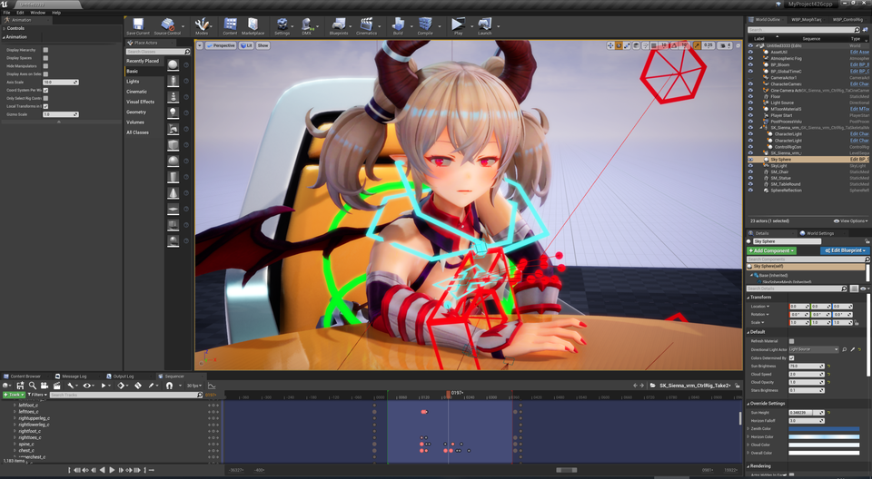](../assets/images/07a_top.png)|
|モデル：[【オリジナル3Dモデル】ドラゴニュート・シェンナ](https://booth.pm/ja/items/2661189)|
|ボディアニメーション：[Control Rig Mannequinサンプル](https://www.unrealengine.com/marketplace/en-US/product/control-rig-mannequin) からIKRigにベイクして編集|
|フェイシャルアニメーション：MorphRigによる手付け|


----

## 概要

ControlRigとシーケンサーを利用し、姿勢や表情のアニメーションを作成します。

Rigを複数利用する場合、特別なセットアップが必要です。ページ後半を参照ください。
{: .notice--info}

## 下準備

[前述の解説より](../06_controlrig/)、`IKRig`と`MorphRig` を作成ください。

----

## ポーズ・アニメーションの設定

### ポーズ：作成する

`IKRig`をコンテンツブラウザからレベルに配置します。自動的にシーケンサー編集モードになります。他の手順でも構いません。

コントローラを操作するとキャラクタが動きます。アニメーションを作成する場合は、シーケンサーにキーを追加します。

||
|-|
|[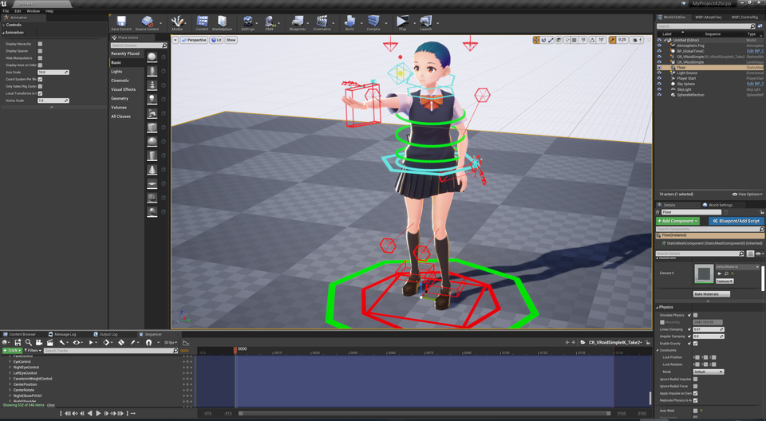](../assets/images/07a_pose2.png)|

### アニメーション：既存のアセットを編集する

既存アニメーションを、ControlRigの動きにベイクし、再編集することができます。（RigにはBackwardSolveを設定済です）

アプローチは2つあります。

|概要|詳細|
|-|-|
|(オススメ)<br>加算アニメで調整する|toleranceを小さめにベイクし、additiveセクションを追加。オフセットを入れて制御する|
|初期設定で調整する|初期設定でベイクし、コントローラを制御する。細かい動きが再現されない|

|アニメーションをセットしてtoleranceを小さめにベイク|
|-|
|[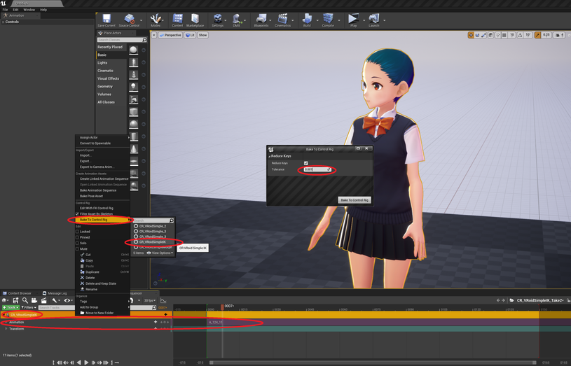](../assets/images/07a_pose3.png)|

|additiveセクションを追加|additive側にキーを打つと既存アニメを調整できる|
|-|-|
|[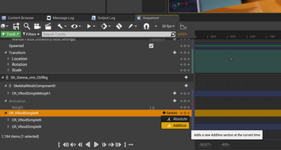](../assets/images/07a_pose1.png)|[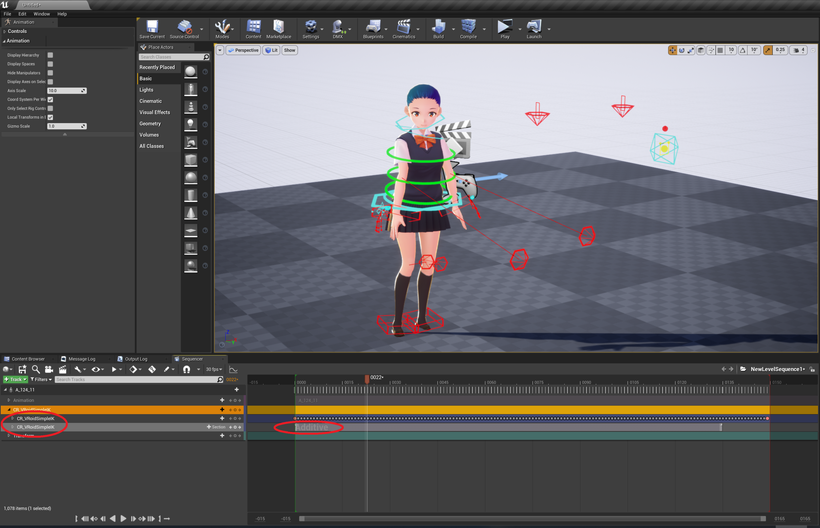](../assets/images/07a_pose4.png)|


----

## 表情の設定

IKRigとMorphRigを併用する場合は、後述のセットアップも合わせて参照ください。
{: .notice--info}

`WBP_MorphTarget`を右クリックから実行し、MoprhTarget制御UIを起動します。

||
|-|
|[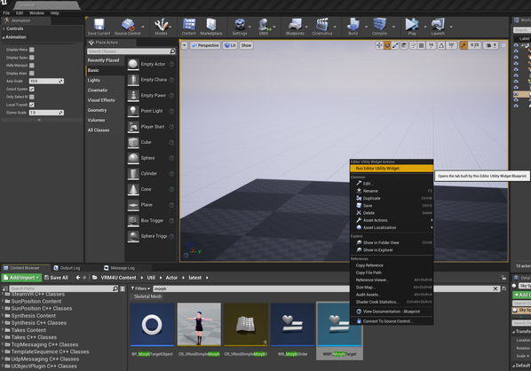](../assets/images/07a_ui1.png)|

|Morph制御UIが起動します|
|-|
|[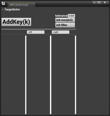](../assets/images/07a_ui2.png)|

### 表情：操作手順

 1. MorphRigをレベルに配置し、シーケンサーの編集モードに入る
 1. 制御UIより、操作対象のモデルをTargetActorに設定する
 1. MorphTargetを制御しキーを打つ。

|TargetActorより対象のモデルを選択する|
|-|
|[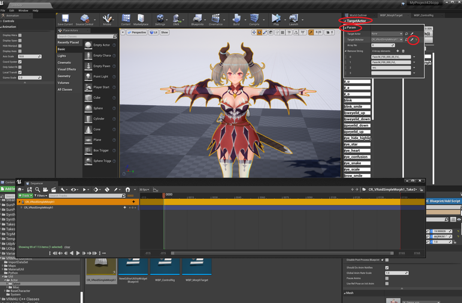](../assets/images/07a_ui3.png)|

|シーケンサーより対象のTrackを選択し、「AddKey」ボタン or 「K」キー|
|-|
|[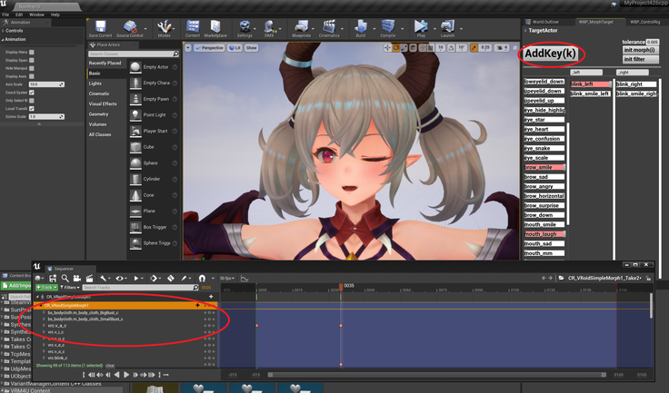](../assets/images/07a_ui4.png)|

### 表情：細かい機能紹介

 - ショートカットキー
   - k  キー追加
   - i  パラメータ初期化
 - Morph名フィルタ
   - 上部のテキスト入力欄でMorph名をサーチできます
 - 不要キーの省略
   - 差分がtolerance以下の場合、キー追加をスキップします
 - 長いMorph名の省略
   - Morph名の先頭を省略します。TargetActorのRemoveStringに一致したものが対象です
 - エラー検知
   - エラー時はボタンの色が変わります。シーケンサーより対象のTrackを選択して再度キーを追加してください。

|ボタンが赤い時はエラー。シーケンサーより対象のTrackを選択する|
|-|
|[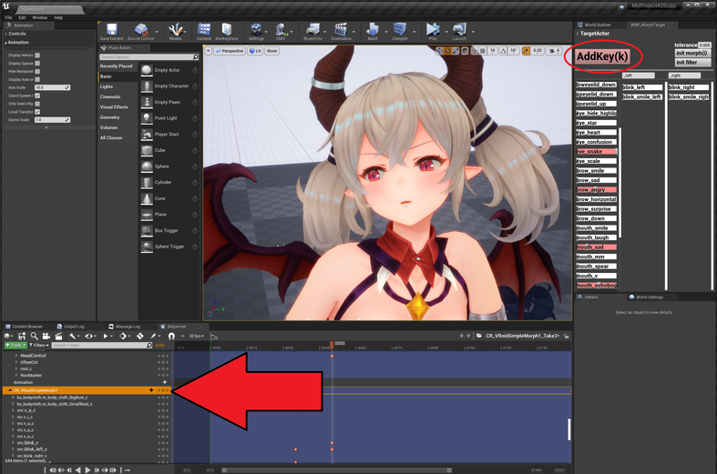](../assets/images/07a_ui5.png)|

### 表情：細かい仕組み（中身を知りたい方向け）

複製スクリプトによって、ControlRigにMorphTarget数ぶんのControlを追加しています。それらの値をカーブ値に渡しています。

あとはシーケンサーでControlの値を変更すれば、MorphTargetへ反映されます。お手軽です。

この仕組みはVRMに依存していないため、どのようなSkeletalMeshにも適用できます。FBXインポートしたものにも使えます。


----

## 複数のRigを同時に利用する

**標準的な作業手順では問題が出ます！** Rigを複数利用する場合は十分ご確認ください。正しくセットアップしたものは VRM4U_ControlRig で確認できます。
{: .notice--info}


### 問題ない構成

以下の画像のようにセットアップされていれば問題ありません。

|Rigの登録場所に注意！！|
|-|
|[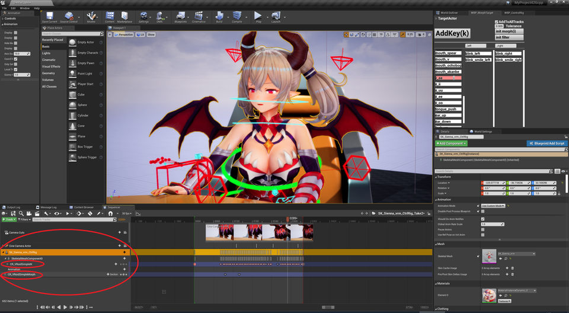](../assets/images/07a_r1.png)|

```
問題ない構成
-SkeltalMeshActor
  -SkeletalMeshComponent0   <- 右クリックから追加する
    -IK_Rig           <- OK.  ここがIKRig
  -Morph_Rig          <- OK.  ここがMorphRig
```

### 問題ある構成

標準的な作業手順では、以下のような構成になりやすいです。

```
問題ある構成
-SkeltalMeshActor
  -SkeletalMeshComponent0
    -Morph_Rig       <- NG.  MorphRigとIKRigが逆
  -IK_Rig            <- NG. 
```

この構成、一見正しく動作しますが、**`IKRig`を選択した時にシーケンサのフォーカスが移動しません！**
キーを打つ手間が大変かかります。

修正には 以下のように操作します。

|IKRigを2つ登録して、キーを選択、移動先のrigにコピーする|
|-|
|[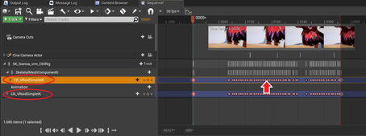](../assets/images/07a_r2.png)|

キーを移動後、元の`IKRig`を削除し 改めて`MorphRig`を追加すれば完了です。

----

## シーケンサー操作時に揺れ骨が動くようにする

`PostProcessAnimBlueprint`を利用します。

以下のようなAnimBPを作成し、SkeletalMeshのPostProcessAnimBlueprintにセットすれば完了です。

|作成するAnimBP|SkeletalMeshにセット。プレビューに表示が増える|
|-|-|
|[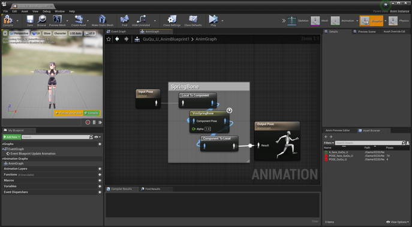](../assets/images/06a_post1.png)|[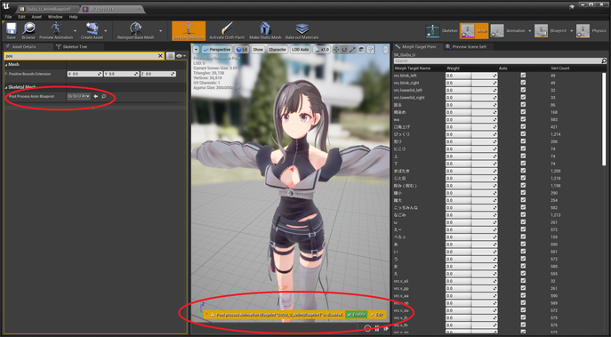](../assets/images/06a_post2.png)|

----


## 見た目のセットアップを忘れずに！

`MToonAttachActor`を配置してTargetをセットしてください。輪郭線やセルフシャドウが有効化されます。
[詳しくは前章の解説を参照ください](../01_look/)