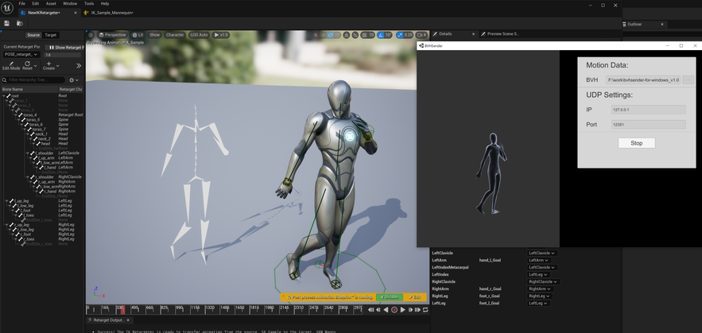
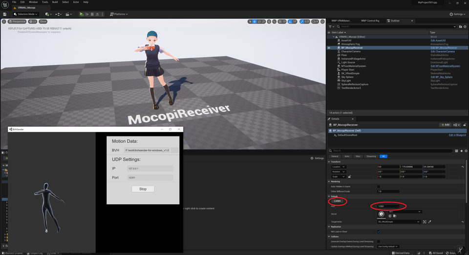
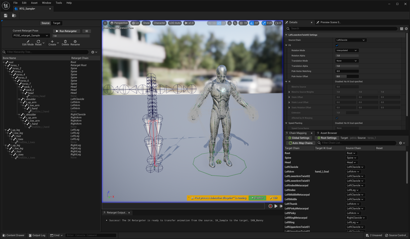
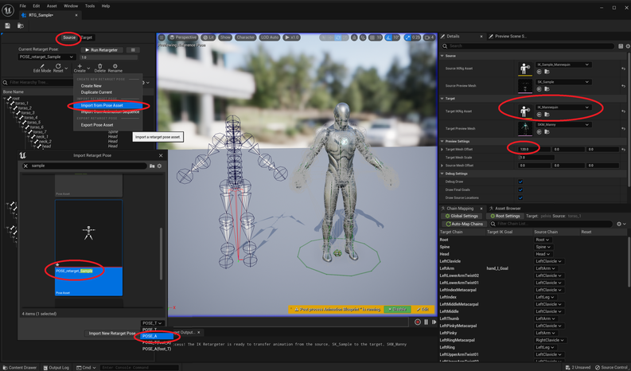
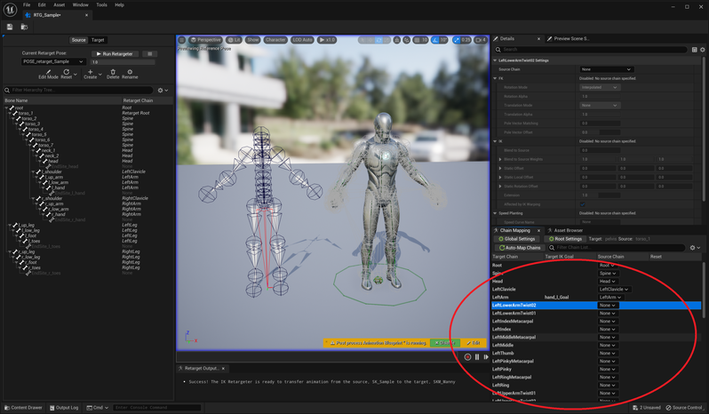

||
|-|
||
|モデル：UE5マネキン|

----

## 概要

外部アプリからモーションキャプチャデータを受け取り、モデルにアニメーションを適用します。

[mocopi公式サイト](https://www.sony.jp/mocopi)

[mocopi開発者向け情報](https://www.sony.net/Products/mocopi-dev/jp/documents/Home/TechSpec.html)

----

## mocopi UDP を受け取る

サンプルマップ `VRM4U_Mocopi` を参照ください

レベル上のBP_MocopiReceiverにポート番号を設定後、Listenボタンを押すかPlayInしてください。

||

完了です。

アニメーションは ABP_VRoidMocopi_Bone を参照ください。

## mocopi BVH をインポートする

[BVHインポート方法はこちら](../04_bvh/)

インポート後、Aポーズ用のアセットと、リターゲット用のIKRIGアセットが生成されます。

UE5.1以降を利用し、リターゲット元の姿勢をAポーズに設定ください。
以下のようにBVH側がAポーズになります。

|初期状態|Aポーズ設定後|
|-|-|
|||

自動設定されたChainMappingには不要な設定が含まれており、指先や肘・膝が捻れています。
解消するために、指先やTwistBoneの設定を下図のように「None」に設定ください。

|不必要なChainMappingをNoneに設定|
|-|
||

----

## 詳細解説（UEの操作に慣れてる人向け）

### マップ上で直接プレビューする。PlayInなし。

SkeletalMeshの`Update Animation in Editor` をONにしてください。
前段の手順にて、「Listen」ボタンを押した際に自動的にONになります。

### 揺れ骨を適用する

揺れ骨を適用する場合は`VRMSpringBone`ノードも追加ください。
[揺れ骨の解説はこちら](../01_animation/)

### 複数の外部アプリからのデータ受信

レベルに各種Receiverをを複数配置し、ポート番号を設定ください。それぞれデータが受信されます。

データの参照には、`VRM4U_AnimationSubsystem`へのアクセス時に、「ポート番号指定」または「通し番号指定」を利用してください。
