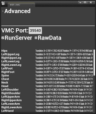

||
|-|
||
|モデル：VRoidStudio プリセット組み合わせ|

----

## 概要

外部アプリからモーションキャプチャデータを受け取り、モデルにアニメーションを適用します。

この機能はタフな動作チェックを行っていません。
VMC対応については、[はるくさん開発のVMC4UE](https://github.com/HAL9HARUKU/VMC4UE)の利用もご検討ください。
{: .notice--info}

**UE5EA版では大きな不具合があり（後述）、UE5正式版で修正される**ようです。
UE4では問題なく動作します。
{: .notice--warning}

Virtual Motion Capture Protocol（以下VMC Protocol）の解説は[こちらからどうぞ](https://protocol.vmc.info/)

----

## 下準備

動作にはEpic公式の`OSCプラグイン`が必要です。有効化し、エディタを再起動ください。

サンプルマップ `VRM4U_VMC` に設定済のモデルがあります。
サンプルをそのままPlayInすると、ポート番号39540に届いたデータでアニメーションします。

||
|-|
||

## AnimBPを作成する

動かす対象モデルでAnimBPを作成し、アニムグラフにVrmVMCノードを追加します。

ノードには、以下の2つのデータをセットします。
 - VRM4U_VMC_Subsystemのデータ。受信した骨情報です。
 - インポート時に生成されたMetaデータ。モデルのHumanoid骨名リストです。

揺れ骨を適用する場合は`VRMSpringBone`ノードも追加ください。
[揺れ骨の解説はこちら](../01_animation/)

||
|-|
||

## VMC Protocolを受け取る

`EUW_VMC` を起動します。
受信ポート番号を確認し、`RunServer` をクリックすれば完了です。

||
|-|
||

正しく受信できた場合は、図のようにWidgetにログが表示されます。
全ての受信データを確認したい場合は、Widgetより `RawData` をOnにしてください。

Widgetにポート番号が表示されない場合は、OSCプラグインを有効化してください。
{: .notice--info}

----

## 高度な使い方

### ブレンドシェイプを受け取る

サンプルマップのAnimBPを参照ください。
VRM4U_VMC_Subsystem内にある、受信データから検索します。
文字列 `/VMC/Ext/Blend/Val:Blink` などで見つかります。

### トラッカー情報を受け取る

ブレンドシェイプと同様です。
文字列 `/VMC/Ext/Tra/Pos:LeftHand` などで見つかります。

その他の受信データの詳細は、Widgetより `RawData` をOnにすると表示されます。

### マップ上で直接プレビューする

SkeletalMeshの`Update Animation in Editor` をONにしてください。エディタ上でそのままアニメーションが動作します。あくまでプレビュー動作です。正確な動作はPlayInで確認ください。

----

## 詳細解説（上級者向け）

### UE5EA版の不具合

 - 不具合1: UE5EAはOSCバンドルを受信できません
   - 送信元アプリにて通信設定を変更できるなら、切り替えて利用ください。
 - 不具合2: UE5EAは前述のブレンドシェイプやトラッカーを正しく検索できないことがあります
   - Map(文字列と姿勢の連想配列)におけるFindが正しく動作しません。データ参照方法に工夫が必要です。Blueprint/cppどちらのFind呼び出しも問題が起きます。

どちらの不具合も、UE5正式リリースには修正されるようです。

### RunServer を押した時の挙動

ボタンを押すと レベルにBP_VMCReceiverがスポーンします。同時にポート番号を設定し、データ受信を開始します。

EditorUtilityWidgetを経由しているため、いつでもデータ受信が可能です。プレビューであれば PlayInは不要です。このページのトップ絵も PlayInしていない状態です。