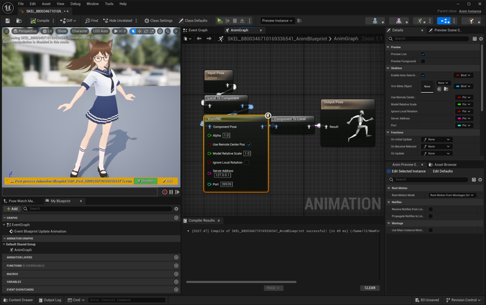
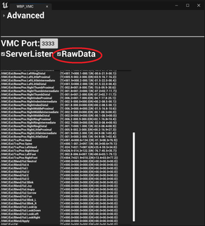

||
|-|
||
|モデル：VRoidStudio プリセット組み合わせ|

----

## 概要

外部アプリからモーションキャプチャデータを受け取り、モデルにアニメーションを適用します。

Virtual Motion Capture Protocol（以下VMC Protocol）の紹介は[こちらからどうぞ](https://protocol.vmc.info/)

----

## 使い方

対象のSkeletonよりAnimationBlueprintを作成し、VrmVMCノードを繋いでください。完了です。

|AnimBPでVrmVMCノードをつなぐ|
|-|
||

## 補足

別PCやスマートフォンからのVMCを受信したい場合、VrmVMCノードに対象のIPアドレスを指定ください。

モデルが崩れてしまう場合、以下を確認ください。

  - 送信元がVRM0を利用している場合、VrmVMCノードのIgnoreLocalRotation をONに変更する
  - 送受信どちらも同じVRMモデルを利用する

  
以下は古い情報です

##  ~~下準備&動作~~

動作にはEpic公式の`OSCプラグイン`が必要です。有効化し、エディタを再起動ください。

||
|-|
||

サンプルマップ `VRM4U_VMC` を参照ください。
動作させる方法が3通りあります。

 - 方法その１．(オススメ)
   - BP_VrmReceiverにポート番号を指定、ServerListenボタンを押す。エディタモードのままアニメーションします。
 - 方法その２．
   - EUW_VMC を利用し、ServerListenボタンを押す。内部的には方法その１と同じ。
 - 方法その３．
   - BP_VrmReceiverにポート番号を指定、PlayInする。
 
|BP_VrmReceiverから起動|EUW_VMCから起動|
|-|-|
|||

### ~~EUW_VMC 解説~~

`EUW_VMC` を右クリックより起動します。
正しく受信できた場合は、図のようにWidgetにログが表示されます。
全ての受信データを確認したい場合は、Widgetより `RawData` をOnにしてください。

|||
|-|-|
|||

Widgetにポート番号が表示されない場合は、OSCプラグインを有効化してください。
{: .notice--info}

EUB_VMCTick について警告が出る場合は、EUB_VMCTickをレベル上に配置ください。
{: .notice--info}

### ~~AnimBPの解説~~

動かす対象モデルでAnimBPを作成し、アニムグラフにVrmModifyBoneListノードを追加します。

ノードには、以下の2つのデータをセットします。
 - VRM4U_AnimationSubsystemのデータ。受信した骨情報です。
 - インポート時に生成されたMetaデータ。モデルのHumanoid骨名リストです。

||
|-|
||

----

## ~~詳細解説（UEの操作に慣れてる人向け）~~

### ~~OSCの受信データを見る （ブレンドシェイプ、トラッカー）~~

サンプルマップのAnimBPを参照ください。
VRM4U_AnimationSubsystem内にある、受信データから検索します。

- ブレンドシェイプを見たい場合
  - 文字列 `/VMC/Ext/Blend/Val:Blink` などで見つかります。

- トラッカーを見たい場合
  - 文字列 `/VMC/Ext/Tra/Pos:LeftHand` などで見つかります。

その他の受信データの詳細は、Widgetより `RawData` をOnにして確認ください

### ~~マップ上で直接プレビューする仕組み~~

OSCサーバの`EditorTick`を有効化しています。
これはEditorUtilityからのみアクセス可能なので、EUB_VMCTick というActorを経由しています。

また、SkeletalMeshの`Update Animation in Editor` をONにしています。

### ~~揺れ骨を適用する~~

揺れ骨を適用する場合は、AnimBlueprintに`VRMSpringBone`ノードも追加ください。
[揺れ骨の解説はこちら](../01_animation/)

### ~~複数の外部アプリからのデータ受信~~

レベルに各種Receiverをを複数配置し、ポート番号を設定ください。それぞれデータが受信されます。

データの参照には、`VRM4U_AnimationSubsystem`へのアクセス時に、「ポート番号指定」または「通し番号指定」を利用してください。

